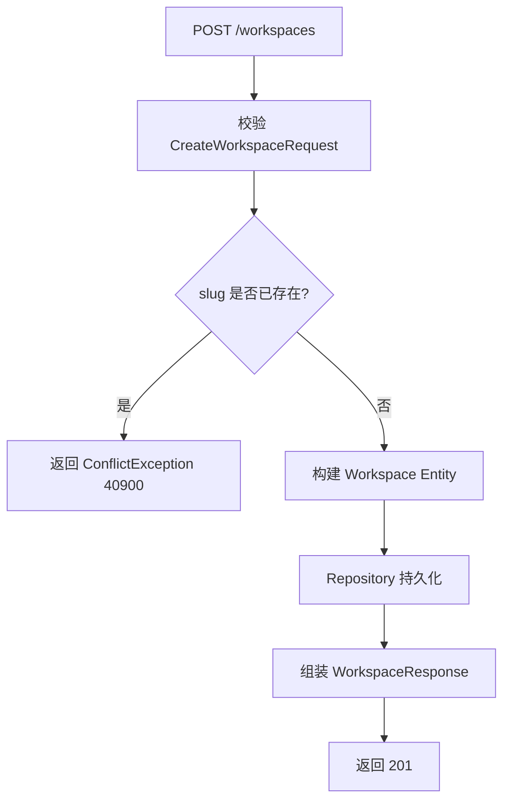

# Phase 1: Core Foundation（基础架构）

> **Depends on**: `../tech-spec.md`, `../architecture/overview.md`, `../architecture/design-principles.md`  
> **Referenced by**: `phase-2-scenario.md`, `phase-3-runner.md`, `phase-4-judge.md`  
> **ADR**: `../decisions/0003-plugin-concept-frontload.md`, `../decisions/0004-llm-client-for-judge.md`

## 1. 目标

搭建 AgentEval 项目骨架，实现 Workspace/Project 管理、健康检查、配置系统、日志/异常/统一返回等基础能力。同时定义 **SPI 基础接口**、**Registry 基类**、**LLMClient 接口**，并前置 Plugin 概念（内置实现通过 Registry.register() 静态注册）。本 Phase 产出可运行的 FastAPI 服务，为后续所有 Phase 提供基础。

## 2. 背景

所有后续模块（Scenario、Evaluation、Judge、Trace、Report、Regression、Plugin）均依赖本 Phase 的项目结构、数据库连接、统一响应、日志和配置。本 Phase 不涉及业务领域逻辑，只做技术基座。

## 3. 模块设计

### 3.1 模块边界

| 模块 | 职责 | 输入 | 输出 |
|------|------|------|------|
| Application Bootstrap | FastAPI 应用初始化、中间件注册、路由挂载 | 配置 | 可运行的 ASGI App |
| Database Engine | 异步 SQLAlchemy 引擎、Session 工厂 | 配置 | AsyncSession |
| Health Check | 服务健康检查 | 无 | DB/Redis 连通状态 |
| Workspace Management | Workspace CRUD | 请求 DTO | Workspace 实体 |
| Project Management | Project CRUD | 请求 DTO | Project 实体 |

### 3.2 依赖关系

```
Application Bootstrap
├── Config System (core/config.py)
├── Logging System (core/logging.py)
├── Exception System (core/exceptions.py)
├── Response System (core/response.py)
├── Database Engine (core/database.py)
├── Redis Client (core/redis.py)
├── Middleware (Request ID, Access Log)
├── API Router
│   ├── Health Router
│   ├── Workspace Router
│   └── Project Router
└── Service Layer
    ├── Workspace Service
    └── Project Service
```

## 4. 数据结构

### 4.1 Workspace ORM Model

```python
# infra/models/workspace_model.py
class WorkspaceModel(BaseModel):
    __tablename__ = "workspaces"
    name: Mapped[str] = mapped_column(String(64), nullable=False)
    slug: Mapped[str] = mapped_column(String(64), nullable=False, unique=True)
    description: Mapped[str | None] = mapped_column(String(512), nullable=True)
    owner_id: Mapped[str] = mapped_column(String(128), nullable=False)
    settings: Mapped[dict] = mapped_column(JSONB, default=dict)
```

### 4.2 Project ORM Model

```python
# infra/models/project_model.py
class ProjectModel(BaseModel):
    __tablename__ = "projects"
    workspace_id: Mapped[UUID] = mapped_column(PGUUID(as_uuid=True), ForeignKey("workspaces.id"), nullable=False)
    name: Mapped[str] = mapped_column(String(64), nullable=False)
    slug: Mapped[str] = mapped_column(String(64), nullable=False)
    description: Mapped[str | None] = mapped_column(String(512), nullable=True)
    agent_config: Mapped[dict] = mapped_column(JSONB, nullable=False)
    default_judge_config: Mapped[dict | None] = mapped_column(JSONB, nullable=True)
    tags: Mapped[list] = mapped_column(JSONB, default=list)

    __table_args__ = (
        UniqueConstraint("workspace_id", "slug", name="uq_project_workspace_slug"),
    )
```

### 4.3 DTO / VO

```python
# schemas/workspace.py
class CreateWorkspaceRequest(BaseModel):
    name: str = Field(min_length=1, max_length=64)
    slug: str = Field(min_length=1, max_length=64, pattern=r"^[a-z0-9-]+$")
    description: str | None = Field(default=None, max_length=512)

class UpdateWorkspaceRequest(BaseModel):
    name: str | None = Field(default=None, min_length=1, max_length=64)
    description: str | None = Field(default=None, max_length=512)

class WorkspaceResponse(BaseModel):
    id: UUID
    name: str
    slug: str
    description: str | None
    owner_id: str
    settings: dict
    created_at: datetime
    updated_at: datetime

class WorkspaceBriefResponse(BaseModel):
    id: UUID
    name: str
    slug: str
    project_count: int
```

```python
# schemas/project.py
class AgentConfigSchema(BaseModel):
    adapter_type: str  # "http" | "openai" | "custom"
    endpoint: str
    model: str = ""
    api_key_ref: str = ""
    temperature: float = Field(default=0.7, ge=0.0, le=2.0)
    max_tokens: int = Field(default=4096, ge=1)
    system_prompt: str = ""
    headers: dict = {}

class CreateProjectRequest(BaseModel):
    name: str = Field(min_length=1, max_length=64)
    slug: str = Field(min_length=1, max_length=64, pattern=r"^[a-z0-9-]+$")
    description: str | None = Field(default=None, max_length=512)
    agent_config: AgentConfigSchema
    default_judge_config: dict | None = None
    tags: list[str] = Field(default=[])

class UpdateProjectRequest(BaseModel):
    name: str | None = None
    description: str | None = None
    agent_config: AgentConfigSchema | None = None
    default_judge_config: dict | None = None
    tags: list[str] | None = None

class ProjectResponse(BaseModel):
    id: UUID
    workspace_id: UUID
    name: str
    slug: str
    description: str | None
    agent_config: dict
    default_judge_config: dict | None
    tags: list[str]
    created_at: datetime
    updated_at: datetime
```

## 5. API 设计

### 5.1 健康检查

| Method | Path | 说明 |
|--------|------|------|
| GET | `/api/v1/health` | 服务健康检查 |

**Response:**

```json
{
  "code": 0,
  "message": "success",
  "data": {
    "status": "ok",
    "version": "0.1.0",
    "checks": {
      "database": "ok",
      "redis": "ok"
    }
  }
}
```

### 5.2 Workspace API

| Method | Path | 说明 |
|--------|------|------|
| POST | `/api/v1/workspaces` | 创建 Workspace |
| GET | `/api/v1/workspaces` | 分页查询 Workspace |
| GET | `/api/v1/workspaces/{workspace_id}` | 获取单个 Workspace |
| PUT | `/api/v1/workspaces/{workspace_id}` | 更新 Workspace |
| DELETE | `/api/v1/workspaces/{workspace_id}` | 软删除 Workspace |

**POST /api/v1/workspaces**

Request Body: `CreateWorkspaceRequest`

Response: `ApiResponse[WorkspaceResponse]`，HTTP 201

**GET /api/v1/workspaces**

Query Parameters:

| 参数 | 类型 | 默认 | 说明 |
|------|------|------|------|
| page | int | 1 | 页码 |
| page_size | int | 20 | 每页条数（max 100） |
| search | str | "" | 按 name 模糊搜索 |
| sort | str | "-created_at" | 排序字段，-前缀为降序 |

Response: `ApiResponse[PageData[WorkspaceBriefResponse]]`

**DELETE /api/v1/workspaces/{workspace_id}**

级联软删除其下所有 Project。返回 HTTP 204。

### 5.3 Project API

| Method | Path | 说明 |
|--------|------|------|
| POST | `/api/v1/workspaces/{workspace_id}/projects` | 创建 Project |
| GET | `/api/v1/workspaces/{workspace_id}/projects` | 分页查询 Project |
| GET | `/api/v1/projects/{project_id}` | 获取单个 Project |
| PUT | `/api/v1/projects/{project_id}` | 更新 Project |
| DELETE | `/api/v1/projects/{project_id}` | 软删除 Project |

**POST /api/v1/workspaces/{workspace_id}/projects**

Request Body: `CreateProjectRequest`

校验：
- `workspace_id` 必须存在且未删除
- `slug` 在同 workspace 内唯一

Response: `ApiResponse[ProjectResponse]`，HTTP 201

## 6. 流程图

### 6.1 应用启动流程

```
main.py
  ├── 读取 Settings (env + .env)
  ├── configure_logging(log_level, json_output)
  ├── 创建 FastAPI(app)
  ├── 注册中间件 (RequestID → AccessLog → ErrorHandler)
  ├── 注册异常处理器 (AgentEvalException, RequestValidationError, Exception)
  ├── 初始化 Database Engine (create_async_engine)
  ├── 初始化 Redis Pool
  ├── 注册 API Routers (health, workspaces, projects)
  ├── 启动事件: DB 连通性检查
  └── uvicorn.run(app)
```

### 6.2 请求处理流程

```
HTTP Request
  → RequestID Middleware (注入 request_id)
  → AccessLog Middleware (记录开始时间)
  → FastAPI Router (匹配路径)
  → Controller (Pydantic 校验 Request DTO)
  → Service (业务编排，操作 Entity)
  → Repository (Entity ↔ ORM Model 转换)
  → Database (SQLAlchemy 执行)
  → Service (组装 Response VO)
  → Controller (包装 ApiResponse)
  → AccessLog Middleware (记录 latency)
  → HTTP Response (含 X-Request-ID)
```

### 6.3 Workspace 创建流程



## 7. 异常设计

| 场景 | 异常类 | 错误码 | HTTP |
|------|--------|--------|------|
| Workspace slug 重复 | ConflictException | 40901 | 409 |
| Workspace 不存在 | NotFoundException | 40401 | 404 |
| Project slug 同 workspace 内重复 | ConflictException | 40902 | 409 |
| Project 不存在 | NotFoundException | 40402 | 404 |
| Workspace 不存在（创建 Project 时） | NotFoundException | 40401 | 404 |
| DB 连接失败 | AgentEvalException | 50001 | 500 |
| Redis 连接失败 | AgentEvalException | 50002 | 500 |

## 8. SPI 基础接口与 Registry

> 本节定义的基类为后续 Phase 的 SPI 扩展提供统一基座。具体契约见 `../contracts/adapter-spi.md` 和 `../contracts/judge-spi.md`。

```python
# core/spi.py — SPI 基类
from abc import ABC, abstractmethod
from typing import TypeVar, Type

T = TypeVar("T")

class Registry(ABC):
    """SPI 统一注册表基类"""
    _registry: dict[str, Type] = {}

    @classmethod
    def register(cls, name: str, impl: Type[T]) -> None:
        cls._registry[name] = impl

    @classmethod
    def create(cls, name: str, **kwargs) -> T:
        if name not in cls._registry:
            raise KeyError(f"Unknown implementation: {name}")
        return cls._registry[name](**kwargs)

    @classmethod
    def list_registered(cls) -> list[str]:
        return list(cls._registry.keys())
```

```python
# core/llm_client.py — LLMClient 接口
from abc import ABC, abstractmethod
from dataclasses import dataclass

@dataclass
class LLMResponse:
    content: str
    usage: dict  # {"prompt_tokens": int, "completion_tokens": int}
    model: str
    raw: dict | None = None

class LLMClient(ABC):
    """MUST: 系统内部 LLM 调用统一接口（与 AgentAdapter 分离）"""
    @abstractmethod
    async def complete(self, messages: list[dict], **kwargs) -> LLMResponse: ...

    @abstractmethod
    def validate_config(self) -> bool: ...

    @property
    @abstractmethod
    def provider(self) -> str: ...
```

## 8.5 扩展点

| 扩展点 | 接口 | 说明 |
|--------|------|------|
| 鉴权 Provider | `AuthProvider` 抽象类 | Phase 1 内置 `NoopAuthProvider`，后续可替换为 JWT/OAuth |
| Repository 接口 | `BaseRepository[T]` 泛型基类 | 所有 Repo 继承，提供 CRUD 模板方法 |
| 健康检查器 | `HealthChecker` 接口 | 可注册自定义检查器（如 MinIO 连通性） |
| SPI Registry | `Registry` 基类 | 所有注册表继承，内置实现通过 register() 静态注册 |
| LLMClient | `LLMClient` 抽象类 | Phase 4 (Judge) 使用，MVP 实现 OpenAILLMClient |

## 9. 项目骨架文件清单

```
agenteval/
├── pyproject.toml
├── .env.example
├── docker-compose.yml
├── Dockerfile
├── alembic.ini
├── alembic/
│   ├── env.py
│   └── versions/
│       └── 001_initial.py
├── src/agenteval/
│   ├── main.py
│   ├── core/
│   │   ├── config.py
│   │   ├── logging.py
│   │   ├── exceptions.py
│   │   ├── response.py
│   │   ├── database.py
│   │   ├── redis.py
│   │   └── security.py
│   ├── api/v1/
│   │   ├── __init__.py
│   │   ├── health.py
│   │   ├── workspaces.py
│   │   └── projects.py
│   ├── services/
│   │   ├── workspace_service.py
│   │   └── project_service.py
│   ├── domain/
│   │   ├── entities/
│   │   │   ├── workspace.py
│   │   │   └── project.py
│   │   └── enums.py
│   ├── infra/
│   │   ├── models/
│   │   │   ├── base.py
│   │   │   ├── workspace_model.py
│   │   │   └── project_model.py
│   │   └── repositories/
│   │       ├── base_repo.py
│   │       ├── workspace_repo.py
│   │       └── project_repo.py
│   └── schemas/
│       ├── common.py
│       ├── workspace.py
│       └── project.py
├── tests/
│   ├── conftest.py
│   ├── test_health.py
│   ├── test_workspaces.py
│   └── test_projects.py
└── Makefile
```

### 9.1 pyproject.toml 关键依赖

```toml
[project]
name = "agenteval"
version = "0.1.0"
requires-python = ">=3.11"

dependencies = [
    "fastapi>=0.110.0",
    "uvicorn[standard]>=0.27.0",
    "sqlalchemy[asyncio]>=2.0.25",
    "asyncpg>=0.29.0",
    "alembic>=1.13.0",
    "pydantic>=2.6.0",
    "pydantic-settings>=2.1.0",
    "redis[hiredis]>=5.0.0",
    "structlog>=24.1.0",
    "python-multipart>=0.0.9",
]

[project.optional-dependencies]
dev = [
    "pytest>=8.0.0",
    "pytest-asyncio>=0.23.0",
    "httpx>=0.27.0",
    "pytest-cov>=4.1.0",
]
```

### 9.2 docker-compose.yml

```yaml
services:
  postgres:
    image: postgres:16-alpine
    environment:
      POSTGRES_DB: agenteval
      POSTGRES_USER: agenteval
      POSTGRES_PASSWORD: agenteval
    ports: ["5432:5432"]
    volumes: ["pgdata:/var/lib/postgresql/data"]

  redis:
    image: redis:7-alpine
    ports: ["6379:6379"]

  minio:
    image: minio/minio:latest
    command: server /data --console-address ":9001"
    ports: ["9000:9000", "9001:9001"]
    environment:
      MINIO_ROOT_USER: minioadmin
      MINIO_ROOT_PASSWORD: minioadmin

volumes:
  pgdata:
```

### 9.3 Alembic 初始迁移

```python
# alembic/versions/001_initial.py
def upgrade():
    op.create_table(
        "workspaces",
        sa.Column("id", PGUUID(as_uuid=True), primary_key=True),
        sa.Column("name", String(64), nullable=False),
        sa.Column("slug", String(64), nullable=False, unique=True),
        sa.Column("description", String(512)),
        sa.Column("owner_id", String(128), nullable=False),
        sa.Column("settings", JSONB, server_default="{}"),
        sa.Column("created_at", DateTime(timezone=True), server_default=sa.func.now()),
        sa.Column("updated_at", DateTime(timezone=True), server_default=sa.func.now()),
        sa.Column("deleted_at", DateTime(timezone=True)),
    )

    op.create_table(
        "projects",
        sa.Column("id", PGUUID(as_uuid=True), primary_key=True),
        sa.Column("workspace_id", PGUUID(as_uuid=True), sa.ForeignKey("workspaces.id"), nullable=False),
        sa.Column("name", String(64), nullable=False),
        sa.Column("slug", String(64), nullable=False),
        sa.Column("description", String(512)),
        sa.Column("agent_config", JSONB, nullable=False),
        sa.Column("default_judge_config", JSONB),
        sa.Column("tags", JSONB, server_default="[]"),
        sa.Column("created_at", DateTime(timezone=True), server_default=sa.func.now()),
        sa.Column("updated_at", DateTime(timezone=True), server_default=sa.func.now()),
        sa.Column("deleted_at", DateTime(timezone=True)),
        sa.UniqueConstraint("workspace_id", "slug", name="uq_project_workspace_slug"),
    )
    op.create_index("ix_projects_workspace_id", "projects", ["workspace_id"])
```

### 9.4 Makefile

```makefile
.PHONY: dev test migrate

dev:
	uvicorn src.agenteval.main:app --reload --host 0.0.0.0 --port 8000

test:
	pytest tests/ -v --cov=src/agenteval --cov-report=term-missing

migrate:
	alembic upgrade head

migrate-new:
	alembic revision --autogenerate -m "$(MSG)"

lint:
	ruff check src/ tests/
	ruff format --check src/ tests/
```

## 10. Repository 基类设计

```python
# infra/repositories/base_repo.py
from typing import TypeVar, Generic, Type
from sqlalchemy import select, func
from sqlalchemy.ext.asyncio import AsyncSession

T = TypeVar("T")

class BaseRepository(Generic[T]):
    model: Type[T]

    def __init__(self, session: AsyncSession):
        self.session = session

    async def get_by_id(self, id: UUID, with_deleted: bool = False) -> T | None:
        stmt = select(self.model).where(self.model.id == id)
        if not with_deleted:
            stmt = stmt.where(self.model.deleted_at.is_(None))
        result = await self.session.execute(stmt)
        return result.scalar_one_or_none()

    async def list(self, page: int = 1, page_size: int = 20,
                   with_deleted: bool = False) -> tuple[list[T], int]:
        offset = (page - 1) * page_size
        base = select(self.model)
        count_base = select(func.count()).select_from(self.model)
        if not with_deleted:
            base = base.where(self.model.deleted_at.is_(None))
            count_base = count_base.where(self.model.deleted_at.is_(None))
        base = base.offset(offset).limit(page_size)
        items = (await self.session.execute(base)).scalars().all()
        total = (await self.session.execute(count_base)).scalar()
        return list(items), total

    async def create(self, entity: T) -> T:
        self.session.add(entity)
        await self.session.flush()
        await self.session.refresh(entity)
        return entity

    async def soft_delete(self, id: UUID) -> bool:
        obj = await self.get_by_id(id)
        if obj is None:
            return False
        obj.deleted_at = datetime.now(timezone.utc)
        await self.session.flush()
        return True
```

## 11. Task 分解

### Task 1.1: 项目骨架初始化
- **Goal**: FastAPI 应用 + Docker Compose + 目录结构
- **Inputs**: `../tech-spec.md` 目录规范
- **Outputs**: 可运行的 `make dev` + `docker compose up`
- **Dependencies**: 无
- **Implementation Notes**: 使用 Poetry 管理依赖；FastAPI + Uvicorn
- **Acceptance Criteria**: `make dev` 启动服务，`/docs` 可访问
- **Files**: `pyproject.toml`, `Makefile`, `docker-compose.yml`, `app/main.py`

### Task 1.2: 配置 / 日志 / 异常 / 统一响应
- **Goal**: 基础 Core 模块
- **Inputs**: Task 1.1
- **Outputs**: `core/config.py`, `core/logging.py`, `core/exceptions.py`, `core/response.py`
- **Dependencies**: Task 1.1
- **Acceptance Criteria**: 所有 API 统一 ApiResponse 格式；异常自动捕获；日志支持 JSON/Console 切换
- **Files**: `core/config.py`, `core/logging.py`, `core/exceptions.py`, `core/response.py`

### Task 1.3: 数据库引擎 + Alembic 迁移
- **Goal**: 异步 SQLAlchemy + Alembic 基础设置
- **Inputs**: Task 1.1
- **Outputs**: `core/database.py`, `alembic/`
- **Dependencies**: Task 1.1, Docker (PostgreSQL)
- **Acceptance Criteria**: `make migrate` 成功建表
- **Files**: `core/database.py`, `alembic.ini`, `alembic/env.py`

### Task 1.4: Repository 基类 + Workspace/Project CRUD
- **Goal**: BaseRepository 泛型基类 + 业务实体 CRUD
- **Inputs**: Task 1.3
- **Outputs**: `repositories/base.py`, `repositories/workspace.py`, `repositories/project.py`
- **Dependencies**: Task 1.3
- **Acceptance Criteria**: Workspace/Project 全套 CRUD API 测试通过
- **Files**: `repositories/`, `services/workspace_service.py`, `api/v1/workspaces.py`

### Task 1.5: SPI Registry 基类 + LLMClient 接口
- **Goal**: 定义统一 Registry 基类和 LLMClient 抽象接口
- **Inputs**: `../contracts/adapter-spi.md`, `../contracts/judge-spi.md`
- **Outputs**: `core/spi.py`, `core/llm_client.py`
- **Dependencies**: Task 1.1
- **Implementation Notes**: 内置实现通过 register() 静态注册（“内置插件”概念）
- **Acceptance Criteria**: Registry 可注册/创建/列举；LLMClient 可被子类实现
- **Files**: `core/spi.py`, `core/llm_client.py`

### Task 1.6: 健康检查 + 可观测性
- **Goal**: Health Check API + X-Request-ID
- **Inputs**: Task 1.2, Task 1.3
- **Outputs**: `api/v1/health.py`, middleware
- **Dependencies**: Task 1.2, Task 1.3
- **Acceptance Criteria**: `/api/v1/health` 返回 DB/Redis 状态；响应头含 X-Request-ID
- **Files**: `api/v1/health.py`, `core/middleware.py`

## 12. 验收标准

| 编号 | 验收项 | 验证方式 |
|------|--------|----------|
| AC-P1-01 | `docker compose up` 后 PostgreSQL/Redis/MinIO 全部 healthy | `docker compose ps` |
| AC-P1-02 | `make migrate` 成功创建 workspaces 和 projects 表 | `\d workspaces` in psql |
| AC-P1-03 | `make dev` 后 `GET /api/v1/health` 返回 200 且 data.status="ok" | curl |
| AC-P1-04 | POST 创建 Workspace 返回 201，重复 slug 返回 409 | curl |
| AC-P1-05 | GET 分页查询 Workspace 返回正确的 total/page/total_pages | curl with page params |
| AC-P1-06 | DELETE Workspace 后 GET 返回 404，其下 Project 同步不可查 | curl |
| AC-P1-07 | POST 创建 Project 时 workspace_id 不存在返回 404 | curl |
| AC-P1-08 | `make test` 全部通过，覆盖率 >= 80% | pytest |
| AC-P1-09 | 所有 API 响应符合统一 ApiResponse 结构 | 响应体校验 |
| AC-P1-10 | 响应头包含 X-Request-ID | curl -v |
| AC-P1-11 | OpenAPI 文档可访问 `/docs` | 浏览器 |
| AC-P1-12 | `AGENTEVAL_LOG_JSON=false` 时日志输出为 Console 格式 | 环境变量测试 |
