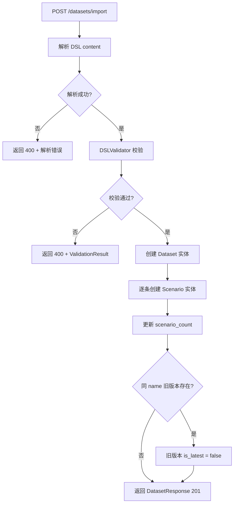

# Phase 2: Scenario System（场景与数据集系统）

> **Depends on**: `phase-1-foundation.md`, `../contracts/domain-model.md`, `../contracts/scenario-dsl.md`  
> **Referenced by**: `phase-3-runner.md`, `phase-6-regression.md`  
> **ADR**: 无

## 1. 目标

实现 Dataset 管理、Scenario 管理、Scenario DSL 解析器、Conversation 历史与 Memory/Context 预置结构。本 Phase 产出可创建数据集、导入场景、解析 DSL 并持久化的完整能力。

## 2. 背景

Scenario 是评测的基本单元。一个 Dataset 包含多个 Scenario。每个 Scenario 定义了用户输入、对话历史、预置记忆、期望输出和约束条件。Scenario DSL 是用于批量导入的声明式格式（详见 `09-scenario-dsl.md`）。

## 3. 模块设计

### 3.1 模块边界

| 模块 | 职责 | 输入 | 输出 |
|------|------|------|------|
| Dataset Management | 数据集 CRUD、版本管理、批量导入 | DSL 文件 / 请求 DTO | Dataset 实体 |
| Scenario Management | 场景 CRUD、标签筛选、优先级排序 | 请求 DTO | Scenario 实体 |
| DSL Parser | 解析 YAML/JSON DSL 为 Scenario 实体列表 | DSL 文件内容 | list[Scenario] |
| DSL Validator | 校验 DSL 语法、字段完整性、引用一致性 | DSL 文件内容 | ValidationResult |
| Conversation Builder | 从 Scenario 构建初始对话上下文 | Scenario 实体 | Conversation 初始状态 |

### 3.2 依赖关系

```
Phase 2 依赖:
  Phase 1 (Project CRUD, DB, 统一响应)
  01-domain-model (Scenario, Dataset, Conversation 定义)
  09-scenario-dsl (DSL 规范)

Phase 2 产出供后续使用:
  Phase 3 (Evaluation Engine 读取 Scenario 执行)
  Phase 4 (Judge 读取 expected 字段评分)
  Phase 6 (Regression 引用 Dataset 回放)
```

## 4. 数据结构

### 4.1 Dataset ORM Model

```python
# infra/models/dataset_model.py
class DatasetModel(BaseModel):
    __tablename__ = "datasets"
    project_id: Mapped[UUID] = mapped_column(PGUUID(as_uuid=True), ForeignKey("projects.id"), nullable=False)
    name: Mapped[str] = mapped_column(String(128), nullable=False)
    version: Mapped[str] = mapped_column(String(32), nullable=False)
    description: Mapped[str | None] = mapped_column(String(512))
    format: Mapped[str] = mapped_column(String(16), nullable=False)  # yaml|json|csv
    source_uri: Mapped[str | None] = mapped_column(String(512))
    scenario_count: Mapped[int] = mapped_column(Integer, default=0)
    tags: Mapped[list] = mapped_column(JSONB, default=list)
    metadata: Mapped[dict] = mapped_column(JSONB, default=dict)
    is_latest: Mapped[bool] = mapped_column(Boolean, default=True)

    __table_args__ = (
        UniqueConstraint("project_id", "name", "version", name="uq_dataset_project_name_version"),
    )
```

### 4.2 Scenario ORM Model

```python
# infra/models/scenario_model.py
class ScenarioModel(BaseModel):
    __tablename__ = "scenarios"
    dataset_id: Mapped[UUID] = mapped_column(PGUUID(as_uuid=True), ForeignKey("datasets.id"), nullable=False)
    external_id: Mapped[str] = mapped_column(String(64), nullable=False)
    title: Mapped[str] = mapped_column(String(256), nullable=False)
    description: Mapped[str | None] = mapped_column(Text)
    input_data: Mapped[dict] = mapped_column(JSONB, nullable=False)
    history: Mapped[list] = mapped_column(JSONB, default=list)
    memory: Mapped[dict] = mapped_column(JSONB, default=dict)
    expected: Mapped[dict] = mapped_column(JSONB, default=dict)
    constraints: Mapped[dict] = mapped_column(JSONB, default=dict)
    judge_config: Mapped[dict | None] = mapped_column(JSONB)
    tags: Mapped[list] = mapped_column(JSONB, default=list)
    priority: Mapped[int] = mapped_column(Integer, default=0)
    metadata: Mapped[dict] = mapped_column(JSONB, default=dict)
    status: Mapped[str] = mapped_column(String(16), default="draft")

    __table_args__ = (
        UniqueConstraint("dataset_id", "external_id", name="uq_scenario_dataset_external_id"),
    )
```

### 4.3 DTO / VO

```python
# schemas/dataset.py
class CreateDatasetRequest(BaseModel):
    name: str = Field(min_length=1, max_length=128)
    version: str = Field(min_length=1, max_length=32, pattern=r"^\d+\.\d+\.\d+$")
    description: str | None = None
    tags: list[str] = []
    metadata: dict = {}

class ImportDatasetRequest(BaseModel):
    name: str = Field(min_length=1, max_length=128)
    version: str = Field(min_length=1, max_length=32, pattern=r"^\d+\.\d+\.\d+$")
    description: str | None = None
    format: str = Field(pattern=r"^(yaml|json)$")
    content: str  # DSL 文件内容（内联）
    tags: list[str] = []
    metadata: dict = {}

class DatasetResponse(BaseModel):
    id: UUID
    project_id: UUID
    name: str
    version: str
    description: str | None
    format: str
    source_uri: str | None
    scenario_count: int
    tags: list[str]
    metadata: dict
    is_latest: bool
    created_at: datetime
    updated_at: datetime

class DatasetBriefResponse(BaseModel):
    id: UUID
    name: str
    version: str
    scenario_count: int
    is_latest: bool
```

```python
# schemas/scenario.py
class CreateScenarioRequest(BaseModel):
    external_id: str = Field(min_length=1, max_length=64)
    title: str = Field(min_length=1, max_length=256)
    description: str | None = None
    input: dict
    history: list[dict] = []
    memory: dict = {}
    expected: dict = {}
    constraints: dict = {}
    judge_config: dict | None = None
    tags: list[str] = []
    priority: int = 0
    metadata: dict = {}

class UpdateScenarioRequest(BaseModel):
    title: str | None = None
    description: str | None = None
    input: dict | None = None
    history: list[dict] | None = None
    memory: dict | None = None
    expected: dict | None = None
    constraints: dict | None = None
    judge_config: dict | None = None
    tags: list[str] | None = None
    priority: int | None = None
    status: str | None = None

class ScenarioResponse(BaseModel):
    id: UUID
    dataset_id: UUID
    external_id: str
    title: str
    description: str | None
    input: dict
    history: list[dict]
    memory: dict
    expected: dict
    constraints: dict
    judge_config: dict | None
    tags: list[str]
    priority: int
    metadata: dict
    status: str
    created_at: datetime
    updated_at: datetime

class ScenarioBriefResponse(BaseModel):
    id: UUID
    external_id: str
    title: str
    tags: list[str]
    priority: int
    status: str

class ValidationResultVO(BaseModel):
    valid: bool
    errors: list[ValidationErrorDetail] = []
    warnings: list[str] = []
    scenario_count: int = 0

class ValidationErrorDetail(BaseModel):
    scenario_external_id: str | None = None
    field: str
    message: str
```

## 5. API 设计

### 5.1 Dataset API

| Method | Path | 说明 |
|--------|------|------|
| POST | `/api/v1/projects/{project_id}/datasets` | 创建空数据集 |
| POST | `/api/v1/projects/{project_id}/datasets/import` | 导入 DSL 创建数据集（含场景） |
| POST | `/api/v1/projects/{project_id}/datasets/import/validate` | 仅校验 DSL，不持久化 |
| GET | `/api/v1/projects/{project_id}/datasets` | 分页查询数据集 |
| GET | `/api/v1/datasets/{dataset_id}` | 获取单个数据集 |
| GET | `/api/v1/datasets/{dataset_id}/export` | 导出数据集为 DSL 文件 |
| PUT | `/api/v1/datasets/{dataset_id}` | 更新数据集元信息 |
| DELETE | `/api/v1/datasets/{dataset_id}` | 软删除数据集（级联场景） |

**POST /api/v1/projects/{project_id}/datasets/import**

Request Body: `ImportDatasetRequest`

处理流程：
1. 解析 `content` 为 DSL 结构
2. 校验 DSL 语法与字段完整性
3. 若校验失败返回 `ValidationResultVO`（HTTP 400）
4. 创建 Dataset 实体
5. 逐条创建 Scenario 实体
6. 更新 `scenario_count`
7. 若同 name 旧版本存在，将其 `is_latest` 置为 false

Response: `ApiResponse[DatasetResponse]`，HTTP 201

**POST /api/v1/projects/{project_id}/datasets/import/validate**

Request Body: `ImportDatasetRequest`

Response: `ApiResponse[ValidationResultVO]`

**GET /api/v1/datasets/{dataset_id}/export?format=yaml**

Response: 文件下载（Content-Type: application/x-yaml 或 application/json）

### 5.2 Scenario API

| Method | Path | 说明 |
|--------|------|------|
| POST | `/api/v1/datasets/{dataset_id}/scenarios` | 创建单个场景 |
| GET | `/api/v1/datasets/{dataset_id}/scenarios` | 分页查询场景 |
| GET | `/api/v1/scenarios/{scenario_id}` | 获取单个场景 |
| PUT | `/api/v1/scenarios/{scenario_id}` | 更新场景 |
| DELETE | `/api/v1/scenarios/{scenario_id}` | 软删除场景 |
| POST | `/api/v1/datasets/{dataset_id}/scenarios/batch` | 批量创建场景 |

**GET /api/v1/datasets/{dataset_id}/scenarios**

Query Parameters:

| 参数 | 类型 | 默认 | 说明 |
|------|------|------|------|
| page | int | 1 | |
| page_size | int | 20 | max 100 |
| tags | str | "" | 逗号分隔，AND 过滤 |
| status | str | "" | draft/active/archived |
| priority_min | int | 0 | 优先级 >= 此值 |
| search | str | "" | 按 title/external_id 模糊搜索 |
| sort | str | "-priority" | 排序字段 |

## 6. DSL 解析器设计

### 6.1 解析器接口

```python
# services/dsl_parser.py
from abc import ABC, abstractmethod

class DSLParser(ABC):
    @abstractmethod
    def parse(self, content: str) -> list[ScenarioEntity]:
        """将 DSL 内容解析为 Scenario 实体列表"""
        pass

class YAMLDSLParser(DSLParser):
    def parse(self, content: str) -> list[ScenarioEntity]:
        data = yaml.safe_load(content)
        return self._build_scenarios(data)

    def _build_scenarios(self, data: dict) -> list[ScenarioEntity]:
        scenarios = []
        for raw in data.get("scenarios", []):
            scenario = ScenarioEntity(
                external_id=raw["id"],
                title=raw.get("title", raw["id"]),
                description=raw.get("description"),
                input_data=self._parse_input(raw),
                history=raw.get("history", []),
                memory=raw.get("memory", {}),
                expected=raw.get("expected", {}),
                constraints=raw.get("constraints", {}),
                judge_config=raw.get("judge_config"),
                tags=raw.get("tags", []),
                priority=raw.get("priority", 0),
                metadata=raw.get("metadata", {}),
                status="active",
            )
            scenarios.append(scenario)
        return scenarios

    def _parse_input(self, raw: dict) -> dict:
        if "input" in raw:
            return raw["input"]
        # 兼容简写：顶层 user_message
        if "user_message" in raw:
            return {"user_message": raw["user_message"], "context": raw.get("context", {})}
        raise DSLParseError("Scenario must have 'input' or 'user_message'")

class JSONDSLParser(DSLParser):
    def parse(self, content: str) -> list[ScenarioEntity]:
        data = json.loads(content)
        # 同 YAMLDSLParser._build_scenarios 逻辑
        ...

def get_parser(format: str) -> DSLParser:
    parsers = {"yaml": YAMLDSLParser, "json": JSONDSLParser}
    if format not in parsers:
        raise ValueError(f"Unsupported format: {format}")
    return parsers[format]()
```

### 6.2 校验器设计

```python
# services/dsl_validator.py
class DSLValidator:
    def validate(self, content: str, format: str) -> ValidationResult:
        result = ValidationResult(valid=True, errors=[], warnings=[])
        try:
            parser = get_parser(format)
            scenarios = parser.parse(content)
        except (yaml.YAMLError, json.JSONDecodeError) as e:
            result.valid = False
            result.errors.append(ValidationErrorDetail(field="_root", message=f"Parse error: {e}"))
            return result
        except DSLParseError as e:
            result.valid = False
            result.errors.append(ValidationErrorDetail(field="_root", message=str(e)))
            return result

        # 检查 external_id 唯一性
        ids = [s.external_id for s in scenarios]
        duplicates = {x for x in ids if ids.count(x) > 1}
        for dup in duplicates:
            result.errors.append(ValidationErrorDetail(
                scenario_external_id=dup, field="id",
                message=f"Duplicate scenario id: {dup}"))

        # 检查必填字段
        for s in scenarios:
            if not s.input_data.get("user_message"):
                result.errors.append(ValidationErrorDetail(
                    scenario_external_id=s.external_id, field="input.user_message",
                    message="user_message is required"))

            if not s.expected:
                result.warnings.append(
                    f"Scenario {s.external_id} has no expected output, "
                    "judge capabilities will be limited")

            # 检查 constraints 合法性
            if s.constraints_data.get("max_turns", 1) < 1:
                result.errors.append(ValidationErrorDetail(
                    scenario_external_id=s.external_id, field="constraints.max_turns",
                    message="max_turns must be >= 1"))

        result.scenario_count = len(scenarios)
        result.valid = len(result.errors) == 0
        return result
```

## 7. 流程图

### 7.1 Dataset 导入流程



### 7.2 Scenario 查询筛选流程

```
GET /datasets/{id}/scenarios?tags=a,b&status=active&priority_min=5

  → Repository 构建查询:
    WHERE dataset_id = :id
      AND deleted_at IS NULL
      AND status = 'active'
      AND priority >= 5
      AND tags @> '["a"]'::jsonb   -- GIN 索引
      AND tags @> '["b"]'::jsonb
    ORDER BY priority DESC
    LIMIT :page_size OFFSET :offset
```

## 8. 异常设计

| 场景 | 错误码 | HTTP | message |
|------|--------|------|---------|
| DSL 解析失败 | 40301 | 400 | `DSL parse error: {detail}` |
| DSL 校验失败 | 40302 | 400 | `DSL validation failed` |
| Dataset 不存在 | 40403 | 404 | `Dataset not found: {id}` |
| Dataset 版本冲突 | 40903 | 409 | `Dataset {name} v{version} already exists` |
| Scenario 不存在 | 40404 | 404 | `Scenario not found: {id}` |
| Scenario external_id 冲突 | 40904 | 409 | `Scenario external_id '{id}' already exists in dataset` |
| 导入场景数量超限（>5000） | 40303 | 400 | `Dataset import exceeds 5000 scenario limit` |

## 9. 扩展点

| 扩展点 | 接口 | 说明 |
|--------|------|------|
| DSL Parser | `DSLParser` 抽象类 | 可扩展 CSV 等新格式解析器 |
| DSL Validator | `DSLValidator` | 可注册自定义校验规则 |
| Scenario Transformer | `ScenarioTransformer` 接口 | 导入时对场景做转换（如变量插值、模板展开） |
| Dataset Source | `DatasetSource` 接口 | 支持从 URL / S3 / Git 导入 DSL |

## 10. GIN 索引设计

```sql
-- 加速 tags JSONB 包含查询
CREATE INDEX ix_scenarios_tags_gin ON scenarios USING GIN (tags);

-- 加速 input_data / expected JSONB 查询
CREATE INDEX ix_scenarios_input_gin ON scenarios USING GIN (input_data jsonb_path_ops);
CREATE INDEX ix_scenarios_expected_gin ON scenarios USING GIN (expected jsonb_path_ops);

-- 复合索引加速分页查询
CREATE INDEX ix_scenarios_dataset_priority ON scenarios (dataset_id, priority DESC)
  WHERE deleted_at IS NULL;
```

## 11. Alembic 迁移

```python
# alembic/versions/002_scenario_system.py
def upgrade():
    op.create_table(
        "datasets",
        sa.Column("id", PGUUID(as_uuid=True), primary_key=True),
        sa.Column("project_id", PGUUID(as_uuid=True), sa.ForeignKey("projects.id"), nullable=False),
        sa.Column("name", String(128), nullable=False),
        sa.Column("version", String(32), nullable=False),
        sa.Column("description", String(512)),
        sa.Column("format", String(16), nullable=False),
        sa.Column("source_uri", String(512)),
        sa.Column("scenario_count", Integer, server_default="0"),
        sa.Column("tags", JSONB, server_default="[]"),
        sa.Column("metadata", JSONB, server_default="{}"),
        sa.Column("is_latest", Boolean, server_default="true"),
        sa.Column("created_at", DateTime(timezone=True), server_default=sa.func.now()),
        sa.Column("updated_at", DateTime(timezone=True), server_default=sa.func.now()),
        sa.Column("deleted_at", DateTime(timezone=True)),
        sa.UniqueConstraint("project_id", "name", "version", name="uq_dataset_project_name_version"),
    )

    op.create_table(
        "scenarios",
        sa.Column("id", PGUUID(as_uuid=True), primary_key=True),
        sa.Column("dataset_id", PGUUID(as_uuid=True), sa.ForeignKey("datasets.id"), nullable=False),
        sa.Column("external_id", String(64), nullable=False),
        sa.Column("title", String(256), nullable=False),
        sa.Column("description", Text),
        sa.Column("input_data", JSONB, nullable=False),
        sa.Column("history", JSONB, server_default="[]"),
        sa.Column("memory", JSONB, server_default="{}"),
        sa.Column("expected", JSONB, server_default="{}"),
        sa.Column("constraints", JSONB, server_default="{}"),
        sa.Column("judge_config", JSONB),
        sa.Column("tags", JSONB, server_default="[]"),
        sa.Column("priority", Integer, server_default="0"),
        sa.Column("metadata", JSONB, server_default="{}"),
        sa.Column("status", String(16), server_default="draft"),
        sa.Column("created_at", DateTime(timezone=True), server_default=sa.func.now()),
        sa.Column("updated_at", DateTime(timezone=True), server_default=sa.func.now()),
        sa.Column("deleted_at", DateTime(timezone=True)),
        sa.UniqueConstraint("dataset_id", "external_id", name="uq_scenario_dataset_external_id"),
    )

    op.execute("CREATE INDEX ix_scenarios_tags_gin ON scenarios USING GIN (tags)")
    op.execute("CREATE INDEX ix_scenarios_input_gin ON scenarios USING GIN (input_data jsonb_path_ops)")
    op.execute("CREATE INDEX ix_scenarios_expected_gin ON scenarios USING GIN (expected jsonb_path_ops)")
    op.execute("CREATE INDEX ix_scenarios_dataset_priority ON scenarios (dataset_id, priority DESC) WHERE deleted_at IS NULL")
```

## 11.5 Task 分解

### Task 2.1: Dataset CRUD + Scenario CRUD
- **Goal**: 基础实体管理
- **Inputs**: `../contracts/domain-model.md` (Dataset, Scenario)
- **Outputs**: `repositories/dataset.py`, `repositories/scenario.py`, `services/`, `api/v1/`
- **Dependencies**: Phase 1 (Repository 基类)
- **Acceptance Criteria**: Dataset/Scenario CRUD API 全部通过
- **Files**: `repositories/`, `services/dataset_service.py`, `api/v1/datasets.py`, `api/v1/scenarios.py`

### Task 2.2: DSL Parser + Validator
- **Goal**: YAML/JSON DSL 解析与校验
- **Inputs**: `../contracts/scenario-dsl.md`
- **Outputs**: `services/dsl_parser.py`, `services/dsl_validator.py`
- **Dependencies**: Task 2.1
- **Acceptance Criteria**: 有效 DSL 解析成功；无效 DSL 返回校验错误
- **Files**: `services/dsl_parser.py`, `services/dsl_validator.py`

### Task 2.3: Dataset Import/Export
- **Goal**: 批量导入导出 + 版本管理
- **Inputs**: Task 2.2
- **Outputs**: `services/dataset_import_service.py`
- **Dependencies**: Task 2.1, Task 2.2
- **Implementation Notes**: 同 name 不同 version 共存；导出的 YAML 可 round-trip 重新导入
- **Acceptance Criteria**: import 返回 scenario_count；export round-trip 测试通过
- **Files**: `services/dataset_import_service.py`, `api/v1/datasets.py` (import/export 端点)

### Task 2.4: Conversation Builder + GIN 索引
- **Goal**: 从 Scenario 构建初始对话上下文 + JSONB 索引优化
- **Inputs**: Task 2.1
- **Outputs**: `services/conversation_builder.py`, Alembic 迁移
- **Dependencies**: Task 2.1
- **Acceptance Criteria**: tags GIN 索引存在且被查询使用
- **Files**: `services/conversation_builder.py`, `alembic/versions/`

## 12. 验收标准

| 编号 | 验收项 | 验证方式 |
|------|--------|----------|
| AC-P2-01 | POST import 有效 DSL 返回 201 且 scenario_count 正确 | curl |
| AC-P2-02 | POST import 无效 YAML 返回 400 且 errors 非空 | curl |
| AC-P2-03 | POST import/validate 不创建数据，仅返回校验结果 | DB 查询确认 |
| AC-P2-04 | 同 name 不同 version 导入后旧版本 is_latest=false | DB 查询 |
| AC-P2-05 | 同 name 同 version 导入返回 409 | curl |
| AC-P2-06 | GET scenarios tags 过滤返回正确子集 | curl with tags param |
| AC-P2-07 | GET scenarios priority_min 过滤生效 | curl |
| AC-P2-08 | GET export 导出的 YAML 可被 import 重新导入 | round-trip 测试 |
| AC-P2-09 | external_id 重复导入返回 409 | curl |
| AC-P2-10 | 批量创建场景（batch）支持最多 100 条/次 | curl |
| AC-P2-11 | DSL 中缺少 user_message 的场景校验失败 | validate API |
| AC-P2-12 | GIN 索引存在且被查询使用 | EXPLAIN ANALYZE |
| AC-P2-13 | 软删除 Dataset 后其下 Scenario 不可查询 | curl |
