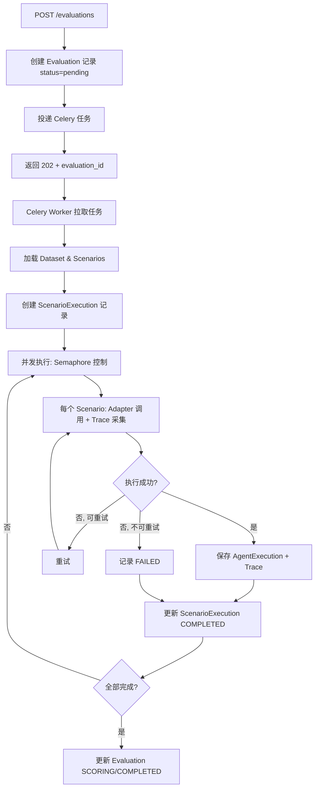

# Phase 3: Evaluation Engine（执行引擎）

> **Depends on**: ../architecture/design-principles.md, ../contracts/adapter-spi.md, ../contracts/domain-model.md, ../tech-spec.md, ./phase-1-foundation.md, ./phase-2-scenario.md
> **Referenced by**: ./phase-4-judge.md, ./phase-5-report.md, ./phase-6-regression.md
> **ADR**: 0001-adapter-spi-minimal-interface.md, 0003-plugin-concept-frontload.md, 0006-adapter-spi-contract-doc.md

## 1. 目标

实现 Evaluation Runner、内置 Agent Adapter、执行生命周期管理、并发调度、重试/超时机制和基础 Trace 采集。本 Phase 产出可端到端执行 Scenario 并获得 AgentExecution + 基础 Trace 的能力。

> **Adapter SPI 定义**：Agent Adapter 接口契约见 `../contracts/adapter-spi.md`。本文档不重复定义接口，只描述 Runner 实现和内置 Adapter 实现。

## 2. 背景

Runner 是评测系统的核心引擎。它读取 Dataset 中的 Scenario 列表，通过 Adapter SPI 调用目标 Agent，采集对话过程和 Trace，产出 AgentExecution 实体。本 Phase 不含评分（Phase 4），不含高级 Trace 可视化（Phase 5）。

## 3. 模块设计

### 3.1 模块边界

| 模块 | 职责 | 输入 | 输出 |
|------|------|------|------|
| Evaluation Service | 评测任务创建、状态管理、结果查询 | CreateEvaluationRequest | Evaluation 实体 |
| Runner Orchestrator | 调度场景执行、并发控制、状态聚合 | Evaluation 实体 | ScenarioExecution 列表 |
| Agent Adapter SPI | 统一 Agent 调用接口 | Scenario + AgentConfig | AgentResponse + Trace |
| HTTP Adapter | 通用 HTTP Agent 适配器 | HTTP 配置 | AgentResponse |
| OpenAI Adapter | OpenAI 兼容 API 适配器 | OpenAI 配置 | AgentResponse |
| Custom Adapter | 自定义函数适配器 | Python 回调 | AgentResponse |
| Trace Collector | 基础 Trace 采集与持久化 | 执行过程事件 | Trace 实体 |
| Execution Lifecycle | 状态机驱动、超时/重试管理 | ScenarioExecution | 最终状态 |

### 3.2 依赖关系

```
Phase 3 依赖:
  Phase 1 (Project, DB, Config, Logging)
  Phase 2 (Dataset, Scenario, Conversation Builder)
  ../contracts/domain-model.md (AgentExecution, ScenarioExecution, Trace)
  ../contracts/adapter-spi.md (AgentAdapter SPI 契约)

Phase 3 产出供后续使用:
  Phase 4 (Judge 读取 AgentExecution 评分)
  Phase 5 (Trace & Report 读取 Trace 和 Execution)
  Phase 6 (Regression 引用 Evaluation 结果)
```

## 4. Agent Adapter 实现

> **接口契约**：AgentAdapter 基础接口、AgentRequest / AgentResponse / ToolCallRecord 数据结构、Capability 模型、Runner 执行策略规范见 `../contracts/adapter-spi.md`（MUST/SHOULD/MAY）。
>
> 本节只描述内置 Adapter 的具体实现。

### 4.1 内置 Adapter 注册

```python
# adapters/__init__.py
from adapters.base import AgentAdapter
from adapters.http_adapter import HTTPAdapter
from adapters.openai_adapter import OpenAIAdapter
from adapters.custom_adapter import CustomAdapter

def register_builtin_adapters():
    """注册内置 Adapter（内置插件概念）。
    外部 Adapter 通过 Plugin 系统在 Phase 7 注册。"""
    AdapterRegistry.register("http", HTTPAdapter)
    AdapterRegistry.register("openai", OpenAIAdapter)
    AdapterRegistry.register("custom", CustomAdapter)
```

### 4.2 HTTP Adapter

```python
# adapters/http_adapter.py
import httpx

class HTTPAdapter(AgentAdapter):
    """通用 HTTP Agent 适配器
    适用于自定义 Agent 服务，通过 HTTP API 交互。
    """

    adapter_type = "http"

    def __init__(self, config: dict):
        self.endpoint = config["endpoint"]
        self.headers = config.get("headers", {})
        self.timeout = config.get("timeout_seconds", 120)
        self.api_key_ref = config.get("api_key_ref")

    async def execute(self, request: AgentRequest) -> AgentResponse:
        try:
            async with httpx.AsyncClient(timeout=self.timeout) as client:
                payload = {
                    "messages": request.messages,
                    "system_prompt": request.system_prompt,
                    "tools": request.tools,
                    "temperature": request.temperature,
                    "max_tokens": request.max_tokens,
                    "metadata": request.metadata,
                }
                headers = {**self.headers}
                if self.api_key_ref:
                    headers["Authorization"] = f"Bearer {resolve_secret(self.api_key_ref)}"

                resp = await client.post(f"{self.endpoint}/chat", json=payload, headers=headers)
                resp.raise_for_status()
                data = resp.json()

                return AgentResponse(
                    messages=data.get("messages", []),
                    final_message=data.get("response", ""),
                    tool_calls=[ToolCallRecord(**tc) for tc in data.get("tool_calls", [])],
                    tokens=data.get("tokens", {}),
                    model=data.get("model", "unknown"),
                    finish_reason=data.get("finish_reason", "stop"),
                    latency_ms=int(resp.elapsed.total_seconds() * 1000),
                    cost_usd=data.get("cost_usd", 0.0),
                    raw_response=data,
                )

        except httpx.TimeoutException:
            raise AdapterTimeoutError(f"HTTP adapter timeout after {self.timeout}s")
        except Exception as e:
            raise AdapterError(f"HTTP adapter error: {e}")

    def validate_config(self, config: dict) -> bool:
        return "endpoint" in config and config["endpoint"].startswith("http")
```

### 4.3 OpenAI Adapter

```python
# adapters/openai_adapter.py
import openai

class OpenAIAdapter(AgentAdapter):
    """OpenAI 兼容 API 适配器
    兼容 OpenAI / Azure OpenAI / 其他 OpenAI 兼容服务。
    """

    adapter_type = "openai"

    def __init__(self, config: dict):
        self.client = openai.AsyncOpenAI(
            api_key=resolve_secret(config.get("api_key_ref", "")),
            base_url=config.get("endpoint", "https://api.openai.com/v1"),
        )
        self.model = config["model"]
        self.default_temperature = config.get("temperature", 0.7)
        self.default_max_tokens = config.get("max_tokens", 4096)

    async def execute(self, request: AgentRequest) -> AgentResponse:
        messages = []
        if request.system_prompt:
            messages.append({"role": "system", "content": request.system_prompt})
        messages.extend(request.messages)

        try:
            completion = await self.client.chat.completions.create(
                model=self.model,
                messages=messages,
                temperature=request.temperature,
                max_tokens=request.max_tokens,
                tools=request.tools,
            )
            choice = completion.choices[0]
            tool_calls = []
            if choice.message.tool_calls:
                for tc in choice.message.tool_calls:
                    tool_calls.append(ToolCallRecord(
                        tool_name=tc.function.name,
                        arguments=json.loads(tc.function.arguments),
                        result=None, latency_ms=0, status="success"))

            return AgentResponse(
                messages=[{"role": "assistant", "content": choice.message.content or ""}],
                final_message=choice.message.content or "",
                tool_calls=tool_calls,
                tokens={"prompt": completion.usage.prompt_tokens,
                        "completion": completion.usage.completion_tokens},
                model=completion.model,
                finish_reason=choice.finish_reason,
                latency_ms=0,  # 由 Runner 计算总延迟
                cost_usd=calculate_cost(completion.usage, self.model),
                raw_response=completion.model_dump(),
            )

        except Exception as e:
            raise AdapterError(f"OpenAI adapter error: {e}")

    @property
    def capabilities(self) -> set[str]:
        return {"tools"}  # OpenAI 支持 function calling

    def validate_config(self, config: dict) -> bool:
        return "model" in config
```

### 4.4 Custom Adapter

```python
# adapters/custom_adapter.py
from typing import Callable, Awaitable

class CustomAdapter(AgentAdapter):
    """自定义函数适配器
    允许用户注册一个 async callable 作为 Agent。
    适用于本地 Agent、测试 Mock 等。
    """

    adapter_type = "custom"

    def __init__(self, config: dict):
        self.handler: Callable[[AgentRequest], Awaitable[AgentResponse]] = config["handler"]
        self.timeout = config.get("timeout_seconds", 120)

    async def execute(self, request: AgentRequest) -> AgentResponse:
        try:
            result = await asyncio.wait_for(self.handler(request), timeout=self.timeout)
            return result
        except asyncio.TimeoutError:
            raise AdapterTimeoutError(f"Custom adapter timeout after {self.timeout}s")

    def validate_config(self, config: dict) -> bool:
        return callable(config.get("handler"))
```

### 4.5 Adapter Registry

```python
# adapters/registry.py
class AdapterRegistry:
    _adapters: dict[str, type[AgentAdapter]] = {}

    @classmethod
    def register(cls, adapter_type: str, adapter_class: type[AgentAdapter]):
        cls._adapters[adapter_type] = adapter_class

    @classmethod
    def create(cls, adapter_type: str, config: dict) -> AgentAdapter:
        if adapter_type not in cls._adapters:
            raise ValueError(f"Unknown adapter type: {adapter_type}")
        adapter = cls._adapters[adapter_type](config)
        if not adapter.validate_config(config):
            raise ValueError(f"Invalid config for adapter: {adapter_type}")
        return adapter

# 默认注册
AdapterRegistry.register("http", HTTPAdapter)
AdapterRegistry.register("openai", OpenAIAdapter)
AdapterRegistry.register("custom", CustomAdapter)
```

## 5. Trace Collector

### 5.1 接口设计

```python
# services/trace_collector.py
from dataclasses import dataclass, field
from datetime import datetime

@dataclass
class SpanContext:
    span_id: str
    trace_id: UUID
    parent_id: str | None

class TraceCollector:
    """基础 Trace 采集器
    Phase 3 只采集基本 Span，Phase 5 扩展为完整 Trace Tree。
    """

    def __init__(self, trace_id: UUID):
        self.trace_id = trace_id
        self.spans: list[dict] = []
        self._span_stack: list[SpanContext] = []

    def start_span(self, name: str, span_type: str, input_data: dict) -> SpanContext:
        span_id = uuid4().hex
        parent_id = self._span_stack[-1].span_id if self._span_stack else None

        ctx = SpanContext(span_id=span_id, trace_id=self.trace_id, parent_id=parent_id)
        self._span_stack.append(ctx)

        span_data = {
            "id": span_id,
            "trace_id": str(self.trace_id),
            "parent_id": parent_id,
            "span_type": span_type,
            "name": name,
            "input_data": input_data,
            "started_at": datetime.now(timezone.utc).isoformat(),
            "status": "running",
        }
        self.spans.append(span_data)
        logger.debug("trace.span_started", span_id=span_id, name=name, span_type=span_type)
        return ctx

    def end_span(self, ctx: SpanContext, output_data: dict, status: str = "ok"):
        for span in self.spans:
            if span["id"] == ctx.span_id:
                completed_at = datetime.now(timezone.utc)
                span["completed_at"] = completed_at.isoformat()
                span["duration_ms"] = int(
                    (completed_at - datetime.fromisoformat(span["started_at"])).total_seconds() * 1000)
                span["output_data"] = output_data
                span["status"] = status
                break
        if self._span_stack and self._span_stack[-1].span_id == ctx.span_id:
            self._span_stack.pop()

    def to_trace_entity(self) -> Trace:
        root_span = self._build_tree()
        return Trace(
            id=self.trace_id,
            root_span=root_span,
            span_count=len(self.spans),
            total_llm_calls=sum(1 for s in self.spans if s["span_type"] == "llm_call"),
            total_tool_calls=sum(1 for s in self.spans if s["span_type"] == "tool_call"),
            total_tokens=self._sum_tokens(),
            started_at=datetime.fromisoformat(self.spans[0]["started_at"]) if self.spans else datetime.now(timezone.utc),
            completed_at=datetime.now(timezone.utc),
        )

    def _build_tree(self) -> TraceSpan:
        """将扁平 span 列表构建为树结构"""
        span_map = {s["id"]: TraceSpan(**s, children=[]) for s in self.spans}
        root = None
        for s in self.spans:
            node = span_map[s["id"]]
            if s["parent_id"] is None:
                root = node
            elif s["parent_id"] in span_map:
                span_map[s["parent_id"]].children.append(node)
        return root or TraceSpan(
            id="root", trace_id=self.trace_id, parent_id=None,
            span_type=TraceSpanType.ROOT, name="root",
            input_data={}, output_data={},
            started_at=datetime.now(timezone.utc),
            completed_at=None, duration_ms=0, status="ok")
```

## 6. Runner Orchestrator

### 6.1 执行流程

```python
# services/runner.py
import asyncio
from celery import shared_task

class EvaluationRunner:
    """评测执行编排器"""

    def __init__(self, session_factory, redis_client):
        self.session_factory = session_factory
        self.redis = redis_client

    async def run_evaluation(self, evaluation_id: UUID):
        """执行整个评测任务"""
        eval_repo = EvaluationRepository(await self.session_factory())
        evaluation = await eval_repo.get_by_id(evaluation_id)
        if not evaluation:
            raise NotFoundException("Evaluation", str(evaluation_id))

        # 更新状态
        await eval_repo.update_status(evaluation_id, EvaluationStatus.RUNNING)

        # 获取场景列表
        scenarios = await self._load_scenarios(evaluation.dataset_id, evaluation.config)

        # 创建 ScenarioExecution 记录
        exec_records = await self._create_scenario_executions(evaluation_id, scenarios)

        # 并发执行
        semaphore = asyncio.Semaphore(evaluation.config.get("max_concurrent", 10))
        tasks = [self._run_single(exec_id, scenario, evaluation, semaphore)
                 for exec_id, scenario in zip(exec_records, scenarios)]
        results = await asyncio.gather(*tasks, return_exceptions=True)

        # 处理结果
        failed_count = sum(1 for r in results if isinstance(r, Exception) or r is None)
        if failed_count == len(results):
            await eval_repo.update_status(evaluation_id, EvaluationStatus.FAILED)
        else:
            await eval_repo.update_status(evaluation_id, EvaluationStatus.SCORING)

        return evaluation_id

    async def _run_single(self, exec_id: UUID, scenario: Scenario,
                          evaluation: Evaluation, semaphore: asyncio.Semaphore):
        async with semaphore:
            try:
                await self._update_exec_status(exec_id, ScenarioExecutionStatus.RUNNING)
                agent_execution = await self._execute_scenario(scenario, evaluation)
                await self._save_agent_execution(exec_id, agent_execution)
                await self._update_exec_status(exec_id, ScenarioExecutionStatus.COMPLETED)
                return agent_execution
            except asyncio.TimeoutError:
                await self._update_exec_status(exec_id, ScenarioExecutionStatus.TIMEOUT)
                return None
            except Exception as e:
                logger.error("evaluation.scenario_failed", exec_id=str(exec_id), error=str(e))
                await self._update_exec_status(exec_id, ScenarioExecutionStatus.FAILED, str(e))
                return None

    async def _execute_scenario(self, scenario: Scenario, evaluation: Evaluation) -> AgentExecution:
        """执行单个场景"""
        adapter = AdapterRegistry.create(
            evaluation.agent_config["adapter_type"],
            evaluation.agent_config)

        trace_id = uuid4()
        trace_collector = TraceCollector(trace_id)

        root_span = trace_collector.start_span(
            f"scenario:{scenario.external_id}", "root",
            input_data={"scenario_id": str(scenario.id)})

        # 构建请求（根据 Capability 检测决定消息构建策略）
        if "stateful" in adapter.capabilities:
            # Stateful Adapter: 只传初始消息，Agent 自行管理会话
            messages = [{"role": "user", "content": scenario.input_data.get("user_message", "")}]
        else:
            # Stateless Adapter: 传完整对话历史
            messages = self._build_messages(scenario)

        agent_request = AgentRequest(
            messages=messages,
            system_prompt=evaluation.agent_config.get("system_prompt"),
            tools=evaluation.agent_config.get("tools") if "tools" in adapter.capabilities else None,
            temperature=evaluation.agent_config.get("temperature", 0.7),
            max_tokens=evaluation.agent_config.get("max_tokens", 4096),
            metadata={"memory": scenario.memory, "context": scenario.input_data.get("context", {})},
        )

        # Trace 包裹：Runner 管理 Trace，Adapter 不感知
        adapter_span = trace_collector.start_span(
            f"adapter:{adapter.adapter_type}", "llm_call",
            input_data={"messages": agent_request.messages, "model": evaluation.agent_config.get("model", "")})

        # 执行（含重试）
        max_retries = evaluation.config.get("retry_count", 2)
        retry_delay = evaluation.config.get("retry_delay_seconds", 5)
        timeout = evaluation.config.get("timeout_seconds", 120)

        started_at = datetime.now(timezone.utc)
        last_error = None

        for attempt in range(max_retries + 1):
            try:
                agent_response = await asyncio.wait_for(
                    adapter.execute(agent_request),  # 不传 trace_collector
                    timeout=timeout)
                trace_collector.end_span(adapter_span,
                    output_data={"final_message": agent_response.final_message,
                                 "tokens": agent_response.tokens,
                                 "finish_reason": agent_response.finish_reason},
                    status="ok")
                break
            except (AdapterTimeoutError, AdapterError) as e:
                last_error = e
                if attempt < max_retries:
                    logger.warn("adapter.retry", attempt=attempt + 1, max_retries=max_retries, error=str(e))
                    await asyncio.sleep(retry_delay * (attempt + 1))
                else:
                    raise
        else:
            raise last_error or AdapterError("Max retries exceeded")

        completed_at = datetime.now(timezone.utc)
        latency_ms = int((completed_at - started_at).total_seconds() * 1000)

        trace_collector.end_span(root_span, output_data={"status": "completed"}, status="ok")
        trace = trace_collector.to_trace_entity()

        # 构建 Conversation
        conversation = Conversation(
            id=uuid4(),
            messages=self._build_conversation_messages(scenario, agent_response),
            turn_count=len([m for m in messages if m["role"] == "user"]),
            total_tokens=agent_response.tokens,
        )

        # 构建路径
        agent_execution = AgentExecution(
            id=uuid4(),
            agent_adapter_type=evaluation.agent_config["adapter_type"],
            agent_config=evaluation.agent_config,
            agent_version=evaluation.agent_config.get("model", "unknown"),
            status=ScenarioExecutionStatus.COMPLETED,
            conversation=conversation,
            trace_id=trace_id,
            started_at=started_at,
            completed_at=completed_at,
            latency_ms=latency_ms,
            retry_count=attempt,
            cost_usd=agent_response.cost_usd,
        )

        # 持久化 Trace
        await self._save_trace(trace, agent_execution.id)

        return agent_execution

    def _build_messages(self, scenario: Scenario) -> list[dict]:
        """从场景构建消息列表"""
        messages = list(scenario.history)  # 预置历史
        messages.append({
            "role": "user",
            "content": scenario.input_data["user_message"],
            "timestamp": datetime.now(timezone.utc).isoformat(),
        })
        return messages

    def _build_conversation_messages(self, scenario: Scenario, response: AgentResponse) -> list[dict]:
        messages = list(scenario.history)
        messages.append({"role": "user", "content": scenario.input_data["user_message"]})
        messages.extend(response.messages)
        return messages
```

### 6.2 Celery 任务定义

```python
# infra/tasks/evaluation_task.py
from celery import shared_task

@shared_task(bind=True, name="agenteval.run_evaluation")
def run_evaluation_task(self, evaluation_id: str):
    """Celery 任务入口，执行评测"""
    import asyncio
    from agenteval.services.runner import EvaluationRunner
    from agenteval.core.database import async_session_factory
    from agenteval.core.redis import get_redis

    async def _run():
        runner = EvaluationRunner(async_session_factory, get_redis())
        await runner.run_evaluation(UUID(evaluation_id))

    asyncio.run(_run())
```

## 7. 生命周期与状态管理

### 7.1 执行生命周期

```
Evaluation Created (PENDING)
    │
    ▼
[Worker picks up task]
    │
    ▼
RUNNING
    │
    ├──▶ ScenarioExecution PENDING → RUNNING → COMPLETED/FAILED/TIMEOUT
    │                                         │
    │    ┌────────────────────────────────────┘
    │    │ (所有场景执行完毕)
    │    ▼
    │  SCORING (若 auto_judge=true，Phase 4 接管)
    │    │
    │    ▼
    │  COMPLETED
    │
    └──▶ FAILED (全部场景失败)
    │
    ▼
CANCELLED (用户主动取消)
```

### 7.2 超时处理

```python
# 三级超时
# 1. 单次 Agent 调用超时: asyncio.wait_for(adapter.execute(...), timeout=timeout_seconds)
# 2. 场景级超时: 整个场景执行（含重试）不超过 timeout_seconds * (retry_count + 1) * 1.5
# 3. 评测级超时: Celery task_time_limit = max_scenarios * scenario_timeout / concurrency + 300s
```

### 7.3 重试策略

```
重试条件:
  - AdapterTimeoutError → 可重试
  - AdapterError (5xx) → 可重试
  - AdapterError (4xx) → 不重试
  - 未知异常 → 可重试

重试退避: retry_delay * (attempt + 1)  # 线性退避
最大重试: config.retry_count (默认 2)
```

## 8. 数据结构

### 8.1 Evaluation ORM Model

```python
# infra/models/evaluation_model.py
class EvaluationModel(BaseModel):
    __tablename__ = "evaluations"
    project_id: Mapped[UUID] = mapped_column(PGUUID(as_uuid=True), ForeignKey("projects.id"), nullable=False)
    name: Mapped[str] = mapped_column(String(128), nullable=False)
    dataset_id: Mapped[UUID] = mapped_column(PGUUID(as_uuid=True), ForeignKey("datasets.id"), nullable=False)
    agent_config: Mapped[dict] = mapped_column(JSONB, nullable=False)
    judge_configs: Mapped[list] = mapped_column(JSONB, nullable=False)
    status: Mapped[str] = mapped_column(String(16), default="pending")
    config: Mapped[dict] = mapped_column(JSONB, default=dict)
    version_label: Mapped[str | None] = mapped_column(String(64))
    started_at: Mapped[datetime | None] = mapped_column(DateTime(timezone=True))
    completed_at: Mapped[datetime | None] = mapped_column(DateTime(timezone=True))
    error_message: Mapped[str | None] = mapped_column(Text)
    created_by: Mapped[str] = mapped_column(String(128), nullable=False)
```

### 8.2 ScenarioExecution ORM Model

```python
class ScenarioExecutionModel(BaseModel):
    __tablename__ = "scenario_executions"
    evaluation_id: Mapped[UUID] = mapped_column(PGUUID(as_uuid=True), ForeignKey("evaluations.id"), nullable=False)
    scenario_id: Mapped[UUID] = mapped_column(PGUUID(as_uuid=True), ForeignKey("scenarios.id"), nullable=False)
    status: Mapped[str] = mapped_column(String(16), default="pending")
    overall_score: Mapped[float | None] = mapped_column(Float)
    overall_verdict: Mapped[str | None] = mapped_column(String(16))
    started_at: Mapped[datetime | None] = mapped_column(DateTime(timezone=True))
    completed_at: Mapped[datetime | None] = mapped_column(DateTime(timezone=True))
    error_message: Mapped[str | None] = mapped_column(Text)
    retry_count: Mapped[int] = mapped_column(Integer, default=0)
```

### 8.3 AgentExecution ORM Model

```python
class AgentExecutionModel(BaseModel):
    __tablename__ = "agent_executions"
    scenario_execution_id: Mapped[UUID] = mapped_column(PGUUID(as_uuid=True), ForeignKey("scenario_executions.id"), nullable=False)
    agent_adapter_type: Mapped[str] = mapped_column(String(16), nullable=False)
    agent_config: Mapped[dict] = mapped_column(JSONB, nullable=False)
    agent_version: Mapped[str | None] = mapped_column(String(64))
    status: Mapped[str] = mapped_column(String(16), nullable=False)
    conversation_data: Mapped[dict] = mapped_column(JSONB)  # 序列化的 Conversation
    trace_id: Mapped[UUID | None] = mapped_column(PGUUID(as_uuid=True))
    started_at: Mapped[datetime] = mapped_column(DateTime(timezone=True), nullable=False)
    completed_at: Mapped[datetime | None] = mapped_column(DateTime(timezone=True))
    latency_ms: Mapped[int | None] = mapped_column(Integer)
    error_message: Mapped[str | None] = mapped_column(Text)
    retry_count: Mapped[int] = mapped_column(Integer, default=0)
    cost_usd: Mapped[float | None] = mapped_column(Float)
```

### 8.4 Trace ORM Model

```python
class TraceModel(BaseModel):
    __tablename__ = "traces"
    agent_execution_id: Mapped[UUID] = mapped_column(PGUUID(as_uuid=True), ForeignKey("agent_executions.id"), nullable=False)
    span_tree: Mapped[dict] = mapped_column(JSONB, nullable=False)  # 序列化的 TraceSpan 树
    span_count: Mapped[int] = mapped_column(Integer, nullable=False)
    total_llm_calls: Mapped[int] = mapped_column(Integer, nullable=False, default=0)
    total_tool_calls: Mapped[int] = mapped_column(Integer, nullable=False, default=0)
    total_tokens: Mapped[dict] = mapped_column(JSONB, default=dict)
    started_at: Mapped[datetime] = mapped_column(DateTime(timezone=True), nullable=False)
    completed_at: Mapped[datetime | None] = mapped_column(DateTime(timezone=True))
```

## 9. API 设计

| Method | Path | 说明 |
|--------|------|------|
| POST | `/api/v1/projects/{project_id}/evaluations` | 创建并启动评测 |
| GET | `/api/v1/projects/{project_id}/evaluations` | 分页查询评测 |
| GET | `/api/v1/evaluations/{evaluation_id}` | 获取评测详情 |
| GET | `/api/v1/evaluations/{evaluation_id}/executions` | 获取场景执行列表 |
| GET | `/api/v1/evaluations/{evaluation_id}/executions/{exec_id}` | 获取单个执行详情 |
| POST | `/api/v1/evaluations/{evaluation_id}/cancel` | 取消评测 |
| GET | `/api/v1/evaluations/{evaluation_id}/status` | 获取评测状态（轮询） |

**POST /api/v1/projects/{project_id}/evaluations**

```python
# schemas/evaluation.py
class CreateEvaluationRequest(BaseModel):
    name: str = Field(min_length=1, max_length=128)
    dataset_id: UUID
    agent_config: AgentConfigSchema
    judge_configs: list[dict] = []  # Phase 4 使用
    version_label: str | None = None
    config: EvaluationConfigSchema = EvaluationConfigSchema()

class EvaluationConfigSchema(BaseModel):
    max_concurrent: int = Field(default=10, ge=1, le=100)
    timeout_seconds: int = Field(default=120, ge=10, le=3600)
    retry_count: int = Field(default=2, ge=0, le=5)
    retry_delay_seconds: int = Field(default=5, ge=1, le=60)
    collect_trace: bool = True
    auto_judge: bool = True  # Phase 4 接管
    filter_tags: list[str] = []
    filter_priority_min: int = 0

class EvaluationResponse(BaseModel):
    id: UUID
    project_id: UUID
    name: str
    dataset_id: UUID
    agent_config: dict
    judge_configs: list[dict]
    status: str
    config: dict
    version_label: str | None
    started_at: datetime | None
    completed_at: datetime | None
    error_message: str | None
    created_at: datetime
    updated_at: datetime

class ScenarioExecutionResponse(BaseModel):
    id: UUID
    evaluation_id: UUID
    scenario_id: UUID
    status: str
    overall_score: float | None
    overall_verdict: str | None
    started_at: datetime | None
    completed_at: datetime | None
    error_message: str | None
    retry_count: int

class AgentExecutionResponse(BaseModel):
    id: UUID
    scenario_execution_id: UUID
    agent_adapter_type: str
    agent_config: dict
    agent_version: str | None
    status: str
    conversation: dict | None
    trace_id: UUID | None
    latency_ms: int | None
    cost_usd: float | None
    retry_count: int
    started_at: datetime
    completed_at: datetime | None
    error_message: str | None
```

创建后返回 202 Accepted + EvaluationResponse（status=pending），Celery 异步执行。

## 10. 流程图

### 10.1 评测执行主流程



### 10.2 并发控制

```
Semaphore(N=10)
  ├── Task 1: Scenario A → Adapter → Response → Save
  ├── Task 2: Scenario B → Adapter → Response → Save
  ├── ...
  └── Task 10: Scenario J → Adapter → Response → Save
  
  当 Task 1 完成, Task 11 获取信号量开始执行
```

## 11. 异常设计

| 场景 | 错误码 | HTTP | message |
|------|--------|------|---------|
| Dataset 不存在 | 40403 | 404 | `Dataset not found` |
| Dataset 无场景 | 40501 | 400 | `Dataset has no scenarios` |
| Adapter 类型不支持 | 40502 | 400 | `Unsupported adapter type: {type}` |
| Adapter 配置无效 | 40503 | 400 | `Invalid adapter config: {detail}` |
| Agent 调用超时 | 50501 | - | 内部错误，记录到 ScenarioExecution |
| Agent 调用失败 | 50502 | - | 内部错误，记录到 ScenarioExecution |
| 评测不存在 | 40405 | 404 | `Evaluation not found` |
| 评测已取消不可重新执行 | 40905 | 409 | `Evaluation is cancelled` |
| 评测级超时 | 50503 | - | Celery task 被终止 |

## 12. 扩展点

> Adapter SPI 契约见 `../contracts/adapter-spi.md`。本节描述 Phase 3 提供的扩展能力。

| 扩展点 | 说明 |
|--------|------|
| AgentAdapter | 实现接口 + 声明 capabilities，通过 AdapterRegistry.register() 注册 |
| TraceCollector | Phase 5 可扩展更多 Span 类型 |

## 12.5 Task 分解

### Task 3.1: 内置 Adapter 注册机制
- **Goal**: 实现 AdapterRegistry + 内置 Adapter 注册
- **Inputs**: `../contracts/adapter-spi.md`
- **Outputs**: `adapters/registry.py`, `adapters/base.py`, `adapters/__init__.py`
- **Dependencies**: Phase 1 (Registry 基类)
- **Implementation Notes**: 内置 Adapter 通过 register() 静态注册
- **Acceptance Criteria**: AdapterRegistry 可注册并创建 3 种内置 Adapter 实例
- **Files to Create/Modify**: `adapters/registry.py`, `adapters/base.py`, `adapters/__init__.py`

### Task 3.2: 实现 HTTP Adapter
- **Goal**: 通用 HTTP Agent 适配器
- **Inputs**: Task 3.1
- **Outputs**: `adapters/builtin/http_adapter.py`
- **Dependencies**: Task 3.1
- **Implementation Notes**: execute() 不接收 trace_collector，Trace 由 Runner 管
- **Acceptance Criteria**: HTTPAdapter 可调用 HTTP 端点并返回 AgentResponse
- **Files to Create/Modify**: `adapters/builtin/http_adapter.py`

### Task 3.3: 实现 OpenAI Adapter
- **Goal**: OpenAI 兼容 API 适配器，声明 {tools} capability
- **Inputs**: Task 3.1
- **Outputs**: `adapters/builtin/openai_adapter.py`
- **Dependencies**: Task 3.1
- **Implementation Notes**: capabilities 返回 {"tools"}，支持 function calling
- **Acceptance Criteria**: OpenAIAdapter 可调用 OpenAI API 并返回 AgentResponse
- **Files to Create/Modify**: `adapters/builtin/openai_adapter.py`

### Task 3.4: 实现 Custom Adapter
- **Goal**: Python 回调适配器
- **Inputs**: Task 3.1
- **Outputs**: `adapters/builtin/custom_adapter.py`
- **Dependencies**: Task 3.1
- **Acceptance Criteria**: CustomAdapter 可调用 Python callable 并返回 AgentResponse
- **Files to Create/Modify**: `adapters/builtin/custom_adapter.py`

### Task 3.5: 实现 TraceCollector
- **Goal**: 基础 Trace 采集与持久化
- **Inputs**: `../contracts/domain-model.md` (Trace, TraceSpan)
- **Outputs**: `services/trace_collector.py`
- **Dependencies**: Phase 1
- **Implementation Notes**: Runner 通过 start_span/end_span 包裹 adapter.execute()
- **Acceptance Criteria**: TraceCollector 可采集 Span 并构建 Trace 实体
- **Files to Create/Modify**: `services/trace_collector.py`

### Task 3.6: 实现单场景 Runner
- **Goal**: 单场景执行流程（Capability 检测 + 请求构建 + Trace 包裹 + 重试）
- **Inputs**: Task 3.1-3.5
- **Outputs**: `services/runner.py` (_execute_scenario 方法)
- **Dependencies**: Task 3.1, Task 3.5, Phase 2
- **Implementation Notes**: 根据 adapter.capabilities 决定请求构建策略；Trace 由 Runner 包裹采集
- **Acceptance Criteria**: 单个 Scenario 可端到端执行并产出 AgentExecution + Trace
- **Files to Create/Modify**: `services/runner.py`

### Task 3.7: 实现并发调度 + 生命周期
- **Goal**: 并发 Semaphore + 重试/超时 + Evaluation 状态机驱动 + Celery 任务
- **Inputs**: Task 3.6
- **Outputs**: `services/runner.py` (run_evaluation), `tasks/evaluation_task.py`
- **Dependencies**: Task 3.6
- **Implementation Notes**: Semaphore 控制并发，Celery 异步执行
- **Acceptance Criteria**: 10 个 Scenario 可并发执行，超时/重试/取消均生效
- **Files to Create/Modify**: `services/runner.py`, `tasks/evaluation_task.py`

### Task 3.8: 实现 Evaluation API
- **Goal**: Evaluation CRUD API + 触发执行
- **Inputs**: Task 3.7
- **Outputs**: `api/v1/evaluations.py`, `services/evaluation_service.py`
- **Dependencies**: Task 3.7
- **Acceptance Criteria**: API 可创建/查询/取消 Evaluation
- **Files to Create/Modify**: `api/v1/evaluations.py`, `services/evaluation_service.py`

| 扩展点 | 接口 | 说明 |
|--------|------|------|
| Agent Adapter | `AgentAdapter` 抽象类 | 新增 Agent 类型只需实现接口并注册 |
| Trace Span Hook | `TraceSpanHook` 接口 | 在 Span 开始/结束时执行自定义逻辑 |
| Pre-Execution Hook | `PreExecutionHook` 接口 | 场景执行前预处理（如注入变量） |
| Post-Execution Hook | `PostExecutionHook` 接口 | 场景执行后后处理（如结果转换） |
| Cost Calculator | `CostCalculator` 接口 | 自定义 Token 到费用的计算 |

## 13. 验收标准

| 编号 | 验收项 | 验证方式 |
|------|--------|----------|
| AC-P3-01 | POST 创建评测返回 202 且 status=pending | curl |
| AC-P3-02 | OpenAI Adapter 可调用真实 OpenAI API 并获得响应 | 集成测试（Mock Server） |
| AC-P3-03 | HTTP Adapter 可调用自定义 HTTP 端点 | 集成测试 |
| AC-P3-04 | Custom Adapter 可调用 Python async callable | 单元测试 |
| AC-P3-05 | 并发执行 10 个场景时 max_concurrent 生效 | 并发测试 |
| AC-P3-06 | Agent 调用超时后 ScenarioExecution.status=TIMEOUT | 单元测试 |
| AC-P3-07 | 可重试异常触发重试且 retry_count 正确递增 | 单元测试 |
| AC-P3-08 | Trace 包含 root span + llm_call span + tool_call span | 检查 DB |
| AC-P3-09 | AgentExecution.conversation 包含完整对话消息 | DB 查询 |
| AC-P3-10 | cost_usd 非 None 且 > 0（OpenAI Adapter） | 单元测试 |
| AC-P3-11 | GET status 返回正确的 Evaluation 状态 | 轮询测试 |
| AC-P3-12 | 取消评测后未开始的 ScenarioExecution 状态变为 SKIPPED | 集成测试 |
| AC-P3-13 | 不支持的 adapter_type 返回 400 | curl |
| AC-P3-14 | filter_tags 过滤生效，仅执行匹配的场景 | 集成测试 |
