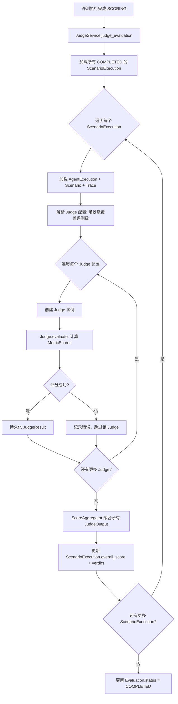

# Phase 4: Judge System（评分系统）

> **Depends on**: `phase-3-runner.md`, `../contracts/judge-spi.md`, `../contracts/domain-model.md`  
> **Referenced by**: `phase-5-report.md`, `phase-6-regression.md`  
> **ADR**: `../decisions/0004-llm-client-for-judge.md`

## 1. 目标

实现 Rule Judge (MUST)、LLM Judge (MUST)、Embedding Judge (MAY——预留扩展点，MVP 可不实现) 三类评分器，多维评分体系，Score Aggregation 聚合逻辑，以及评分任务调度。LLM Judge 通过 `LLMClient` 统一接口调用（而非直接依赖 openai SDK）。本 Phase 产出可对 AgentExecution 自动评分并产出 JudgeResult + MetricScore 的能力。

## 2. 背景

Phase 3 产出了 AgentExecution（含对话内容和 Trace），但尚未评估质量。Judge System 读取 Scenario.expected 和 AgentExecution.conversation，通过不同策略计算各维度指标得分，聚合为 overall_score。指标体系定义详见 `10-metrics-system.md`。

## 3. 模块设计

### 3.1 模块边界

| 模块 | 职责 | 输入 | 输出 |
|------|------|------|------|
| Judge Service | 评分任务调度、结果管理 | AgentExecution | JudgeResult |
| Rule Judge | 基于规则的确定性评分 | Scenario.expected + Conversation | MetricScore[] |
| LLM Judge | 基于 LLM 的语义评分 | Scenario + Conversation + Prompt 模板 | MetricScore[] |
| Embedding Judge | 基于向量的相似度评分 | Response + Reference | MetricScore[] |
| Score Aggregator | 多 Judge 结果加权聚合 | list[JudgeResult] | overall_score + verdict |
| Judge Config Resolver | 场景级/评测级配置合并 | Scenario.judge_config + Evaluation.judge_configs | 最终 Judge 配置 |

### 3.2 依赖关系

```
Phase 4 依赖:
  Phase 3 (AgentExecution, Conversation, Trace)
  Phase 2 (Scenario.expected)
  10-metrics-system (指标定义与计算方式)

Phase 4 产出供后续使用:
  Phase 5 (Report 包含评分结果)
  Phase 6 (Regression 对比 Score Diff)
  Phase 7 (Judge Plugin 扩展)
```

## 4. Judge SPI

> **接口契约**：Judge 基础接口、JudgeContext / JudgeOutput 数据结构、LLMClient 接口、JudgeService 调度、ScoreAggregator 见 `../contracts/judge-spi.md`（MUST/SHOULD/MAY）。

### 4.1 核心接口

```python
# judges/base.py
from abc import ABC, abstractmethod

@dataclass
class JudgeContext:
    """评分上下文"""
    scenario: Scenario
    agent_execution: AgentExecution
    trace: Trace | None
    config: dict  # 合并后的 Judge 配置

@dataclass
class JudgeOutput:
    """评分器输出"""
    judge_type: JudgeType
    metric_scores: list[MetricScore]
    reasoning: str | None = None
    error: str | None = None

class Judge(ABC):
    """评分器 SPI 接口"""

    @abstractmethod
    async def evaluate(self, ctx: JudgeContext) -> JudgeOutput:
        """执行评分"""
        pass

    @property
    @abstractmethod
    def judge_type(self) -> JudgeType:
        """评分器类型"""
        pass

    @abstractmethod
    def supported_metrics(self) -> list[str]:
        """该评分器支持的指标键列表"""
        pass
```

### 4.2 Judge 配置结构

```python
class JudgeConfig(BaseModel):
    """单个评分器配置"""
    judge_type: str  # "rule" | "llm" | "embedding"
    enabled: bool = True
    metrics: list[str] = []  # 评分的指标键列表，空则使用该 Judge 全部支持指标
    weights: dict[str, float] = {}  # 指标权重覆盖，默认各 1.0
    params: dict = {}  # 评分器特定参数

class LLMJudgeParams(BaseModel):
    model: str = "gpt-4o"
    temperature: float = 0.0  # 评分用低温保证一致性
    prompt_template: str = "default"  # 模板 ID 或自定义模板
    max_tokens: int = 1024

class EmbeddingJudgeParams(BaseModel):
    model: str = "text-embedding-3-small"
    threshold: float = 0.75  # 相似度达标阈值
    distance_metric: str = "cosine"  # "cosine" | "euclidean" | "dot"

class RuleJudgeParams(BaseModel):
    case_sensitive: bool = False
    partial_match: bool = True
    forbidden_patterns_action: str = "fail"  # "fail" | "penalize"
```

## 5. Rule Judge

### 5.1 设计

Rule Judge 是确定性评分器，基于 Scenario.expected 中定义的规则进行匹配。不调用任何外部服务。

### 5.2 支持指标

| 指标键 | 计算方式 |
|--------|----------|
| `correctness` | response_contains 全部命中=1.0，每缺一个扣 1/N |
| `forbidden_check` | response_not_contains 全部未命中=1.0，命中任一=0.0 |
| `tool_accuracy` | tool_calls_expected 匹配数 / 总期望数 |
| `intent_match` | expected.intent 在 response 中可识别=1.0，否则=0.0 |

### 5.3 实现

```python
# judges/rule_judge.py
class RuleJudge(Judge):
    judge_type = JudgeType.RULE

    def supported_metrics(self) -> list[str]:
        return ["correctness", "forbidden_check", "tool_accuracy", "intent_match"]

    async def evaluate(self, ctx: JudgeContext) -> JudgeOutput:
        params = RuleJudgeParams(**ctx.config.get("params", {}))
        response_text = ctx.agent_execution.conversation.messages[-1]["content"]
        expected = ctx.scenario.expected
        scores = []

        # correctness: response_contains
        if "response_contains" in expected:
            contains = expected["response_contains"]
            hits = sum(1 for kw in contains if self._match(kw, response_text, params))
            score = hits / len(contains) if contains else 1.0
            scores.append(MetricScore(
                metric_key="correctness", metric_name="Correctness",
                score=round(score, 4), weight=ctx.config.get("weights", {}).get("correctness", 1.0),
                detail={"expected_keywords": contains, "matched": hits},
                reasoning=f"Matched {hits}/{len(contains)} expected keywords"))

        # forbidden_check
        if "response_not_contains" in expected:
            forbidden = expected["response_not_contains"]
            violations = [kw for kw in forbidden if self._match(kw, response_text, params)]
            score = 0.0 if violations else 1.0
            scores.append(MetricScore(
                metric_key="forbidden_check", metric_name="Forbidden Check",
                score=score, weight=ctx.config.get("weights", {}).get("forbidden_check", 0.5),
                detail={"forbidden": forbidden, "violations": violations},
                reasoning=f"{len(violations)} forbidden patterns found"))

        # tool_accuracy
        if "tool_calls_expected" in expected:
            expected_calls = expected["tool_calls_expected"]
            actual_calls = self._extract_tool_calls(ctx.agent_execution)
            matches = sum(1 for ec in expected_calls
                          if self._tool_call_matches(ec, actual_calls, params))
            score = matches / len(expected_calls) if expected_calls else 1.0
            scores.append(MetricScore(
                metric_key="tool_accuracy", metric_name="Tool Accuracy",
                score=round(score, 4), weight=ctx.config.get("weights", {}).get("tool_accuracy", 1.5),
                detail={"expected_count": len(expected_calls), "matched": matches},
                reasoning=f"Matched {matches}/{len(expected_calls)} expected tool calls"))

        # intent_match
        if "intent" in expected:
            expected_intent = expected["intent"]
            score = 1.0 if self._detect_intent(expected_intent, response_text, ctx) else 0.0
            scores.append(MetricScore(
                metric_key="intent_match", metric_name="Intent Match",
                score=score, weight=ctx.config.get("weights", {}).get("intent_match", 1.0),
                detail={"expected_intent": expected_intent},
                reasoning=f"Intent '{expected_intent}' {'detected' if score == 1.0 else 'not detected'}"))

        return JudgeOutput(judge_type=self.judge_type, metric_scores=scores,
                          reasoning="Rule-based evaluation completed")

    def _match(self, keyword: str, text: str, params: RuleJudgeParams) -> bool:
        if params.case_sensitive:
            return keyword in text
        return keyword.lower() in text.lower()

    def _extract_tool_calls(self, execution: AgentExecution) -> list[dict]:
        calls = []
        for msg in execution.conversation.messages:
            if msg.get("tool_calls"):
                for tc in msg["tool_calls"]:
                    calls.append(tc)
        return calls

    def _tool_call_matches(self, expected_call: dict, actual_calls: list[dict],
                           params: RuleJudgeParams) -> bool:
        for ac in actual_calls:
            if ac.get("tool_name") == expected_call.get("tool_name"):
                if not expected_call.get("args_match"):
                    return True
                for key, val in expected_call["args_match"].items():
                    if ac.get("arguments", {}).get(key) != val:
                        break
                else:
                    return True
        return False

    def _detect_intent(self, intent: str, response_text: str, ctx: JudgeContext) -> bool:
        # 简单意图检测：基于关键词
        intent_keywords = {
            "weather_query": ["天气", "weather", "气温"],
            "search": ["搜索", "查找", "search", "find"],
            "booking": ["预订", "预约", "book", "reserve"],
            "calculation": ["计算", "等于", "calculate", "result"],
        }
        keywords = intent_keywords.get(intent, [intent])
        return any(kw.lower() in response_text.lower() for kw in keywords)
```

## 6. LLM Judge

### 6.1 设计

LLM Judge 使用大语言模型对 Agent 回复进行语义级评分。支持自定义 Prompt 模板，低温保证一致性。

### 6.2 支持指标

| 指标键 | 计算方式 |
|--------|----------|
| `correctness` | LLM 对比 reference_answer 判断正确性 |
| `hallucination` | LLM 判断回复中是否存在编造内容 |
| `planning_score` | LLM 评估多步推理质量 |
| `memory_accuracy` | LLM 评估记忆使用是否正确 |
| `coherence` | LLM 评估回复连贯性 |

### 6.3 Prompt 模板

```python
# judges/prompts.py
DEFAULT_LLM_JUDGE_PROMPT = """You are an expert evaluator for AI agent responses.

## Scenario
- Title: {title}
- User Input: {user_message}
- Expected Intent: {intent}
- Reference Answer: {reference_answer}

## Agent Response
{agent_response}

## Tool Calls
{tool_calls_summary}

## Conversation History
{history_summary}

## Evaluation Task
Evaluate the agent's response on the following metrics. For each metric, provide:
1. A score from 0.0 to 1.0 (1.0 = perfect, 0.0 = completely wrong)
2. A brief reasoning (1-2 sentences)

### Metrics to evaluate:
{metrics_instructions}

## Output Format
You MUST respond in valid JSON only:
```json
{{
  "scores": [
    {{
      "metric_key": "<metric_name>",
      "score": <float>,
      "reasoning": "<explanation>"
    }}
  ],
  "overall_reasoning": "<summary>"
}}
```
"""

METRIC_INSTRUCTIONS = {
    "correctness": "correctness: Is the response factually correct and addresses the user's question? Compare with reference answer if available.",
    "hallucination": "hallucination: Score 1.0 means NO hallucination (all content is grounded), 0.0 means severe hallucination. Invert: lower score = more hallucination.",
    "planning_score": "planning_score: If the agent used multi-step reasoning or tool calls, evaluate the quality of the plan. If no planning needed, score 1.0.",
    "memory_accuracy": "memory_accuracy: Did the agent correctly use provided memory/context? If no memory provided, score 1.0.",
    "coherence": "coherence: Is the response coherent, well-structured, and easy to understand?",
}
```

### 6.4 实现

```python
# judges/llm_judge.py
import openai
import json

class LLMJudge(Judge):
    judge_type = JudgeType.LLM

    def supported_metrics(self) -> list[str]:
        return ["correctness", "hallucination", "planning_score", "memory_accuracy", "coherence"]

    async def evaluate(self, ctx: JudgeContext) -> JudgeOutput:
        params = LLMJudgeParams(**ctx.config.get("params", {}))
        metrics = ctx.config.get("metrics", []) or self.supported_metrics()

        prompt = self._build_prompt(ctx, metrics, params)

        client = openai.AsyncOpenAI(
            api_key=resolve_secret(ctx.config.get("api_key_ref", "")),
            base_url=params.model if "://" in params.model else None,
        )

        try:
            completion = await client.chat.completions.create(
                model=params.model,
                messages=[{"role": "user", "content": prompt}],
                temperature=params.temperature,
                max_tokens=params.max_tokens,
                response_format={"type": "json_object"},
            )
            result = json.loads(completion.choices[0].message.content)

            scores = []
            for s in result.get("scores", []):
                if s["metric_key"] in metrics:
                    scores.append(MetricScore(
                        metric_key=s["metric_key"],
                        metric_name=s["metric_key"].replace("_", " ").title(),
                        score=max(0.0, min(1.0, float(s["score"]))),
                        weight=ctx.config.get("weights", {}).get(s["metric_key"], 1.0),
                        reasoning=s.get("reasoning"),
                    ))

            return JudgeOutput(
                judge_type=self.judge_type,
                metric_scores=scores,
                reasoning=result.get("overall_reasoning"),
            )

        except json.JSONDecodeError as e:
            return JudgeOutput(
                judge_type=self.judge_type, metric_scores=[],
                error=f"LLM response not valid JSON: {e}")
        except Exception as e:
            return JudgeOutput(
                judge_type=self.judge_type, metric_scores=[],
                error=f"LLM Judge error: {e}")

    def _build_prompt(self, ctx: JudgeContext, metrics: list[str], params: LLMJudgeParams) -> str:
        template = DEFAULT_LLM_JUDGE_PROMPT
        if params.prompt_template != "default":
            template = load_custom_template(params.prompt_template)

        metric_instructions = "\n".join(
            METRIC_INSTRUCTIONS.get(m, f"{m}: Evaluate this metric.") for m in metrics)

        conv = ctx.agent_execution.conversation
        response_text = conv.messages[-1]["content"] if conv.messages else ""
        tool_calls_summary = json.dumps(
            [{"tool": tc.get("tool_name"), "args": tc.get("arguments")}
             for msg in conv.messages for tc in msg.get("tool_calls", [])],
            ensure_ascii=False, indent=2)
        history_summary = "\n".join(
            f"[{m['role']}] {m['content'][:200]}" for m in ctx.scenario.history)

        return template.format(
            title=ctx.scenario.title,
            user_message=ctx.scenario.input_data.get("user_message", ""),
            intent=ctx.scenario.expected.get("intent", "N/A"),
            reference_answer=ctx.scenario.expected.get("reference_answer", "N/A"),
            agent_response=response_text,
            tool_calls_summary=tool_calls_summary or "No tool calls",
            history_summary=history_summary or "No history",
            metrics_instructions=metric_instructions,
        )
```

## 7. Embedding Judge (MAY)

> **状态**: 预留扩展点。MVP 可不实现，留接口定义即可。待 LLMClient 支持 Embedding 方法后启用。

### 7.1 设计

Embedding Judge 使用向量相似度评估回复与参考答案的语义匹配度。

### 7.2 支持指标

| 指标键 | 计算方式 |
|--------|----------|
| `semantic_similarity` | cosine_similarity(embed(response), embed(reference)) |
| `semantic_pass` | similarity >= threshold ? 1.0 : 0.0 |

### 7.3 实现

```python
# judges/embedding_judge.py
import numpy as np
import openai

class EmbeddingJudge(Judge):
    judge_type = JudgeType.EMBEDDING

    def supported_metrics(self) -> list[str]:
        return ["semantic_similarity", "semantic_pass"]

    async def evaluate(self, ctx: JudgeContext) -> JudgeOutput:
        params = EmbeddingJudgeParams(**ctx.config.get("params", {}))

        reference = ctx.scenario.expected.get("reference_answer")
        if not reference:
            return JudgeOutput(
                judge_type=self.judge_type, metric_scores=[],
                reasoning="No reference_answer provided, skipping embedding judge")

        conv = ctx.agent_execution.conversation
        response_text = conv.messages[-1]["content"] if conv.messages else ""

        client = openai.AsyncOpenAI(api_key=resolve_secret(ctx.config.get("api_key_ref", "")))

        try:
            resp = await client.embeddings.create(
                model=params.model,
                input=[response_text, reference],
            )
            emb_response = np.array(resp.data[0].embedding)
            emb_reference = np.array(resp.data[1].embedding)

            similarity = self._cosine_similarity(emb_response, emb_reference)
            scores = [
                MetricScore(
                    metric_key="semantic_similarity",
                    metric_name="Semantic Similarity",
                    score=round(float(similarity), 4),
                    weight=ctx.config.get("weights", {}).get("semantic_similarity", 1.0),
                    detail={"model": params.model, "distance_metric": params.distance_metric},
                    reasoning=f"Cosine similarity: {similarity:.4f}",
                ),
                MetricScore(
                    metric_key="semantic_pass",
                    metric_name="Semantic Pass",
                    score=1.0 if similarity >= params.threshold else 0.0,
                    weight=ctx.config.get("weights", {}).get("semantic_pass", 0.5),
                    detail={"threshold": params.threshold, "actual": float(similarity)},
                    reasoning=f"{'Above' if similarity >= params.threshold else 'Below'} threshold {params.threshold}",
                ),
            ]

            return JudgeOutput(judge_type=self.judge_type, metric_scores=scores,
                              reasoning=f"Embedding similarity: {similarity:.4f}")

        except Exception as e:
            return JudgeOutput(judge_type=self.judge_type, metric_scores=[],
                              error=f"Embedding Judge error: {e}")

    def _cosine_similarity(self, a: np.ndarray, b: np.ndarray) -> float:
        return float(np.dot(a, b) / (np.linalg.norm(a) * np.linalg.norm(b)))
```

## 8. Score Aggregation

### 8.1 聚合规则

```python
# services/score_aggregator.py
class ScoreAggregator:
    """多 Judge 结果加权聚合"""

    def aggregate(self, judge_outputs: list[JudgeOutput],
                  weights: dict[str, float] | None = None) -> tuple[float, str]:
        """
        聚合所有 Judge 的 MetricScore 为 overall_score 和 overall_verdict。

        规则:
        1. 同一 metric_key 的得分取所有 Judge 的加权平均
        2. overall_score = sum(metric_score * metric_weight) / sum(metric_weight)
        3. verdict:
           - overall_score >= 0.8 → "pass"
           - overall_score >= 0.5 → "partial"
           - overall_score < 0.5 → "fail"
        """
        weights = weights or {}
        metric_scores: dict[str, list[tuple[float, float]]] = {}  # key → [(score, weight)]

        for output in judge_outputs:
            if output.error:
                continue
            for ms in output.metric_scores:
                weight = ms.weight or weights.get(ms.metric_key, 1.0)
                metric_scores.setdefault(ms.metric_key, []).append((ms.score, weight))

        if not metric_scores:
            return 0.0, "fail"

        # 每个指标取加权平均
        metric_aggregated: dict[str, float] = {}
        metric_weight_map: dict[str, float] = {}
        for key, scores_weights in metric_scores.items():
            total_w = sum(w for _, w in scores_weights)
            weighted_sum = sum(s * w for s, w in scores_weights)
            metric_aggregated[key] = weighted_sum / total_w if total_w > 0 else 0.0
            metric_weight_map[key] = weights.get(key, 1.0)

        # 全局加权平均
        total_weight = sum(metric_weight_map.values())
        overall = sum(score * metric_weight_map[key]
                      for key, score in metric_aggregated.items()) / total_weight

        overall = round(max(0.0, min(1.0, overall)), 4)

        if overall >= 0.8:
            verdict = "pass"
        elif overall >= 0.5:
            verdict = "partial"
        else:
            verdict = "fail"

        return overall, verdict
```

### 8.2 聚合示例

```
Judge: RuleJudge
  correctness: 0.8 (weight=1.0)
  tool_accuracy: 0.5 (weight=1.5)
  forbidden_check: 1.0 (weight=0.5)

Judge: LLMJudge
  correctness: 0.9 (weight=1.0)
  hallucination: 0.85 (weight=2.0)  # 注意：hallucination 1.0 = 无幻觉
  coherence: 0.95 (weight=1.0)

聚合:
  correctness: (0.8*1.0 + 0.9*1.0) / (1.0+1.0) = 0.85 (weight=1.0)
  tool_accuracy: 0.5 (weight=1.5)
  forbidden_check: 1.0 (weight=0.5)
  hallucination: 0.85 (weight=2.0)
  coherence: 0.95 (weight=1.0)

  overall = (0.85*1.0 + 0.5*1.5 + 1.0*0.5 + 0.85*2.0 + 0.95*1.0) / (1.0+1.5+0.5+2.0+1.0)
          = (0.85 + 0.75 + 0.50 + 1.70 + 0.95) / 6.0
          = 4.75 / 6.0
          = 0.7917
  verdict = "partial"
```

## 9. Judge Service

### 9.1 评分调度流程

```python
# services/judge_service.py
class JudgeService:

    def __init__(self, session_factory):
        self.session_factory = session_factory
        self.registry = JudgeRegistry()
        self.aggregator = ScoreAggregator()

    async def judge_evaluation(self, evaluation_id: UUID):
        """对评测下所有完成的 AgentExecution 执行评分"""
        session = await self.session_factory()
        exec_repo = ScenarioExecutionRepository(session)

        executions = await exec_repo.get_by_evaluation(
            evaluation_id, status=ScenarioExecutionStatus.COMPLETED)

        for exec_record in executions:
            if exec_record.judge_results:
                continue  # 已评分
            await self._judge_single(session, exec_record)

        # 更新 Evaluation 状态
        eval_repo = EvaluationRepository(session)
        await eval_repo.update_status(evaluation_id, EvaluationStatus.COMPLETED)

    async def _judge_single(self, session, scenario_exec: ScenarioExecution):
        """对单个 ScenarioExecution 执行所有配置的 Judge"""
        # 加载关联数据
        agent_exec = await self._load_agent_execution(session, scenario_exec.id)
        scenario = await self._load_scenario(session, scenario_exec.scenario_id)
        trace = await self._load_trace(session, agent_exec.trace_id) if agent_exec.trace_id else None

        # 解析 Judge 配置
        judge_configs = self._resolve_judge_configs(scenario, scenario_exec.evaluation)
        ctx = JudgeContext(scenario=scenario, agent_execution=agent_exec,
                          trace=trace, config={})

        outputs = []
        for jc in judge_configs:
            if not jc.get("enabled", True):
                continue
            judge = self.registry.create(jc["judge_type"], jc)
            ctx.config = jc
            try:
                output = await judge.evaluate(ctx)
                outputs.append(output)

                # 持久化 JudgeResult
                await self._save_judge_result(session, scenario_exec.id, judge, output)
            except Exception as e:
                logger.error("judge.failed", judge_type=jc["judge_type"],
                            scenario_exec_id=str(scenario_exec.id), error=str(e))

        # 聚合
        overall_score, verdict = self.aggregator.aggregate(outputs)
        scenario_exec.overall_score = overall_score
        scenario_exec.overall_verdict = verdict
        await session.flush()
```

### 9.2 Judge Registry

```python
# judges/registry.py
class JudgeRegistry:
    _judges: dict[str, type[Judge]] = {}

    @classmethod
    def register(cls, judge_type: str, judge_class: type[Judge]):
        cls._judges[judge_type] = judge_class

    def create(self, judge_type: str, config: dict) -> Judge:
        if judge_type not in self._judges:
            raise ValueError(f"Unknown judge type: {judge_type}")
        return self._judges[judge_type]()

# 默认注册
JudgeRegistry.register("rule", RuleJudge)
JudgeRegistry.register("llm", LLMJudge)
JudgeRegistry.register("embedding", EmbeddingJudge)
```

### 9.3 配置合并

```python
def _resolve_judge_configs(self, scenario: Scenario, evaluation: Evaluation) -> list[dict]:
    """合并场景级和评测级的 Judge 配置
    场景级 judge_config 优先于评测级。
    """
    base_configs = copy.deepcopy(evaluation.judge_configs)
    scenario_override = scenario.judge_config

    if not scenario_override:
        return base_configs

    # 场景级覆盖：找到同 type 的配置合并
    for sc in scenario_override.get("judges", []):
        found = False
        for bc in base_configs:
            if bc["judge_type"] == sc["judge_type"]:
                bc.update(sc)  # 浅合并
                found = True
                break
        if not found:
            base_configs.append(sc)

    # 应用场景级权重覆盖
    global_weights = scenario_override.get("weights", {})
    for bc in base_configs:
        bc.setdefault("weights", {}).update(global_weights)

    return base_configs
```

## 10. 数据结构

### 10.1 JudgeResult ORM Model

```python
# infra/models/judge_result_model.py
class JudgeResultModel(BaseModel):
    __tablename__ = "judge_results"
    scenario_execution_id: Mapped[UUID] = mapped_column(
        PGUUID(as_uuid=True), ForeignKey("scenario_executions.id"), nullable=False)
    judge_type: Mapped[str] = mapped_column(String(16), nullable=False)
    judge_config: Mapped[dict] = mapped_column(JSONB, nullable=False)
    status: Mapped[str] = mapped_column(String(16), nullable=False)
    metric_scores: Mapped[list] = mapped_column(JSONB, nullable=False)  # 序列化的 MetricScore 列表
    overall_score: Mapped[float | None] = mapped_column(Float)
    overall_verdict: Mapped[str | None] = mapped_column(String(16))
    reasoning: Mapped[str | None] = mapped_column(Text)
    started_at: Mapped[datetime] = mapped_column(DateTime(timezone=True), nullable=False)
    completed_at: Mapped[datetime | None] = mapped_column(DateTime(timezone=True))
    error_message: Mapped[str | None] = mapped_column(Text)
```

## 11. API 设计

| Method | Path | 说明 |
|--------|------|------|
| POST | `/api/v1/evaluations/{evaluation_id}/judge` | 手动触发评分 |
| GET | `/api/v1/scenario-executions/{exec_id}/judge-results` | 获取执行的所有评分结果 |
| GET | `/api/v1/judge-results/{result_id}` | 获取单个评分结果 |
| POST | `/api/v1/projects/{project_id}/judge-configs/validate` | 校验 Judge 配置 |

**POST /api/v1/evaluations/{evaluation_id}/judge**

触发对评测下所有已完成 ScenarioExecution 的评分。返回 202 + 任务 ID。

**GET /api/v1/scenario-executions/{exec_id}/judge-results**

```json
{
  "code": 0,
  "data": {
    "items": [
      {
        "id": "uuid",
        "scenario_execution_id": "uuid",
        "judge_type": "rule",
        "status": "completed",
        "metric_scores": [
          {
            "metric_key": "correctness",
            "metric_name": "Correctness",
            "score": 0.8,
            "max_score": 1.0,
            "weight": 1.0,
            "detail": {"expected_keywords": ["北京", "天气"], "matched": 2},
            "reasoning": "Matched 2/2 expected keywords"
          }
        ],
        "overall_score": 0.8,
        "overall_verdict": "pass",
        "reasoning": "Rule-based evaluation completed",
        "started_at": "2026-07-04T12:00:00Z",
        "completed_at": "2026-07-04T12:00:01Z"
      }
    ]
  }
}
```

## 12. 流程图

### 12.1 评分调度流程



### 12.2 配置合并流程

```
Evaluation.judge_configs:
  [{judge_type: "rule", metrics: ["correctness", "tool_accuracy"]},
   {judge_type: "llm", metrics: ["correctness", "hallucination"]}]

Scenario.judge_config:
  {judges: [{judge_type: "rule", weights: {"tool_accuracy": 2.0}}],
   weights: {"correctness": 1.5}}

合并结果:
  [{judge_type: "rule", metrics: ["correctness", "tool_accuracy"],
    weights: {"tool_accuracy": 2.0, "correctness": 1.5}},
   {judge_type: "llm", metrics: ["correctness", "hallucination"],
    weights: {"correctness": 1.5}}]
```

## 13. 异常设计

| 场景 | 错误码 | HTTP | message |
|------|--------|------|---------|
| Judge 类型不支持 | 40601 | 400 | `Unknown judge type: {type}` |
| Judge 配置无效 | 40602 | 400 | `Invalid judge config: {detail}` |
| LLM Judge 调用失败 | 50601 | - | 内部错误，记录到 JudgeResult.error_message |
| Embedding 服务不可用 | 50602 | - | 内部错误 |
| ScenarioExecution 不存在 | 40406 | 404 | `ScenarioExecution not found` |
| 评测未完成不可评分 | 40906 | 409 | `Evaluation is not in SCORING state` |

## 14. 扩展点

| 扩展点 | 接口 | 说明 |
|--------|------|------|
| Judge | `Judge` 抽象类 | 新增评分策略只需实现接口并注册 |
| Prompt Template | `PromptTemplate` 接口 | LLM Judge 可注册自定义模板 |
| Score Aggregator | `ScoreAggregator` 类 | 可替换聚合策略（如几何平均、最大最小） |
| Verdict Policy | `VerdictPolicy` 接口 | 可自定义 pass/partial/fail 阈值 |
| Intent Detector | `IntentDetector` 接口 | Rule Judge 的意图检测可扩展 |

## 15. Task 分解

### Task 4.1: OpenAILLMClient 实现
- **Goal**: 实现基于 OpenAI SDK 的 LLMClient
- **Inputs**: `../contracts/judge-spi.md` (LLMClient 接口), Phase 1 (core/llm_client.py)
- **Outputs**: `llm/openai_client.py`
- **Dependencies**: Phase 1 Task 1.5
- **Implementation Notes**: 实现 complete() + validate_config() + provider
- **Acceptance Criteria**: OpenAILLMClient 可调用 OpenAI API 并返回 LLMResponse
- **Files**: `llm/openai_client.py`, `llm/__init__.py`

### Task 4.2: JudgeRegistry + Judge 基类
- **Goal**: 统一 Judge 注册表
- **Inputs**: `../contracts/judge-spi.md`
- **Outputs**: `judges/registry.py`, `judges/base.py`
- **Dependencies**: Phase 1 (Registry 基类)
- **Acceptance Criteria**: JudgeRegistry 可注册并创建 Judge 实例
- **Files**: `judges/registry.py`, `judges/base.py`

### Task 4.3: Rule Judge 实现
- **Goal**: 确定性规则评分器
- **Inputs**: Task 4.2
- **Outputs**: `judges/builtin/rule_judge.py`
- **Dependencies**: Task 4.2
- **Acceptance Criteria**: response_contains / not_contains / tool_calls 全部通过
- **Files**: `judges/builtin/rule_judge.py`

### Task 4.4: LLM Judge 实现
- **Goal**: 基于 LLMClient 的语义评分器
- **Inputs**: Task 4.1, Task 4.2
- **Outputs**: `judges/builtin/llm_judge.py`
- **Dependencies**: Task 4.1, Task 4.2
- **Implementation Notes**: 通过 LLMClient.complete() 调用，不直接依赖 openai SDK
- **Acceptance Criteria**: LLM Judge 返回 JSON 格式 scores + reasoning
- **Files**: `judges/builtin/llm_judge.py`, `judges/prompts/`

### Task 4.5: Score Aggregator + Verdict
- **Goal**: 加权聚合 + 判定逻辑
- **Inputs**: Task 4.3, Task 4.4
- **Outputs**: `services/score_aggregator.py`
- **Dependencies**: Task 4.2
- **Implementation Notes**: 动态指标集合，新增 Judge 无需修改 Aggregator
- **Acceptance Criteria**: 多 Judge 结果加权聚合正确；verdict 按阈值判定
- **Files**: `services/score_aggregator.py`

### Task 4.6: JudgeService 调度
- **Goal**: 配置解析 + 多 Judge 编排 + 结果持久化
- **Inputs**: Task 4.3-4.5
- **Outputs**: `services/judge_service.py`
- **Dependencies**: Task 4.3, Task 4.4, Task 4.5, Phase 3 (AgentExecution)
- **Acceptance Criteria**: JudgeService 可对 AgentExecution 执行评分并产出 JudgeResult
- **Files**: `services/judge_service.py`

### Task 4.7: Judge API
- **Goal**: 评分结果查询 + 配置校验 API
- **Inputs**: Task 4.6
- **Outputs**: `api/v1/judges.py`
- **Dependencies**: Task 4.6
- **Acceptance Criteria**: API 可查询 JudgeResult + 校验 judge_config
- **Files**: `api/v1/judges.py`

## 16. 验收标准

| 编号 | 验收项 | 验证方式 |
|------|--------|----------|
| AC-P4-01 | Rule Judge 对 response_contains 全部命中返回 correctness=1.0 | 单元测试 |
| AC-P4-02 | Rule Judge 对 response_not_contains 命中返回 forbidden_check=0.0 | 单元测试 |
| AC-P4-03 | Rule Judge 对 tool_calls_expected 匹配返回正确比例 | 单元测试 |
| AC-P4-04 | LLM Judge 返回 JSON 格式且包含 scores 数组 | Mock LLM 测试 |
| AC-P4-05 | LLM Judge score 范围在 [0.0, 1.0] | 单元测试 |
| AC-P4-06 | Embedding Judge cosine_similarity 计算正确 | 单元测试 |
| AC-P4-07 | semantic_pass 在阈值以上返回 1.0 | 单元测试 |
| AC-P4-08 | 多 Judge 聚合后 overall_score 正确计算 | 单元测试 |
| AC-P4-09 | overall_verdict 按 0.8/0.5 阈值判定 | 单元测试 |
| AC-P4-10 | 场景级 judge_config 覆盖评测级 | 集成测试 |
| AC-P4-11 | Judge 失败时 JudgeResult.status=FAILED 且 error_message 非空 | 集成测试 |
| AC-P4-12 | 评分完成后 Evaluation.status=COMPLETED | 集成测试 |
| AC-P4-13 | LLM Judge temperature=0 保证可复现性 | 多次调用对比 |
| AC-P4-14 | 无 reference_answer 时 Embedding Judge 跳过 | 单元测试 |
| AC-P4-15 | judge-configs/validate 返回校验结果 | curl |
