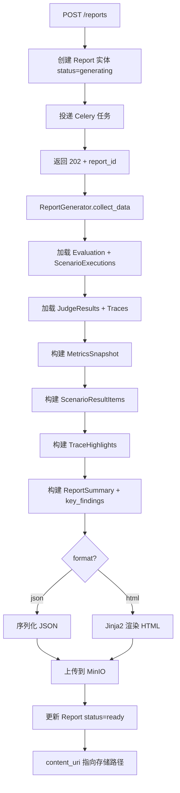

# Phase 5: Trace & Report（可观测系统）

> **Depends on**: `phase-3-runner.md`, `phase-4-judge.md`, `../contracts/domain-model.md`  
> **Referenced by**: `phase-6-regression.md`  
> **ADR**: `../decisions/0002-conversation-trace-jsonb-storage.md`

## 1. 目标

实现完整 Trace Tree 可视化、Execution Timeline、Tool/Prompt/Memory 操作记录，以及 **JSON + HTML** 格式的评测报告生成（两者均为 MVP 必做）。衍生指标通过 **Derived Metric Provider** 注册式访问（而非直接暴露 trace.get_derived()）。本 Phase 将 Phase 3 的基础 Trace 采集扩展为完整的可观测体系，并产出可读的评测报告。

## 2. 背景

Phase 3 的 TraceCollector 已采集了基础 Span，但仅以 JSONB 存储在数据库中。本 Phase 需要：(1) 提供 Trace 树的查询与可视化 API；(2) 构建 Execution Timeline 展示执行时序；(3) 生成包含摘要、指标分布、失败分析、Trace 详情的评测报告。

## 3. 模块设计

### 3.1 模块边界

| 模块 | 职责 | 输入 | 输出 |
|------|------|------|------|
| Trace Query Service | Trace 树查询、Span 筛选 | trace_id / execution_id | Trace 树结构 |
| Trace Enricher | 补全 Span 元数据、计算衍生指标 | 原始 Trace | 增强 Trace |
| Timeline Builder | 构建执行时间线 | Trace + AgentExecution | Timeline 数据 |
| Report Generator | 生成 JSON / HTML 报告 | Evaluation + 所有结果 | Report 文件 |
| Report Template Engine | HTML 模板渲染 | 报告数据 + 模板 | HTML 文件 |
| Report Storage | 报告文件存储与下载 | 生成的文件 | 存储路径 |

### 3.2 依赖关系

```
Phase 5 依赖:
  Phase 3 (AgentExecution, Trace 数据)
  Phase 4 (JudgeResult, MetricScore)
  01-domain-model (Trace, Report 定义)

Phase 5 产出供后续使用:
  Phase 6 (Regression 引用 Report 做对比)
  Phase 7 (Report Plugin 扩展模板)
```

## 4. Trace Tree 设计

### 4.1 Trace 查询 API

| Method | Path | 说明 |
|--------|------|------|
| GET | `/api/v1/traces/{trace_id}` | 获取完整 Trace 树 |
| GET | `/api/v1/traces/{trace_id}/spans` | 获取扁平 Span 列表 |
| GET | `/api/v1/traces/{trace_id}/timeline` | 获取时间线视图 |
| GET | `/api/v1/agent-executions/{exec_id}/trace` | 通过执行 ID 获取 Trace |

**GET /api/v1/traces/{trace_id}**

```json
{
  "code": 0,
  "data": {
    "id": "trace-uuid",
    "agent_execution_id": "exec-uuid",
    "span_count": 15,
    "total_llm_calls": 3,
    "total_tool_calls": 5,
    "total_tokens": {"prompt": 1200, "completion": 350},
    "started_at": "2026-07-04T12:00:00.000Z",
    "completed_at": "2026-07-04T12:00:12.500Z",
    "root_span": {
      "id": "span-001",
      "trace_id": "trace-uuid",
      "parent_id": null,
      "span_type": "root",
      "name": "scenario:S001",
      "input_data": {"scenario_id": "scn-uuid"},
      "output_data": {"status": "completed"},
      "started_at": "2026-07-04T12:00:00.000Z",
      "completed_at": "2026-07-04T12:00:12.500Z",
      "duration_ms": 12500,
      "status": "ok",
      "attributes": {},
      "children": [
        {
          "id": "span-002",
          "parent_id": "span-001",
          "span_type": "llm_call",
          "name": "openai_call_gpt-4o",
          "input_data": {
            "model": "gpt-4o",
            "messages": [{"role": "user", "content": "北京明天天气"}],
            "temperature": 0.7
          },
          "output_data": {
            "response": "让我帮你查一下...",
            "tokens": {"prompt": 50, "completion": 20},
            "finish_reason": "tool_calls"
          },
          "duration_ms": 1500,
          "status": "ok",
          "children": [
            {
              "id": "span-003",
              "parent_id": "span-002",
              "span_type": "tool_call",
              "name": "tool_get_weather",
              "input_data": {"tool_name": "get_weather", "arguments": {"location": "北京"}},
              "output_data": {"result": {"temp": 30, "condition": "晴"}, "status": "success"},
              "duration_ms": 200,
              "status": "ok",
              "children": []
            }
          ]
        }
      ]
    }
  }
}
```

### 4.2 Derived Metric Provider

> 衍生指标通过注册式 Provider 暴露，不直接将计算逻辑放在 Trace 实体内。访问方式：`derived_metrics.get("name")`。

```python
# services/derived_metrics.py
from abc import ABC, abstractmethod

class DerivedMetricProvider(ABC):
    """MUST: 衍生指标计算 Provider"""
    @abstractmethod
    def name(self) -> str: ...

    @abstractmethod
    def compute(self, trace: Trace) -> float | dict: ...

class DerivedMetricRegistry:
    """Provider 注册表"""
    _providers: dict[str, DerivedMetricProvider] = {}

    @classmethod
    def register(cls, provider: DerivedMetricProvider):
        cls._providers[provider.name()] = provider

    @classmethod
    def get(cls, name: str, trace: Trace) -> float | dict:
        if name not in cls._providers:
            raise KeyError(f"Unknown derived metric: {name}")
        return cls._providers[name].compute(trace)

    @classmethod
    def compute_all(cls, trace: Trace) -> dict[str, float | dict]:
        return {name: p.compute(trace) for name, p in cls._providers.items()}
```

### 4.3 内置 Provider

| Provider | name | 计算方式 |
|----------|------|----------|
| SelfTimeMsProvider | `self_time_ms` | span.duration_ms - sum(child.duration_ms) |
| TokenUsageProvider | `total_tokens` | 遍历 llm_call spans 求和 |
| ToolSuccessRateProvider | `tool_success_rate` | success_count / total_tool_calls |

### 4.4 TraceEnricher

```python
# services/trace_enricher.py
class TraceEnricher:
    """补全 Trace Span 的衍生信息"""

    def enrich(self, trace: Trace) -> Trace:
        self._enrich_span(trace.root_span, depth=0)
        return trace

    def _enrich_span(self, span: TraceSpan, depth: int):
        # 添加深度属性
        span.attributes["depth"] = depth

        # 计算子 Span 总耗时占比
        if span.children:
            child_duration = sum(c.duration_ms for c in span.children)
            span.attributes["child_duration_ms"] = child_duration
            span.attributes["self_time_ms"] = max(0, span.duration_ms - child_duration)
            span.attributes["child_ratio"] = round(
                child_duration / span.duration_ms, 4) if span.duration_ms > 0 else 0.0
        else:
            span.attributes["self_time_ms"] = span.duration_ms
            span.attributes["child_ratio"] = 0.0

        # 标注 LLM 调用的 token 消耗
        if span.span_type == TraceSpanType.LLM_CALL:
            tokens = span.output_data.get("tokens", {})
            span.attributes["prompt_tokens"] = tokens.get("prompt", 0)
            span.attributes["completion_tokens"] = tokens.get("completion", 0)
            span.attributes["total_tokens"] = sum(tokens.values())

        # 标注工具调用状态
        if span.span_type == TraceSpanType.TOOL_CALL:
            span.attributes["tool_name"] = span.input_data.get("tool_name", "unknown")
            span.attributes["tool_status"] = span.output_data.get("status", "unknown")

        # 递归处理子 Span
        for child in span.children:
            self._enrich_span(child, depth + 1)
```

### 4.3 Timeline 数据结构

```python
# schemas/trace.py
class TimelineEvent(BaseModel):
    span_id: str
    name: str
    span_type: str
    start_ms: int          # 相对于 Trace 开始的毫秒偏移
    duration_ms: int
    depth: int             # 嵌套深度
    status: str
    label: str             # 简短标签（如 "LLM: gpt-4o" / "Tool: get_weather"）

class TimelineResponse(BaseModel):
    trace_id: UUID
    total_duration_ms: int
    events: list[TimelineEvent]
    lanes: dict[str, list[TimelineEvent]]  # 按类型分组的时间线

class TraceSpanResponse(BaseModel):
    id: str
    trace_id: str
    parent_id: str | None
    span_type: str
    name: str
    input_data: dict
    output_data: dict
    started_at: datetime
    completed_at: datetime | None
    duration_ms: int
    status: str
    attributes: dict
    children: list["TraceSpanResponse"]
```

### 4.4 Timeline Builder

```python
# services/timeline_builder.py
class TimelineBuilder:
    def build(self, trace: Trace) -> TimelineResponse:
        events = []
        trace_start = trace.started_at

        def _walk(span: TraceSpan, depth: int):
            start_ms = int((span.started_at - trace_start).total_seconds() * 1000)
            label = self._make_label(span)
            events.append(TimelineEvent(
                span_id=span.id, name=span.name, span_type=span.span_type,
                start_ms=start_ms, duration_ms=span.duration_ms,
                depth=depth, status=span.status, label=label))
            for child in span.children:
                _walk(child, depth + 1)

        _walk(trace.root_span, 0)
        events.sort(key=lambda e: e.start_ms)

        lanes = self._group_by_type(events)

        return TimelineResponse(
            trace_id=trace.id,
            total_duration_ms=int((trace.completed_at - trace_start).total_seconds() * 1000),
            events=events, lanes=lanes)

    def _make_label(self, span: TraceSpan) -> str:
        if span.span_type == "llm_call":
            model = span.input_data.get("model", "unknown")
            return f"LLM: {model}"
        elif span.span_type == "tool_call":
            tool = span.input_data.get("tool_name", "unknown")
            return f"Tool: {tool}"
        elif span.span_type == "retrieval":
            return f"Retrieval: {span.name}"
        elif span.span_type == "memory_read":
            return f"Memory Read: {span.name}"
        elif span.span_type == "memory_write":
            return f"Memory Write: {span.name}"
        return span.name

    def _group_by_type(self, events: list[TimelineEvent]) -> dict[str, list[TimelineEvent]]:
        lanes = {}
        for e in events:
            lanes.setdefault(e.span_type, []).append(e)
        return lanes
```

## 5. Report 生成

### 5.1 Report 数据模型

```python
# schemas/report.py
class ReportData(BaseModel):
    """报告渲染数据"""
    evaluation: EvaluationSummary
    metrics: MetricsSnapshot
    scenario_results: list[ScenarioResultItem]
    trace_highlights: list[TraceHighlight]
    summary: ReportSummary

class EvaluationSummary(BaseModel):
    id: UUID
    name: str
    version_label: str | None
    dataset_name: str
    dataset_version: str
    agent_config: dict
    status: str
    started_at: datetime | None
    completed_at: datetime | None
    duration_seconds: int

class MetricsSnapshot(BaseModel):
    scenario_count: int
    executed_count: int
    scored_count: int
    pass_rate: float
    metric_aggregates: dict
    cost_total_usd: float
    latency_avg_ms: float
    latency_p50_ms: float
    latency_p95_ms: float
    latency_p99_ms: float

class ScenarioResultItem(BaseModel):
    scenario_id: UUID
    external_id: str
    title: str
    status: str
    overall_score: float | None
    overall_verdict: str | None
    latency_ms: int | None
    cost_usd: float | None
    metric_scores: dict[str, float]  # {metric_key: score}
    tags: list[str]
    error_message: str | None

class TraceHighlight(BaseModel):
    scenario_external_id: str
    span_type: str
    span_name: str
    duration_ms: int
    status: str
    detail: str  # 如 "Slowest LLM call" / "Failed tool call"

class ReportSummary(BaseModel):
    total_scenarios: int
    pass_rate: float
    overall_score: float
    failed_scenarios: int
    top_failed_metrics: list[dict]
    cost_total_usd: float
    duration_seconds: int
    key_findings: list[str]  # 自动生成的关键发现
```

### 5.2 Report Generator

```python
# services/report_generator.py
from jinja2 import Environment, FileSystemLoader
import json

class ReportGenerator:
    def __init__(self, session_factory, storage_client):
        self.session_factory = session_factory
        self.storage = storage_client
        self.jinja_env = Environment(
            loader=FileSystemLoader("templates/reports/"),
            autoescape=True,
        )

    async def generate_report(self, evaluation_id: UUID, fmt: ReportFormat) -> Report:
        """生成评测报告"""
        # 1. 收集数据
        report_data = await self._collect_data(evaluation_id)

        # 2. 创建 Report 实体
        report = Report(
            id=uuid4(), evaluation_id=evaluation_id,
            format=fmt, status="generating",
            created_at=datetime.now(timezone.utc),
        )

        # 3. 生成内容
        if fmt == ReportFormat.JSON:
            content = self._generate_json(report_data)
            content_type = "application/json"
            ext = "json"
        elif fmt == ReportFormat.HTML:
            content = self._generate_html(report_data)
            content_type = "text/html"
            ext = "html"
        else:
            raise ValueError(f"Unsupported format: {fmt}")

        # 4. 上传到对象存储
        object_key = f"reports/{evaluation_id}/{report.id}.{ext}"
        uri = await self.storage.upload(object_key, content, content_type)

        # 5. 更新 Report
        report.content_uri = uri
        report.status = "ready"
        report.summary = report_data.summary.model_dump()
        report.metrics_snapshot = report_data.metrics.model_dump()
        report.completed_at = datetime.now(timezone.utc)

        return report

    async def _collect_data(self, evaluation_id: UUID) -> ReportData:
        session = await self.session_factory()
        eval_repo = EvaluationRepository(session)
        exec_repo = ScenarioExecutionRepository(session)

        evaluation = await eval_repo.get_by_id(evaluation_id)
        executions = await exec_repo.get_by_evaluation(evaluation_id)

        # 构建摘要
        eval_summary = EvaluationSummary(
            id=evaluation.id, name=evaluation.name,
            version_label=evaluation.version_label,
            dataset_name=evaluation.dataset.name,
            dataset_version=evaluation.dataset.version,
            agent_config=evaluation.agent_config,
            status=evaluation.status,
            started_at=evaluation.started_at,
            completed_at=evaluation.completed_at,
            duration_seconds=int((evaluation.completed_at - evaluation.started_at).total_seconds())
            if evaluation.started_at and evaluation.completed_at else 0)

        # 构建指标快照
        metrics = self._compute_metrics(executions)

        # 构建场景结果
        scenario_results = [self._build_result_item(e) for e in executions]

        # 构建 Trace 高亮
        trace_highlights = await self._collect_trace_highlights(executions)

        # 构建摘要
        summary = self._build_summary(metrics, scenario_results)

        return ReportData(
            evaluation=eval_summary, metrics=metrics,
            scenario_results=scenario_results,
            trace_highlights=trace_highlights, summary=summary)

    def _compute_metrics(self, executions: list[ScenarioExecution]) -> MetricsSnapshot:
        scored = [e for e in executions if e.overall_score is not None]
        scores = [e.overall_score for e in scored]
        latencies = [e.agent_execution.latency_ms for e in executions
                     if e.agent_execution and e.agent_execution.latency_ms]
        costs = [e.agent_execution.cost_usd for e in executions
                 if e.agent_execution and e.agent_execution.cost_usd]

        metric_aggregates = self._aggregate_metric_scores(scored)

        return MetricsSnapshot(
            scenario_count=len(executions),
            executed_count=len([e for e in executions if e.status == "completed"]),
            scored_count=len(scored),
            pass_rate=len([s for s in scores if s >= 0.8]) / len(scores) if scores else 0.0,
            metric_aggregates=metric_aggregates,
            cost_total_usd=sum(costs) if costs else 0.0,
            latency_avg_ms=sum(latencies) / len(latencies) if latencies else 0.0,
            latency_p50_ms=self._percentile(latencies, 50),
            latency_p95_ms=self._percentile(latencies, 95),
            latency_p99_ms=self._percentile(latencies, 99),
        )

    def _aggregate_metric_scores(self, scored_execs) -> dict:
        metric_values: dict[str, list[float]] = {}
        for exec in scored_execs:
            for jr in exec.judge_results:
                for ms in jr.metric_scores:
                    metric_values.setdefault(ms.metric_key, []).append(ms.score)

        aggregates = {}
        for key, values in metric_values.items():
            aggregates[key] = {
                "mean": round(sum(values) / len(values), 4),
                "std": round(np.std(values), 4),
                "min": round(min(values), 4),
                "max": round(max(values), 4),
                "p50": round(self._percentile(values, 50), 4),
                "p95": round(self._percentile(values, 95), 4),
            }
        return aggregates

    def _build_summary(self, metrics: MetricsSnapshot, results: list) -> ReportSummary:
        failed = [r for r in results if r.overall_verdict in ("fail", None)]
        metric_fails = {}
        for r in results:
            if r.overall_verdict in ("fail", "partial"):
                for key, score in r.metric_scores.items():
                    if score < 0.5:
                        metric_fails[key] = metric_fails.get(key, 0) + 1

        top_failed = sorted(metric_fails.items(), key=lambda x: -x[1])[:5]
        top_failed_list = [{"metric": k, "fail_count": v} for k, v in top_failed]

        findings = self._generate_findings(metrics, results)

        return ReportSummary(
            total_scenarios=metrics.scenario_count,
            pass_rate=metrics.pass_rate,
            overall_score=metrics.metric_aggregates.get("correctness", {}).get("mean", 0.0),
            failed_scenarios=len(failed),
            top_failed_metrics=top_failed_list,
            cost_total_usd=metrics.cost_total_usd,
            duration_seconds=metrics.latency_avg_ms,  # 由调用方填充
            key_findings=findings)

    def _generate_findings(self, metrics: MetricsSnapshot, results: list) -> list[str]:
        findings = []
        if metrics.pass_rate >= 0.9:
            findings.append(f"Pass rate {metrics.pass_rate:.1%} — 整体表现优秀")
        elif metrics.pass_rate >= 0.7:
            findings.append(f"Pass rate {metrics.pass_rate:.1%} — 存在改进空间")
        else:
            findings.append(f"Pass rate {metrics.pass_rate:.1%} — 需要重点关注")

        for metric, agg in metrics.metric_aggregates.items():
            if agg["mean"] < 0.5:
                findings.append(f"指标 '{metric}' 均分 {agg['mean']:.2f}，低于 0.5，需要优先改进")

        slow = [r for r in results if r.latency_ms and r.latency_ms > metrics.latency_p95_ms]
        if slow:
            findings.append(f"{len(slow)} 个场景延迟超过 P95 ({metrics.latency_p95_ms}ms)")

        return findings

    def _generate_json(self, data: ReportData) -> bytes:
        return json.dumps(data.model_dump(), default=str, ensure_ascii=False, indent=2).encode()

    def _generate_html(self, data: ReportData) -> bytes:
        template = self.jinja_env.get_template("evaluation_report.html.j2")
        html = template.render(data=data.model_dump())
        return html.encode()

    def _percentile(self, values: list[float], p: int) -> float:
        if not values:
            return 0.0
        sorted_vals = sorted(values)
        k = (len(sorted_vals) - 1) * p / 100
        f = int(k)
        c = min(f + 1, len(sorted_vals) - 1)
        return sorted_vals[f] + (sorted_vals[c] - sorted_vals[f]) * (k - f)
```

### 5.3 HTML 模板结构

```html
<!-- templates/reports/evaluation_report.html.j2 -->
<!DOCTYPE html>
<html lang="zh-CN">
<head>
    <meta charset="UTF-8">
    <title>评测报告 - {{ data.evaluation.name }}</title>
    <style>
        /* 内联 CSS，确保报告自包含 */
        body { font-family: system-ui, sans-serif; margin: 40px; }
        .summary-grid { display: grid; grid-template-columns: repeat(4, 1fr); gap: 16px; }
        .metric-card { border: 1px solid #ddd; border-radius: 8px; padding: 16px; }
        .score-bar { height: 8px; border-radius: 4px; background: #e0e0e0; }
        .score-fill { height: 100%; border-radius: 4px; }
        .pass { background: #4caf50; }
        .partial { background: #ff9800; }
        .fail { background: #f44336; }
        table { width: 100%; border-collapse: collapse; }
        th, td { padding: 8px 12px; text-align: left; border-bottom: 1px solid #eee; }
    </style>
</head>
<body>
    <h1>评测报告</h1>
    <h2>{{ data.evaluation.name }}</h2>
    <p>版本: {{ data.evaluation.version_label or "未标注" }}</p>
    <p>数据集: {{ data.evaluation.dataset_name }} v{{ data.evaluation.dataset_version }}</p>
    <p>执行时间: {{ data.evaluation.started_at }} ~ {{ data.evaluation.completed_at }}</p>

    <!-- 摘要 -->
    <h3>摘要</h3>
    <div class="summary-grid">
        <div class="metric-card">
            <h4>通过率</h4>
            <p class="big-number">{{ '{:.1%}'.format(data.summary.pass_rate) }}</p>
        </div>
        <div class="metric-card">
            <h4>场景总数</h4>
            <p class="big-number">{{ data.summary.total_scenarios }}</p>
        </div>
        <div class="metric-card">
            <h4>失败数</h4>
            <p class="big-number">{{ data.summary.failed_scenarios }}</p>
        </div>
        <div class="metric-card">
            <h4>总花费</h4>
            <p class="big-number">${{ '{:.2f}'.format(data.summary.cost_total_usd) }}</p>
        </div>
    </div>

    <!-- 关键发现 -->
    <h3>关键发现</h3>
    <ul>
        
        <li>{{ finding }}</li>
        
    </ul>

    <!-- 指标聚合 -->
    <h3>指标分布</h3>
    <table>
        <tr>
            <th>指标</th><th>均值</th><th>标准差</th><th>最小</th><th>最大</th><th>P50</th><th>P95</th>
        </tr>
        
        <tr>
            <td>{{ metric }}</td>
            <td>{{ agg.mean }}</td><td>{{ agg.std }}</td>
            <td>{{ agg.min }}</td><td>{{ agg.max }}</td>
            <td>{{ agg.p50 }}</td><td>{{ agg.p95 }}</td>
        </tr>
        
    </table>

    <!-- 场景明细 -->
    <h3>场景明细</h3>
    <table>
        <tr>
            <th>ID</th><th>标题</th><th>状态</th><th>得分</th><th>判定</th><th>延迟(ms)</th><th>花费($)</th>
        </tr>
        
        <tr>
            <td>{{ r.external_id }}</td>
            <td>{{ r.title }}</td>
            <td>{{ r.status }}</td>
            <td>{{ '{:.2f}'.format(r.overall_score) if r.overall_score else 'N/A' }}</td>
            <td class="{{ r.overall_verdict }}">{{ r.overall_verdict or 'N/A' }}</td>
            <td>{{ r.latency_ms or '-' }}</td>
            <td>{{ '{:.4f}'.format(r.cost_usd) if r.cost_usd else '-' }}</td>
        </tr>
        
    </table>

    <!-- Trace 高亮 -->
    <h3>Trace 高亮</h3>
    <table>
        <tr><th>场景</th><th>类型</th><th>名称</th><th>耗时(ms)</th><th>状态</th><th>说明</th></tr>
        
        <tr>
            <td>{{ h.scenario_external_id }}</td>
            <td>{{ h.span_type }}</td>
            <td>{{ h.span_name }}</td>
            <td>{{ h.duration_ms }}</td>
            <td class="{{ h.status }}">{{ h.status }}</td>
            <td>{{ h.detail }}</td>
        </tr>
        
    </table>
</body>
</html>
```

## 6. Report API 设计

| Method | Path | 说明 |
|--------|------|------|
| POST | `/api/v1/evaluations/{evaluation_id}/reports` | 生成报告 |
| GET | `/api/v1/evaluations/{evaluation_id}/reports` | 获取报告列表 |
| GET | `/api/v1/reports/{report_id}` | 获取报告元信息 |
| GET | `/api/v1/reports/{report_id}/download` | 下载报告文件 |
| GET | `/api/v1/reports/{report_id}/preview` | 预览 HTML 报告（inline） |

**POST /api/v1/evaluations/{evaluation_id}/reports**

```python
class CreateReportRequest(BaseModel):
    format: str = Field(pattern=r"^(json|html)$")  # 默认 html

class ReportResponse(BaseModel):
    id: UUID
    evaluation_id: UUID
    format: str
    status: str
    content_uri: str | None
    summary: dict | None
    created_at: datetime
    completed_at: datetime | None
```

返回 202 + ReportResponse（status=generating），异步生成。

## 7. 流程图

### 7.1 报告生成流程



### 7.2 Trace 查询流程

```
GET /traces/{trace_id}
  → TraceRepository.get_by_id
  → TraceEnricher.enrich (补全 self_time, child_ratio, token 属性)
  → 转换为 TraceSpanResponse (递归序列化)
  → 返回完整树

GET /traces/{trace_id}/timeline
  → TraceRepository.get_by_id
  → TimelineBuilder.build
  → 扁平化 Span → 按类型分组 → 排序
  → 返回 TimelineResponse
```

## 8. Trace 高亮收集

```python
async def _collect_trace_highlights(self, executions) -> list[TraceHighlight]:
    highlights = []
    for exec in executions:
        if not exec.agent_execution or not exec.agent_execution.trace_id:
            continue
        trace = await self._load_trace(exec.agent_execution.trace_id)
        if not trace:
            continue

        # 找最慢的 LLM 调用
        llm_spans = self._flatten_by_type(trace.root_span, "llm_call")
        if llm_spans:
            slowest = max(llm_spans, key=lambda s: s.duration_ms)
            highlights.append(TraceHighlight(
                scenario_external_id=exec.scenario.external_id,
                span_type="llm_call", span_name=slowest.name,
                duration_ms=slowest.duration_ms, status=slowest.status,
                detail=f"Slowest LLM call in {exec.scenario.external_id}"))

        # 找失败的工具调用
        tool_spans = self._flatten_by_type(trace.root_span, "tool_call")
        for ts in tool_spans:
            if ts.status == "error":
                highlights.append(TraceHighlight(
                    scenario_external_id=exec.scenario.external_id,
                    span_type="tool_call", span_name=ts.name,
                    duration_ms=ts.duration_ms, status=ts.status,
                    detail=f"Failed tool call: {ts.input_data.get('tool_name')}"))

    return highlights
```

## 9. 异常设计

| 场景 | 错误码 | HTTP | message |
|------|--------|------|---------|
| Trace 不存在 | 40407 | 404 | `Trace not found: {id}` |
| Report 不存在 | 40408 | 404 | `Report not found: {id}` |
| 报告格式不支持 | 40801 | 400 | `Unsupported report format: {format}` |
| 评测未完成不可生成报告 | 40908 | 409 | `Evaluation not completed, cannot generate report` |
| 对象存储上传失败 | 50801 | - | 内部错误，Report.status=failed |
| 模板渲染失败 | 50802 | - | 内部错误，Report.status=failed |

## 10. 扩展点

| 扩展点 | 接口 | 说明 |
|--------|------|------|
| Report Template | Jinja2 模板文件 | 可注册自定义 HTML 模板 |
| Derived Metric Provider | `DerivedMetricProvider` | 注册式衍生指标计算 |
| Trace Highlight Detector | `HighlightDetector` 接口 | 可扩展自动高亮规则 |
| Report Section | `ReportSection` 接口 | 可插入自定义报告章节 |
| Metrics Snapshot Builder | `MetricsBuilder` 接口 | 可自定义指标聚合方式 |

## 10.5 Task 分解

### Task 5.1: Trace 查询服务
- **Goal**: Trace 树查询 + Span 筛选
- **Inputs**: Phase 3 (TraceCollector 采集的数据)
- **Outputs**: `services/trace_query_service.py`
- **Dependencies**: Phase 3
- **Acceptance Criteria**: GET /traces/{id} 返回完整嵌套树
- **Files**: `services/trace_query_service.py`, `api/v1/traces.py`

### Task 5.2: Derived Metric Provider 框架 + 内置 Provider
- **Goal**: 注册式衍生指标计算
- **Inputs**: Task 5.1
- **Outputs**: `services/derived_metrics.py`
- **Dependencies**: Task 5.1
- **Implementation Notes**: 通过 DerivedMetricRegistry.get("name") 访问，不暴露 trace.get_derived()
- **Acceptance Criteria**: 内置 3 个 Provider 可正确计算衍生指标
- **Files**: `services/derived_metrics.py`, `services/providers/`

### Task 5.3: TraceEnricher + Timeline Builder
- **Goal**: Span 增强 + 时间线构建
- **Inputs**: Task 5.1, Task 5.2
- **Outputs**: `services/trace_enricher.py`, `services/timeline_builder.py`
- **Dependencies**: Task 5.1
- **Acceptance Criteria**: Timeline 事件按 start_ms 排序；lanes 按 span_type 分组
- **Files**: `services/trace_enricher.py`, `services/timeline_builder.py`

### Task 5.4: JSON Report Generator
- **Goal**: 生成结构化 JSON 报告
- **Inputs**: Task 5.2, Phase 4 (JudgeResult)
- **Outputs**: `services/report_generator.py` (JSON 部分)
- **Dependencies**: Task 5.2, Phase 4
- **Implementation Notes**: 衍生指标通过 derived_metrics.get() 获取
- **Acceptance Criteria**: JSON 报告可解析，含 summary/metrics/scenarios
- **Files**: `services/report_generator.py`

### Task 5.5: HTML Report Generator
- **Goal**: 生成可读 HTML 报告（内联 CSS，无外部依赖）
- **Inputs**: Task 5.4
- **Outputs**: `services/report_generator.py` (HTML 部分), `templates/`
- **Dependencies**: Task 5.4
- **Acceptance Criteria**: HTML 报告含摘要、指标表、场景明细
- **Files**: `services/report_generator.py`, `templates/report.html.j2`

### Task 5.6: Report API + 存储
- **Goal**: 报告生成/查询/下载 API
- **Inputs**: Task 5.4, Task 5.5
- **Outputs**: `api/v1/reports.py`, `services/report_storage.py`
- **Dependencies**: Task 5.4, Task 5.5
- **Acceptance Criteria**: POST 生成报告返回 202；下载返回正确 Content-Type
- **Files**: `api/v1/reports.py`, `services/report_storage.py`

## 11. 验收标准

| 编号 | 验收项 | 验证方式 |
|------|--------|----------|
| AC-P5-01 | GET /traces/{id} 返回完整嵌套树 | 检查 children 递归结构 |
| AC-P5-02 | Trace Span 的 attributes 包含 self_time_ms | 响应体校验 |
| AC-P5-03 | GET /traces/{id}/timeline 事件按 start_ms 排序 | 响应体校验 |
| AC-P5-04 | Timeline lanes 按 span_type 正确分组 | 响应体校验 |
| AC-P5-05 | POST 生成 HTML 报告返回 202 | curl |
| AC-P5-06 | HTML 报告包含摘要、指标表、场景明细表 | 下载检查 |
| AC-P5-07 | JSON 报告可被 json.loads 解析 | 下载检查 |
| AC-P5-08 | 报告 summary 包含 key_findings 数组 | 响应体校验 |
| AC-P5-09 | metric_aggregates 包含 mean/std/p50/p95 | 响应体校验 |
| AC-P5-10 | pass_rate 计算正确 | 单元测试 |
| AC-P5-11 | latency_p95 计算正确 | 单元测试 |
| AC-P5-12 | Trace 高亮包含最慢 LLM 调用 | 响应体校验 |
| AC-P5-13 | 报告下载返回正确 Content-Type | curl -I |
| AC-P5-14 | 评测未完成时生成报告返回 409 | curl |
| AC-P5-15 | HTML 报告内联 CSS，无外部依赖 | 检查 HTML 源码 |
