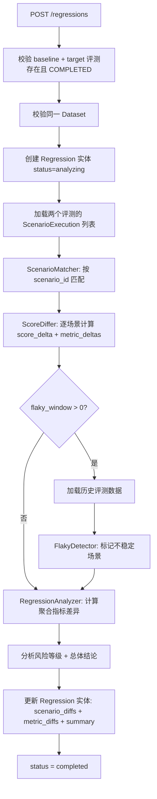

# Phase 6: Regression System（版本对比）

> **Depends on**: `phase-3-runner.md`, `phase-4-judge.md`, `phase-5-report.md`, `../contracts/domain-model.md`  
> **Referenced by**: 无  
> **ADR**: 无

## 1. 目标

实现多版本评测对比、Dataset 回放（简化：复用同一 Dataset + 新 AgentConfig 重新触发 Evaluation）、Score Diff 计算、Regression 分析与自动报告生成。

**ScoreDiffer** 基于动态指标集合工作（Open/Closed），新增 Judge 只需注册，ScoreDiffer 不需修改。
**FlakyDetector** 为可选扩展点 (MAY)，MVP 可不实现，留接口定义即可。

## 2. 背景

Agent 迭代过程中需要验证新版本是否引入回归。Regression System 以两次已完成的 Evaluation 为输入，按场景逐一对比得分差异，计算指标级和场景级 Diff，并生成包含回归项标注的对比报告。

## 3. 模块设计

### 3.1 模块边界

| 模块 | 职责 | 输入 | 输出 |
|------|------|------|------|
| Regression Service | 回归分析创建、状态管理 | CreateRegressionRequest | Regression 实体 |
| Scenario Matcher | 基线与目标评测的场景匹配 | 两个 Evaluation 的 ScenarioExecution | 匹配对列表 |
| Score Differ | 逐场景/逐指标计算得分差异 | 匹配对列表 | ScenarioDiff 列表 |
| Regression Analyzer | 分析回归趋势、风险等级、Flaky 检测 | ScenarioDiff 列表 | Regression 结论 |
| Diff Report Generator | 生成对比报告（JSON/HTML） | Regression 实体 | Report 文件 |
| Dataset Replay | 使用旧 Dataset 对新 Agent 版本回放评测 | Dataset + AgentConfig | 新 Evaluation |

### 3.2 依赖关系

```
Phase 6 依赖:
  Phase 3 (Evaluation, ScenarioExecution)
  Phase 4 (JudgeResult, MetricScore)
  Phase 5 (Report Generator, Metrics Snapshot)
  01-domain-model (Regression, ScenarioDiff 定义)

Phase 6 产出供后续使用:
  Phase 7 (Regression 可作为 Plugin 扩展点)
```

## 4. 数据结构

### 4.1 Regression ORM Model

```python
# infra/models/regression_model.py
class RegressionModel(BaseModel):
    __tablename__ = "regressions"
    project_id: Mapped[UUID] = mapped_column(PGUUID(as_uuid=True), ForeignKey("projects.id"), nullable=False)
    name: Mapped[str] = mapped_column(String(128), nullable=False)
    baseline_evaluation_id: Mapped[UUID] = mapped_column(PGUUID(as_uuid=True), ForeignKey("evaluations.id"), nullable=False)
    target_evaluation_id: Mapped[UUID] = mapped_column(PGUUID(as_uuid=True), ForeignKey("evaluations.id"), nullable=False)
    status: Mapped[str] = mapped_column(String(16), default="pending")
    scenario_diffs: Mapped[list | None] = mapped_column(JSONB)  # 序列化的 ScenarioDiff 列表
    metric_diffs: Mapped[dict | None] = mapped_column(JSONB)
    overall_verdict: Mapped[str | None] = mapped_column(String(16))
    summary: Mapped[dict | None] = mapped_column(JSONB)
    started_at: Mapped[datetime | None] = mapped_column(DateTime(timezone=True))
    completed_at: Mapped[datetime | None] = mapped_column(DateTime(timezone=True))
    error_message: Mapped[str | None] = mapped_column(Text)
```

### 4.2 DTO / VO

```python
# schemas/regression.py
class CreateRegressionRequest(BaseModel):
    name: str = Field(min_length=1, max_length=128)
    baseline_evaluation_id: UUID
    target_evaluation_id: UUID
    # 可选：指定对比的指标子集
    metrics_filter: list[str] = []
    # 可选：回归阈值（低于此 delta 视为 unchanged）
    regression_threshold: float = Field(default=0.05, ge=0.0, le=1.0)
    # 可选：Flaky 检测窗口（对比最近 N 次同场景评测）
    flaky_window: int = Field(default=0, ge=0, le=10)

class RegressionResponse(BaseModel):
    id: UUID
    project_id: UUID
    name: str
    baseline_evaluation_id: UUID
    target_evaluation_id: UUID
    status: str
    overall_verdict: str | None
    summary: dict | None
    metric_diffs: dict | None
    started_at: datetime | None
    completed_at: datetime | None
    error_message: str | None
    created_at: datetime
    updated_at: datetime

class ScenarioDiffResponse(BaseModel):
    scenario_id: UUID
    external_id: str
    baseline_score: float | None
    target_score: float | None
    score_delta: float | None
    baseline_verdict: str | None
    target_verdict: str | None
    verdict: str  # improved | regressed | unchanged | flaky
    metric_deltas: dict[str, float]
    notes: str | None

class RegressionDetailResponse(RegressionResponse):
    scenario_diffs: list[ScenarioDiffResponse]
```

## 5. 核心逻辑

### 5.1 Scenario Matcher

```python
# services/regression/scenario_matcher.py
class ScenarioMatcher:
    """匹配基线和目标评测中的场景"""

    def match(self, baseline_execs: list[ScenarioExecution],
              target_execs: list[ScenarioExecution]) -> list[tuple[ScenarioExecution | None, ScenarioExecution | None]]:
        """
        按 scenario_id 匹配。仅出现在一侧的标记为 None。
        """
        baseline_map = {e.scenario_id: e for e in baseline_execs}
        target_map = {e.scenario_id: e for e in target_execs}

        all_ids = set(baseline_map.keys()) | set(target_map.keys())
        pairs = []
        for sid in sorted(all_ids):
            pairs.append((baseline_map.get(sid), target_map.get(sid)))

        return pairs
```

### 5.2 Score Differ

```python
# services/regression/score_differ.py
class ScoreDiffer:
    """计算逐场景和逐指标的得分差异"""

    def __init__(self, regression_threshold: float = 0.05):
        self.threshold = regression_threshold

    def diff(self, pairs: list[tuple[ScenarioExecution | None, ScenarioExecution | None]],
             metrics_filter: list[str] | None = None) -> list[ScenarioDiff]:
        diffs = []
        for baseline, target in pairs:
            diff = self._diff_single(baseline, target, metrics_filter)
            diffs.append(diff)
        return diffs

    def _diff_single(self, baseline: ScenarioExecution | None,
                     target: ScenarioExecution | None,
                     metrics_filter: list[str] | None) -> ScenarioDiff:
        baseline_scores = self._extract_metric_scores(baseline, metrics_filter)
        target_scores = self._extract_metric_scores(target, metrics_filter)

        metric_deltas = {}
        for key in set(baseline_scores.keys()) | set(target_scores.keys()):
            b = baseline_scores.get(key)
            t = target_scores.get(key)
            if b is not None and t is not None:
                metric_deltas[key] = round(t - b, 4)

        baseline_overall = baseline.overall_score if baseline else None
        target_overall = target.overall_score if target else None
        score_delta = None
        if baseline_overall is not None and target_overall is not None:
            score_delta = round(target_overall - baseline_overall, 4)

        verdict = self._determine_verdict(score_delta, baseline, target)

        return ScenarioDiff(
            scenario_id=(target or baseline).scenario_id,
            external_id=(target or baseline).scenario.external_id,
            baseline_score=baseline_overall,
            target_score=target_overall,
            score_delta=score_delta,
            baseline_verdict=baseline.overall_verdict if baseline else None,
            target_verdict=target.overall_verdict if target else None,
            verdict=verdict,
            metric_deltas=metric_deltas,
            notes=self._generate_notes(baseline, target, verdict),
        )

    def _extract_metric_scores(self, exec: ScenarioExecution | None,
                                metrics_filter: list[str] | None) -> dict[str, float]:
        if not exec or not exec.judge_results:
            return {}
        scores = {}
        for jr in exec.judge_results:
            if jr.status != "completed":
                continue
            for ms in jr.metric_scores:
                if metrics_filter and ms.metric_key not in metrics_filter:
                    continue
                # 同 metric 取最高分（多 Judge 情况）
                current = scores.get(ms.metric_key)
                if current is None or ms.score > current:
                    scores[ms.metric_key] = ms.score
        return scores

    def _determine_verdict(self, score_delta: float | None,
                           baseline: ScenarioExecution | None,
                           target: ScenarioExecution | None) -> RegressionVerdict:
        # 一侧缺失
        if baseline is None and target is not None:
            return RegressionVerdict.IMPROVED  # 新增场景覆盖
        if baseline is not None and target is None:
            return RegressionVerdict.REGRESSED  # 场景丢失

        if score_delta is None:
            return RegressionVerdict.UNCHANGED

        if abs(score_delta) < self.threshold:
            return RegressionVerdict.UNCHANGED
        elif score_delta > 0:
            return RegressionVerdict.IMPROVED
        else:
            return RegressionVerdict.REGRESSED

    def _generate_notes(self, baseline, target, verdict) -> str:
        if baseline is None:
            return "New scenario in target evaluation"
        if target is None:
            return "Scenario missing in target evaluation"
        if verdict == RegressionVerdict.REGRESSED:
            regressed_metrics = [k for k, v in (target.overall_score - baseline.overall_score
                                                if hasattr(target, 'overall_score') else {}).items()
                                 if v < 0] if False else []
            return f"Score dropped by {abs(baseline.overall_score - target.overall_score):.4f}"
        elif verdict == RegressionVerdict.IMPROVED:
            return f"Score improved by {target.overall_score - baseline.overall_score:.4f}"
        return "No significant change"
```

### 5.3 Regression Analyzer

```python
# services/regression/regression_analyzer.py
class RegressionAnalyzer:
    """分析回归趋势和风险等级"""

    def analyze(self, scenario_diffs: list[ScenarioDiff],
                metric_diffs: dict) -> RegressionAnalysis:
        improved = sum(1 for d in scenario_diffs if d.verdict == RegressionVerdict.IMPROVED)
        regressed = sum(1 for d in scenario_diffs if d.verdict == RegressionVerdict.REGRESSED)
        unchanged = sum(1 for d in scenario_diffs if d.verdict == RegressionVerdict.UNCHANGED)
        flaky = sum(1 for d in scenario_diffs if d.verdict == RegressionVerdict.FLAKY)

        total = len(scenario_diffs)
        regression_rate = regressed / total if total > 0 else 0.0

        # 风险等级
        if regression_rate >= 0.2:
            risk = "critical"
        elif regression_rate >= 0.1:
            risk = "high"
        elif regression_rate >= 0.05:
            risk = "medium"
        else:
            risk = "low"

        # 总体结论
        if regressed > improved:
            overall = RegressionVerdict.REGRESSED
        elif improved > regressed:
            overall = RegressionVerdict.IMPROVED
        else:
            overall = RegressionVerdict.UNCHANGED

        summary = {
            "total_compared": total,
            "improved": improved,
            "regressed": regressed,
            "unchanged": unchanged,
            "flaky": flaky,
            "regression_rate": round(regression_rate, 4),
            "regression_risk": risk,
        }

        return RegressionAnalysis(
            overall_verdict=overall,
            summary=summary,
            metric_diffs=metric_diffs,
            scenario_diffs=scenario_diffs,
        )

    def compute_metric_diffs(self, scenario_diffs: list[ScenarioDiff]) -> dict:
        """计算指标级聚合差异"""
        metric_deltas: dict[str, list[float]] = {}
        for diff in scenario_diffs:
            for key, delta in diff.metric_deltas.items():
                metric_deltas.setdefault(key, []).append(delta)

        result = {}
        for key, deltas in metric_deltas.items():
            mean_delta = sum(deltas) / len(deltas) if deltas else 0.0
            result[key] = {
                "baseline_mean": None,  # 由调用方填充
                "target_mean": None,
                "delta": round(mean_delta, 4),
                "direction": "improved" if mean_delta > 0 else "regressed" if mean_delta < 0 else "unchanged",
                "affected_count": len(deltas),
            }
        return result
```

### 5.4 Flaky 检测

```python
# services/regression/flaky_detector.py
class FlakyDetector:
    """检测不稳定场景：历史评测中得分波动大的场景"""

    def __init__(self, threshold_std: float = 0.15):
        self.threshold_std = threshold_std

    def detect(self, scenario_execs_history: dict[UUID, list[ScenarioExecution]]) -> set[UUID]:
        """
        输入: {scenario_id: [exec_v1, exec_v2, ..., exec_vN]}
        输出: 被标记为 flaky 的 scenario_id 集合
        """
        flaky_ids = set()
        for scenario_id, execs in scenario_execs_history.items():
            scores = [e.overall_score for e in execs if e.overall_score is not None]
            if len(scores) < 3:
                continue
            std = np.std(scores)
            if std > self.threshold_std:
                flaky_ids.add(scenario_id)
        return flaky_ids
```

## 6. Dataset Replay

> **简化策略**: Dataset Replay 只做“复用同一 Dataset + 新 AgentConfig 重新触发 Evaluation”，不引入变量控制/流量分配等复杂抽象。

### 6.1 设计

Dataset Replay 允许用户使用历史 Dataset 对当前 Agent 版本重新执行评测，以便进行公平对比。

```python
# services/regression/dataset_replay.py
class DatasetReplayService:
    """数据集回放服务"""

    def __init__(self, evaluation_service, session_factory):
        self.evaluation_service = evaluation_service
        self.session_factory = session_factory

    async def replay(self, baseline_evaluation_id: UUID,
                     new_agent_config: dict,
                     name: str | None = None) -> UUID:
        """
        使用基线评测的 Dataset + 新 Agent 配置创建新评测。
        返回新 Evaluation ID。
        """
        session = await self.session_factory()
        eval_repo = EvaluationRepository(session)
        baseline = await eval_repo.get_by_id(baseline_evaluation_id)

        if not baseline:
            raise NotFoundException("Evaluation", str(baseline_evaluation_id))

        create_request = CreateEvaluationRequest(
            name=name or f"Replay-{baseline.name}-{datetime.now().strftime('%Y%m%d%H%M')}",
            dataset_id=baseline.dataset_id,
            agent_config=new_agent_config,
            judge_configs=baseline.judge_configs,
            version_label=f"replay-of-{baseline.version_label or baseline.id}",
            config=baseline.config,
        )

        new_eval = await self.evaluation_service.create(create_request, baseline.project_id)
        return new_eval.id
```

### 6.2 回放 API

| Method | Path | 说明 |
|--------|------|------|
| POST | `/api/v1/evaluations/{evaluation_id}/replay` | 使用新 Agent 配置回放数据集 |

**Request:**

```json
{
  "agent_config": {
    "adapter_type": "openai",
    "model": "gpt-4o-2024-08-06",
    "endpoint": "https://api.openai.com/v1",
    "api_key_ref": "vault://openai-key"
  },
  "name": "v2.1-replay"
}
```

## 7. Regression Service

### 7.1 主流程

```python
# services/regression/regression_service.py
class RegressionService:

    def __init__(self, session_factory):
        self.session_factory = session_factory
        self.matcher = ScenarioMatcher()
        self.differ = ScoreDiffer()
        self.analyzer = RegressionAnalyzer()

    async def create_regression(self, request: CreateRegressionRequest,
                                project_id: UUID) -> Regression:
        """创建并执行回归分析"""
        session = await self.session_factory()

        # 加载两个评测
        eval_repo = EvaluationRepository(session)
        baseline = await eval_repo.get_by_id(request.baseline_evaluation_id)
        target = await eval_repo.get_by_id(request.target_evaluation_id)

        self._validate(baseline, target)

        # 创建 Regression 实体
        regression = RegressionModel(
            id=uuid4(), project_id=project_id,
            name=request.name,
            baseline_evaluation_id=request.baseline_evaluation_id,
            target_evaluation_id=request.target_evaluation_id,
            status=RegressionStatus.ANALYZING,
            started_at=datetime.now(timezone.utc),
        )
        session.add(regression)
        await session.flush()

        # 执行分析
        try:
            result = await self._analyze(baseline, target, request)
            regression.scenario_diffs = [d.model_dump() for d in result.scenario_diffs]
            regression.metric_diffs = result.metric_diffs
            regression.overall_verdict = result.overall_verdict
            regression.summary = result.summary
            regression.status = RegressionStatus.COMPLETED
            regression.completed_at = datetime.now(timezone.utc)
        except Exception as e:
            regression.status = RegressionStatus.FAILED
            regression.error_message = str(e)
            await session.flush()
            raise

        await session.flush()
        return regression

    async def _analyze(self, baseline: Evaluation, target: Evaluation,
                       request: CreateRegressionRequest) -> RegressionAnalysis:
        """执行回归分析"""
        session = await self.session_factory()
        exec_repo = ScenarioExecutionRepository(session)

        baseline_execs = await exec_repo.get_by_evaluation(baseline.id)
        target_execs = await exec_repo.get_by_evaluation(target.id)

        # 匹配场景
        pairs = self.matcher.match(baseline_execs, target_execs)

        # 配置 differ
        self.differ.threshold = request.regression_threshold

        # 计算差异
        scenario_diffs = self.differ.diff(pairs, request.metrics_filter)

        # Flaky 检测（可选）
        if request.flaky_window > 0:
            history = await self._load_history(
                baseline.project_id, request.flaky_window)
            detector = FlakyDetector()
            flaky_ids = detector.detect(history)
            for diff in scenario_diffs:
                if diff.scenario_id in flaky_ids:
                    diff.verdict = RegressionVerdict.FLAKY

        # 计算指标级差异
        metric_diffs = self.analyzer.compute_metric_diffs(scenario_diffs)

        # 填充 baseline/target 均值
        metric_diffs = self._fill_metric_means(metric_diffs, baseline_execs, target_execs)

        # 分析总体结论
        return self.analyzer.analyze(scenario_diffs, metric_diffs)

    def _validate(self, baseline: Evaluation, target: Evaluation):
        if not baseline:
            raise NotFoundException("Evaluation", "baseline")
        if not target:
            raise NotFoundException("Evaluation", "target")
        if baseline.status != EvaluationStatus.COMPLETED:
            raise AgentEvalException(40909, "Baseline evaluation not completed", 409)
        if target.status != EvaluationStatus.COMPLETED:
            raise AgentEvalException(40909, "Target evaluation not completed", 409)
        if baseline.dataset_id != target.dataset_id:
            raise AgentEvalException(40910,
                "Baseline and target evaluations must use the same dataset", 409)
```

## 8. Diff Report 生成

### 8.1 Diff Report 数据模型

```python
# schemas/regression_report.py
class RegressionReportData(BaseModel):
    regression: RegressionInfo
    summary: RegressionSummary
    metric_diffs: dict[str, MetricDiff]
    scenario_diffs: list[ScenarioDiffItem]
    top_regressions: list[ScenarioDiffItem]  # 回归最严重的
    top_improvements: list[ScenarioDiffItem]  # 改进最显著的

class RegressionInfo(BaseModel):
    id: UUID
    name: str
    baseline_name: str
    target_name: str
    baseline_version: str | None
    target_version: str | None
    created_at: datetime

class MetricDiff(BaseModel):
    baseline_mean: float | None
    target_mean: float | None
    delta: float
    direction: str
    affected_count: int

class ScenarioDiffItem(BaseModel):
    external_id: str
    title: str
    baseline_score: float | None
    target_score: float | None
    score_delta: float | None
    verdict: str
    metric_deltas: dict[str, float]
    notes: str | None
```

### 8.2 Diff Report HTML 模板

```html
<!-- templates/reports/regression_report.html.j2 -->
<!DOCTYPE html>
<html lang="zh-CN">
<head>
    <meta charset="UTF-8">
    <title>回归分析报告 - {{ data.regression.name }}</title>
    <style>
        body { font-family: system-ui, sans-serif; margin: 40px; }
        .verdict-improved { color: #2e7d32; }
        .verdict-regressed { color: #c62828; font-weight: bold; }
        .verdict-unchanged { color: #757575; }
        .verdict-flaky { color: #f57f17; }
        .delta-positive { color: #2e7d32; }
        .delta-negative { color: #c62828; }
        .summary-grid { display: grid; grid-template-columns: repeat(5, 1fr); gap: 12px; }
        .card { border: 1px solid #ddd; border-radius: 8px; padding: 12px; text-align: center; }
        table { width: 100%; border-collapse: collapse; }
        th, td { padding: 8px; border-bottom: 1px solid #eee; text-align: left; }
    </style>
</head>
<body>
    <h1>回归分析报告</h1>
    <p>{{ data.regression.name }}</p>
    <p>基线: {{ data.regression.baseline_name }} ({{ data.regression.baseline_version or '-' }})</p>
    <p>目标: {{ data.regression.target_name }} ({{ data.regression.target_version or '-' }})</p>

    <div class="summary-grid">
        <div class="card"><h4>总对比数</h4><p>{{ data.summary.total_compared }}</p></div>
        <div class="card verdict-improved"><h4>改进</h4><p>{{ data.summary.improved }}</p></div>
        <div class="card verdict-regressed"><h4>回归</h4><p>{{ data.summary.regressed }}</p></div>
        <div class="card verdict-unchanged"><h4>不变</h4><p>{{ data.summary.unchanged }}</p></div>
        <div class="card verdict-flaky"><h4>不稳定</h4><p>{{ data.summary.flaky }}</p></div>
    </div>

    <h3>风险等级: {{ data.summary.regression_risk }}</h3>
    <p>回归率: {{ '{:.2%}'.format(data.summary.regression_rate) }}</p>

    <h3>指标差异</h3>
    <table>
        <tr><th>指标</th><th>基线均值</th><th>目标均值</th><th>差异</th><th>方向</th><th>影响场景数</th></tr>
        
        <tr>
            <td>{{ metric }}</td>
            <td>{{ '%.4f' % diff.baseline_mean if diff.baseline_mean is not none else '-' }}</td>
            <td>{{ '%.4f' % diff.target_mean if diff.target_mean is not none else '-' }}</td>
            <td class="{{ 'delta-positive' if diff.delta > 0 else 'delta-negative' }}">{{ '%+.4f' % diff.delta }}</td>
            <td>{{ diff.direction }}</td>
            <td>{{ diff.affected_count }}</td>
        </tr>
        
    </table>

    <h3>Top 回归场景</h3>
    <table>
        <tr><th>ID</th><th>标题</th><th>基线</th><th>目标</th><th>差异</th><th>判定</th></tr>
        
        <tr>
            <td>{{ d.external_id }}</td>
            <td>{{ d.title }}</td>
            <td>{{ '%.4f' % d.baseline_score if d.baseline_score is not none else '-' }}</td>
            <td>{{ '%.4f' % d.target_score if d.target_score is not none else '-' }}</td>
            <td class="delta-negative">{{ '%+.4f' % d.score_delta if d.score_delta is not none else '-' }}</td>
            <td class="verdict-{{ d.verdict }}">{{ d.verdict }}</td>
        </tr>
        
    </table>

    <h3>Top 改进场景</h3>
    <table>
        <tr><th>ID</th><th>标题</th><th>基线</th><th>目标</th><th>差异</th><th>判定</th></tr>
        
        <tr>
            <td>{{ d.external_id }}</td>
            <td>{{ d.title }}</td>
            <td>{{ '%.4f' % d.baseline_score if d.baseline_score is not none else '-' }}</td>
            <td>{{ '%.4f' % d.target_score if d.target_score is not none else '-' }}</td>
            <td class="delta-positive">{{ '%+.4f' % d.score_delta if d.score_delta is not none else '-' }}</td>
            <td class="verdict-{{ d.verdict }}">{{ d.verdict }}</td>
        </tr>
        
    </table>

    <h3>全量场景对比</h3>
    <table>
        <tr><th>ID</th><th>标题</th><th>基线</th><th>目标</th><th>差异</th><th>判定</th><th>备注</th></tr>
        
        <tr>
            <td>{{ d.external_id }}</td>
            <td>{{ d.title }}</td>
            <td>{{ '%.4f' % d.baseline_score if d.baseline_score is not none else '-' }}</td>
            <td>{{ '%.4f' % d.target_score if d.target_score is not none else '-' }}</td>
            <td class="{{ 'delta-positive' if d.score_delta and d.score_delta > 0 else 'delta-negative' if d.score_delta and d.score_delta < 0 else '' }}">
                {{ '%+.4f' % d.score_delta if d.score_delta is not none else '-' }}
            </td>
            <td class="verdict-{{ d.verdict }}">{{ d.verdict }}</td>
            <td>{{ d.notes or '' }}</td>
        </tr>
        
    </table>
</body>
</html>
```

## 9. API 设计

| Method | Path | 说明 |
|--------|------|------|
| POST | `/api/v1/projects/{project_id}/regressions` | 创建回归分析 |
| GET | `/api/v1/projects/{project_id}/regressions` | 分页查询 |
| GET | `/api/v1/regressions/{regression_id}` | 获取详情（含 scenario_diffs） |
| GET | `/api/v1/regressions/{regression_id}/report` | 生成/获取 Diff 报告 |
| POST | `/api/v1/evaluations/{evaluation_id}/replay` | 数据集回放 |

## 10. 流程图

### 10.1 回归分析流程



### 10.2 数据集回放流程

```
POST /evaluations/{baseline_id}/replay
  → 加载 baseline Evaluation
  → 提取 dataset_id + judge_configs + config
  → 使用 new_agent_config 创建新 Evaluation
  → 投递 Celery 任务
  → 返回新 Evaluation ID
  → 用户等待新评测完成后，创建 Regression 对比两次评测
```

## 11. 异常设计

| 场景 | 错误码 | HTTP | message |
|------|--------|------|---------|
| 基线评测不存在 | 40409 | 404 | `Baseline evaluation not found` |
| 目标评测不存在 | 40409 | 404 | `Target evaluation not found` |
| 评测未完成 | 40909 | 409 | `Evaluation not completed` |
| Dataset 不一致 | 40910 | 409 | `Evaluations must use the same dataset` |
| Regression 不存在 | 40410 | 404 | `Regression not found` |
| 回放时 Agent 配置无效 | 40503 | 400 | `Invalid agent config` |

## 12. 扩展点

| 扩展点 | 接口 | 说明 |
|--------|------|------|
| Verdict Strategy | `VerdictStrategy` 接口 | 可自定义 improved/regressed 判定逻辑 |
| Risk Assessor | `RiskAssessor` 接口 | 可自定义风险等级计算 |
| Flaky Detector | `FlakyDetector` 类 (MAY) | 可选扩展，不稳定检测算法 |
| Diff Report Template | Jinja2 模板文件 | 可注册自定义对比报告模板 |
| Auto-Regression Trigger | `RegressionTrigger` 接口 | 可在特定条件自动触发回归分析 |

## 12.5 Task 分解

### Task 6.1: Scenario Matcher
- **Goal**: 基线与目标评测的场景匹配
- **Inputs**: 两个 Evaluation 的 ScenarioExecution 列表
- **Outputs**: `services/regression/scenario_matcher.py`
- **Dependencies**: Phase 3, Phase 4
- **Acceptance Criteria**: 同一 scenario_id 正确匹配；缺失场景正确标记
- **Files**: `services/regression/scenario_matcher.py`

### Task 6.2: ScoreDiffer
- **Goal**: 逐场景/逐指标 Diff 计算
- **Inputs**: Task 6.1
- **Outputs**: `services/regression/score_differ.py`
- **Dependencies**: Task 6.1
- **Implementation Notes**: 基于动态指标集合工作，不硬编码指标名
- **Acceptance Criteria**: score_delta = target - baseline 计算正确；verdict 按阈值判定
- **Files**: `services/regression/score_differ.py`

### Task 6.3: Regression Analyzer
- **Goal**: 回归趋势分析 + 风险等级
- **Inputs**: Task 6.2
- **Outputs**: `services/regression/regression_analyzer.py`
- **Dependencies**: Task 6.2
- **Acceptance Criteria**: 分级正确 (low/medium/high/critical)
- **Files**: `services/regression/regression_analyzer.py`

### Task 6.4: Dataset Replay (简化)
- **Goal**: 复用 Dataset + 新 AgentConfig 触发新 Evaluation
- **Inputs**: Phase 3 Evaluation API
- **Outputs**: `services/regression/dataset_replay.py`
- **Dependencies**: Phase 3 (Evaluation 创建)
- **Implementation Notes**: 不引入变量控制/流量分配等复杂抽象
- **Acceptance Criteria**: 回放创建的新评测使用同一 Dataset
- **Files**: `services/regression/dataset_replay.py`

### Task 6.5: RegressionService + API
- **Goal**: 回归分析创建/查询 API
- **Inputs**: Task 6.1-6.4
- **Outputs**: `services/regression/regression_service.py`, `api/v1/regressions.py`
- **Dependencies**: Task 6.1-6.4
- **Acceptance Criteria**: POST 创建回归分析返回完整 scenario_diffs
- **Files**: `services/regression/regression_service.py`, `api/v1/regressions.py`

### Task 6.6: Diff Report Generator
- **Goal**: 对比报告 JSON/HTML
- **Inputs**: Task 6.5
- **Outputs**: `services/regression/diff_report_generator.py`
- **Dependencies**: Task 6.5, Phase 5 (Report Template)
- **Acceptance Criteria**: HTML 报告含 Top 回归和 Top 改进
- **Files**: `services/regression/diff_report_generator.py`

## 13. 验收标准

| 编号 | 验收项 | 验证方式 |
|------|--------|----------|
| AC-P6-01 | POST 创建回归分析返回完整 scenario_diffs | curl |
| AC-P6-02 | score_delta = target_score - baseline_score 计算正确 | 单元测试 |
| AC-P6-03 | verdict=regressed 当 score_delta < -threshold | 单元测试 |
| AC-P6-04 | verdict=improved 当 score_delta > threshold | 单元测试 |
| AC-P6-05 | verdict=unchanged 当 abs(score_delta) < threshold | 单元测试 |
| AC-P6-06 | 一侧缺失场景时 verdict 正确判定 | 单元测试 |
| AC-P6-07 | metric_diffs 包含每个指标的 delta 和 direction | 响应体校验 |
| AC-P6-08 | regression_risk 按 regression_rate 正确分级 | 单元测试 |
| AC-P6-09 | Dataset 不一致时返回 409 | curl |
| AC-P6-10 | 回放创建的新评测使用同一 Dataset | 集成测试 |
| AC-P6-11 | Diff HTML 报告包含 Top 回归和 Top 改进表 | 下载检查 |
| AC-P6-12 | Flaky 检测标记波动大的场景 | 单元测试 |
| AC-P6-13 | regression_threshold 参数生效（默认 0.05） | 单元测试 |
| AC-P6-14 | GET 详情返回 scenario_diffs 列表 | curl |
| AC-P6-15 | summary 包含 total_compared/improved/regressed/unchanged/flaky | 响应体校验 |
