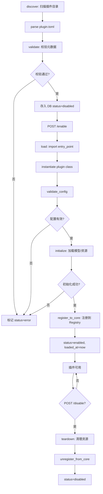

# Phase 7: Plugin System（插件系统）

> **Depends on**: `phase-1-foundation.md` (Registry 基类), `phase-3-runner.md`, `phase-4-judge.md`  
> **Referenced by**: 无  
> **ADR**: `../decisions/0003-plugin-concept-frontload.md`

## 1. 目标

实现统一的**外部插件**生命周期管理（纯增量），覆盖 Judge Plugin、Adapter Plugin、Dataset Plugin、Metrics Plugin、Report Plugin 五类扩展点。

> **与 Phase 1 的关系**: Phase 1 已定义 SPI 基类 + Registry，内置实现通过 register() 静态注册。本 Phase 只做增量——管理“外部插件”的发现、加载、卸载、配置。

**安全沙箱** (MAY): 可选扩展点，MVP 可不实现。  
**热加载** (MAY): 可选扩展点，MVP 可不实现。

## 2. 背景

前 6 个 Phase 的所有扩展点（AgentAdapter、Judge、DSLParser、ReportTemplate 等）已通过 Phase 1 的 Registry 基类实现了内置注册。本 Phase 提供“外部插件”统一管理：发现、加载、校验、配置、卸载。

## 3. 模块设计

### 3.1 模块边界

| 模块 | 职责 | 输入 | 输出 |
|------|------|------|------|
| Plugin Framework | 插件生命周期管理（发现/加载/注册/卸载） | 插件目录/配置 | 已注册的 Plugin 实例 |
| Plugin Registry | 插件注册表，按类型索引 | Plugin 元数据 | 查询接口 |
| Plugin Config Manager | 插件配置管理（持久化/热更新） | 配置请求 | 配置实例 |
| Plugin Validator | 插件元数据与接口合规性校验 | 插件包 | ValidationResult |
| Plugin API | 插件管理 REST API | HTTP 请求 | 插件状态/配置 |

### 3.2 依赖关系

```
Phase 7 依赖:
  Phase 3 (AgentAdapter SPI → Adapter Plugin)
  Phase 4 (Judge SPI → Judge Plugin)
  Phase 5 (Report Template → Report Plugin)
  Phase 2 (DSLParser → Dataset Plugin)
  10-metrics-system (Metrics 计算 → Metrics Plugin)

Phase 7 产出:
  统一插件管理框架
  五类插件 SPI 接口标准化
  插件热加载/卸载能力
```

## 4. 插件架构

### 4.1 整体架构

```
┌──────────────────────────────────────────────────────┐
│                    Plugin Manager                     │
│  ┌──────────┐ ┌──────────┐ ┌──────────┐ ┌─────────┐ │
│  │ Discovery │ │  Loader  │ │ Registry │ │ Config  │ │
│  │ (扫描目录) │ │ (import) │ │ (注册表) │ │ Manager │ │
│  └─────┬────┘ └─────┬────┘ └─────┬────┘ └────┬────┘ │
│        │            │            │             │      │
│        ▼            ▼            ▼             ▼      │
│  ┌─────────────────────────────────────────────────┐ │
│  │              Plugin Lifecycle                    │ │
│  │  discover → validate → load → register → enable │ │
│  │                                    ↓             │ │
│  │  disable ← unregister ← unload ←───┘             │ │
│  └─────────────────────────────────────────────────┘ │
├──────────────────────────────────────────────────────┤
│              Plugin Type SPIs                         │
│  ┌────────┐ ┌────────┐ ┌────────┐ ┌────────┐ ┌────┐ │
│  │ Adapter │ │ Judge  │ │Dataset │ │Metrics │ │Report│ │
│  │ Plugin  │ │ Plugin │ │Plugin  │ │ Plugin │ │Plugin│ │
│  └────────┘ └────────┘ └────────┘ └────────┘ └────┘ │
├──────────────────────────────────────────────────────┤
│              Core System (Phase 1-6)                  │
│  AdapterRegistry / JudgeRegistry / DSLParser / ...    │
└──────────────────────────────────────────────────────┘
```

### 4.2 插件描述文件

每个插件包必须包含 `plugin.toml` 描述文件：

```toml
# plugins/my_custom_judge/plugin.toml
[plugin]
name = "my_custom_judge"
version = "1.0.0"
type = "judge"           # judge | adapter | dataset | metrics | report
author = "AgentEval Team"
description = "Custom judge using BERTScore for semantic evaluation"
entry_point = "my_custom_judge.plugin:BERTScoreJudgePlugin"
min_agenteval_version = "0.1.0"

[config]
# 插件配置 schema（JSON Schema 格式）
schema = """
{
  "type": "object",
  "properties": {
    "model": {"type": "string", "default": "bert-base-chinese"},
    "threshold": {"type": "number", "default": 0.85, "minimum": 0, "maximum": 1}
  }
}
"""

[dependencies]
# Python 依赖
python_packages = ["transformers>=4.35.0", "torch>=2.0.0"]
```

## 5. 插件 SPI 接口

### 5.1 基础插件接口

```python
# plugins/base.py
from abc import ABC, abstractmethod
from typing import Any

class Plugin(ABC):
    """所有插件的基础接口"""

    @property
    @abstractmethod
    def plugin_type(self) -> str:
        """插件类型: judge | adapter | dataset | metrics | report"""
        pass

    @property
    @abstractmethod
    def name(self) -> str:
        """插件名称（唯一标识）"""
        pass

    @property
    def version(self) -> str:
        return "1.0.0"

    @abstractmethod
    async def initialize(self, config: dict) -> None:
        """初始化插件（加载模型、建立连接等）"""
        pass

    @abstractmethod
    async def teardown(self) -> None:
        """清理插件资源"""
        pass

    def get_config_schema(self) -> dict:
        """返回配置 JSON Schema"""
        return {}

    def validate_config(self, config: dict) -> list[str]:
        """校验配置，返回错误列表（空列表=通过）"""
        return []
```

### 5.2 Judge Plugin

```python
# plugins/spi/judge_plugin.py
class JudgePlugin(Plugin, ABC):
    """Judge 插件接口"""

    plugin_type = "judge"

    @abstractmethod
    def create_judge(self, config: dict) -> Judge:
        """创建 Judge 实例"""
        pass

    @abstractmethod
    def supported_metrics(self) -> list[str]:
        """支持的指标列表"""
        pass

# 示例实现: BERTScore Judge Plugin
class BERTScoreJudgePlugin(JudgePlugin):
    name = "bertscore_judge"
    version = "1.0.0"

    def supported_metrics(self) -> list[str]:
        return ["bertscore_precision", "bertscore_recall", "bertscore_f1"]

    async def initialize(self, config: dict) -> None:
        from transformers import AutoTokenizer, AutoModel
        self.tokenizer = AutoTokenizer.from_pretrained(config.get("model", "bert-base-chinese"))
        self.model = AutoModel.from_pretrained(config.get("model", "bert-base-chinese"))

    async def teardown(self) -> None:
        del self.model, self.tokenizer

    def create_judge(self, config: dict) -> Judge:
        return BERTScoreJudge(self.model, self.tokenizer, config)
```

### 5.3 Adapter Plugin

```python
# plugins/spi/adapter_plugin.py
class AdapterPlugin(Plugin, ABC):
    """Agent Adapter 插件接口"""

    plugin_type = "adapter"

    @abstractmethod
    def create_adapter(self, config: dict) -> AgentAdapter:
        """创建 AgentAdapter 实例"""
        pass

# 示例实现: LangChain Adapter Plugin
class LangChainAdapterPlugin(AdapterPlugin):
    name = "langchain_adapter"
    version = "1.0.0"

    async def initialize(self, config: dict) -> None:
        pass  # LangChain 无需特殊初始化

    async def teardown(self) -> None:
        pass

    def create_adapter(self, config: dict) -> AgentAdapter:
        return LangChainAdapter(config)
```

### 5.4 Dataset Plugin

```python
# plugins/spi/dataset_plugin.py
class DatasetPlugin(Plugin, ABC):
    """Dataset 插件接口：扩展 DSL 格式或数据源"""

    plugin_type = "dataset"

    @abstractmethod
    def create_parser(self, config: dict) -> DSLParser:
        """创建 DSL 解析器"""
        pass

    @abstractmethod
    def supported_formats(self) -> list[str]:
        """支持的格式列表"""
        pass

# 示例实现: CSV Dataset Plugin
class CSVDatasetPlugin(DatasetPlugin):
    name = "csv_dataset"
    version = "1.0.0"

    def supported_formats(self) -> list[str]:
        return ["csv"]

    async def initialize(self, config: dict) -> None:
        pass

    async def teardown(self) -> None:
        pass

    def create_parser(self, config: dict) -> DSLParser:
        return CSVDSLParser(config)
```

### 5.5 Metrics Plugin

```python
# plugins/spi/metrics_plugin.py
class MetricsPlugin(Plugin, ABC):
    """Metrics 插件接口：扩展指标计算"""

    plugin_type = "metrics"

    @abstractmethod
    def metric_definitions(self) -> list[MetricDefinition]:
        """返回该插件提供的指标定义"""
        pass

    @abstractmethod
    async def compute(self, metric_key: str, ctx: JudgeContext) -> MetricScore:
        """计算单个指标"""
        pass

# MetricDefinition 结构
@dataclass
class MetricDefinition:
    key: str
    name: str
    description: str
    score_range: tuple[float, float]  # (min, max)
    weight_default: float
    higher_is_better: bool
```

### 5.6 Report Plugin

```python
# plugins/spi/report_plugin.py
class ReportPlugin(Plugin, ABC):
    """Report 插件接口：扩展报告格式或章节"""

    plugin_type = "report"

    @abstractmethod
    def supported_formats(self) -> list[str]:
        """支持的报告格式"""
        pass

    @abstractmethod
    async def generate_section(self, section_name: str, data: ReportData) -> str:
        """生成报告章节内容（HTML 片段）"""
        pass

    @abstractmethod
    def get_template_path(self, format: str) -> str | None:
        """返回模板文件路径"""
        pass

# 示例实现: PDF Report Plugin
class PDFReportPlugin(ReportPlugin):
    name = "pdf_report"
    version = "1.0.0"

    def supported_formats(self) -> list[str]:
        return ["pdf"]

    async def initialize(self, config: dict) -> None:
        pass

    async def teardown(self) -> None:
        pass

    async def generate_section(self, section_name: str, data: ReportData) -> str:
        # 返回 PDF 兼容的 HTML 片段
        return f"<h2>{section_name}</h2><p>...</p>"

    def get_template_path(self, format: str) -> str | None:
        if format == "pdf":
            return "plugins/pdf_report/templates/report.html.j2"
        return None
```

## 6. Plugin Manager

### 6.1 插件生命周期

```python
# plugins/manager.py
import importlib
import tomllib
from pathlib import Path

class PluginManager:
    """插件管理器"""

    PLUGIN_DIRS = [
        Path("plugins"),           # 内置插件目录
        Path("external_plugins"),  # 外部插件目录
    ]

    def __init__(self):
        self.registry = PluginRegistry()
        self.configs: dict[str, dict] = {}  # plugin_name → config
        self.instances: dict[str, Plugin] = {}  # plugin_name → instance

    async def discover(self) -> list[PluginMetadata]:
        """扫描插件目录，发现所有插件"""
        metadatas = []
        for plugin_dir in self.PLUGIN_DIRS:
            if not plugin_dir.exists():
                continue
            for manifest_path in plugin_dir.glob("*/plugin.toml"):
                metadata = self._parse_manifest(manifest_path)
                if metadata:
                    metadatas.append(metadata)
        return metadatas

    def _parse_manifest(self, path: Path) -> PluginMetadata | None:
        with open(path, "rb") as f:
            data = tomllib.load(f)
        plugin_section = data.get("plugin", {})
        return PluginMetadata(
            name=plugin_section.get("name"),
            version=plugin_section.get("version"),
            type=plugin_section.get("type"),
            author=plugin_section.get("author"),
            description=plugin_section.get("description"),
            entry_point=plugin_section.get("entry_point"),
            min_agenteval_version=plugin_section.get("min_agenteval_version"),
            config_schema=data.get("config", {}).get("schema", "{}"),
            dependencies=data.get("dependencies", {}),
            manifest_path=str(path),
        )

    async def load_plugin(self, metadata: PluginMetadata, config: dict | None = None) -> Plugin:
        """加载单个插件"""
        # 校验
        validator = PluginValidator()
        errors = validator.validate(metadata)
        if errors:
            raise PluginValidationError(f"Plugin validation failed: {errors}")

        # 动态导入
        module_path, class_name = metadata.entry_point.split(":")
        module = importlib.import_module(module_path)
        plugin_class = getattr(module, class_name)

        # 实例化
        instance = plugin_class()
        config = config or {}

        # 校验配置
        config_errors = instance.validate_config(config)
        if config_errors:
            raise PluginValidationError(f"Config validation failed: {config_errors}")

        # 初始化
        await instance.initialize(config)

        # 注册
        self.registry.register(metadata.type, metadata.name, instance)
        self.configs[metadata.name] = config
        self.instances[metadata.name] = instance

        # 注册到核心系统
        await self._register_to_core(metadata.type, instance, config)

        logger.info("plugin.loaded", name=metadata.name, type=metadata.type, version=metadata.version)
        return instance

    async def unload_plugin(self, plugin_name: str) -> bool:
        """卸载插件"""
        instance = self.instances.get(plugin_name)
        if not instance:
            return False

        await instance.teardown()
        self.registry.unregister(instance.plugin_type, plugin_name)
        del self.instances[plugin_name]
        del self.configs[plugin_name]

        # 从核心系统注销
        await self._unregister_from_core(instance.plugin_type, plugin_name)

        logger.info("plugin.unloaded", name=plugin_name)
        return True

    async def reload_plugin(self, plugin_name: str, config: dict | None = None) -> Plugin:
        """重新加载插件（热更新）"""
        old_config = self.configs.get(plugin_name, {})
        await self.unload_plugin(plugin_name)
        # 重新发现
        metadatas = await self.discover()
        metadata = next((m for m in metadatas if m.name == plugin_name), None)
        if not metadata:
            raise PluginNotFoundError(f"Plugin not found: {plugin_name}")
        return await self.load_plugin(metadata, config or old_config)

    async def _register_to_core(self, plugin_type: str, instance: Plugin, config: dict):
        """将插件注册到核心系统"""
        if plugin_type == "judge":
            judge = instance.create_judge(config)
            JudgeRegistry.register(instance.name, type(judge))
        elif plugin_type == "adapter":
            adapter = instance.create_adapter(config)
            AdapterRegistry.register(instance.name, type(adapter))
        elif plugin_type == "dataset":
            parser = instance.create_parser(config)
            for fmt in instance.supported_formats():
                DSLParserRegistry.register(fmt, type(parser))
        elif plugin_type == "report":
            ReportTemplateRegistry.register(instance.name, instance)

    async def _unregister_from_core(self, plugin_type: str, plugin_name: str):
        """从核心系统注销"""
        if plugin_type == "judge":
            JudgeRegistry.unregister(plugin_name)
        elif plugin_type == "adapter":
            AdapterRegistry.unregister(plugin_name)
        # ... 其他类型类似
```

### 6.2 Plugin Registry

```python
# plugins/registry.py
class PluginRegistry:
    """插件注册表"""

    def __init__(self):
        self._plugins: dict[str, dict[str, Plugin]] = {}
        # 结构: {plugin_type: {plugin_name: Plugin instance}}

    def register(self, plugin_type: str, name: str, instance: Plugin):
        self._plugins.setdefault(plugin_type, {})[name] = instance

    def unregister(self, plugin_type: str, name: str):
        self._plugins.get(plugin_type, {}).pop(name, None)

    def get(self, plugin_type: str, name: str) -> Plugin | None:
        return self._plugins.get(plugin_type, {}).get(name)

    def list_by_type(self, plugin_type: str) -> dict[str, Plugin]:
        return self._plugins.get(plugin_type, {})

    def list_all(self) -> dict[str, dict[str, Plugin]]:
        return self._plugins

    def is_registered(self, plugin_type: str, name: str) -> bool:
        return name in self._plugins.get(plugin_type, {})
```

### 6.3 Plugin Validator

```python
# plugins/validator.py
class PluginValidator:
    """插件合规性校验"""

    REQUIRED_MANIFEST_FIELDS = ["name", "version", "type", "entry_point"]
    VALID_TYPES = ["judge", "adapter", "dataset", "metrics", "report"]

    def validate(self, metadata: PluginMetadata) -> list[str]:
        errors = []

        # 必填字段
        for field in self.REQUIRED_MANIFEST_FIELDS:
            if not getattr(metadata, field, None):
                errors.append(f"Missing required field: {field}")

        # 类型校验
        if metadata.type and metadata.type not in self.VALID_TYPES:
            errors.append(f"Invalid plugin type: {metadata.type}")

        # entry_point 格式
        if metadata.entry_point and ":" not in metadata.entry_point:
            errors.append("entry_point must be 'module:ClassName' format")

        # 版本格式
        if metadata.version:
            try:
                tuple(int(x) for x in metadata.version.split("."))
            except ValueError:
                errors.append(f"Invalid version format: {metadata.version}")

        return errors
```

## 7. Plugin 元数据与配置存储

### 7.1 ORM Model

```python
# infra/models/plugin_model.py
class PluginModel(BaseModel):
    __tablename__ = "plugins"
    name: Mapped[str] = mapped_column(String(128), nullable=False, unique=True)
    version: Mapped[str] = mapped_column(String(32), nullable=False)
    type: Mapped[str] = mapped_column(String(16), nullable=False)
    description: Mapped[str | None] = mapped_column(String(512))
    entry_point: Mapped[str] = mapped_column(String(256), nullable=False)
    config_schema: Mapped[dict] = mapped_column(JSONB, default=dict)
    config: Mapped[dict] = mapped_column(JSONB, default=dict)
    status: Mapped[str] = mapped_column(String(16), default="disabled")  # enabled|disabled|error
    error_message: Mapped[str | None] = mapped_column(Text)
    manifest_path: Mapped[str | None] = mapped_column(String(512))
    loaded_at: Mapped[datetime | None] = mapped_column(DateTime(timezone=True))
```

### 7.2 Plugin Config DTO

```python
# schemas/plugin.py
class PluginMetadataResponse(BaseModel):
    name: str
    version: str
    type: str
    description: str | None
    entry_point: str
    status: str  # enabled | disabled | error
    config: dict
    config_schema: dict
    error_message: str | None
    loaded_at: datetime | None

class UpdatePluginConfigRequest(BaseModel):
    config: dict

class PluginListResponse(BaseModel):
    items: list[PluginMetadataResponse]
    total: int
```

## 8. API 设计

| Method | Path | 说明 |
|--------|------|------|
| GET | `/api/v1/plugins` | 列出所有已发现插件 |
| GET | `/api/v1/plugins/{plugin_name}` | 获取插件详情 |
| POST | `/api/v1/plugins/{plugin_name}/enable` | 启用插件 |
| POST | `/api/v1/plugins/{plugin_name}/disable` | 禁用插件 |
| PUT | `/api/v1/plugins/{plugin_name}/config` | 更新插件配置 |
| POST | `/api/v1/plugins/{plugin_name}/reload` | 重新加载插件 |
| POST | `/api/v1/plugins/discover` | 重新扫描插件目录 |
| GET | `/api/v1/plugins/types/{type}` | 按类型筛选插件 |

**POST /api/v1/plugins/{plugin_name}/enable**

启用指定插件。加载插件 → 初始化 → 注册到核心系统。

Response: `ApiResponse[PluginMetadataResponse]`

**POST /api/v1/plugins/{plugin_name}/reload**

重新加载插件代码与配置。先卸载再加载。

## 9. 流程图

### 9.1 插件生命周期



### 9.2 插件注册到核心系统

```
Plugin enabled
  ├─ Judge Plugin → JudgeRegistry.register(name, JudgeClass)
  │   → 可在 JudgeConfig.judge_type 中使用 plugin name
  │
  ├─ Adapter Plugin → AdapterRegistry.register(name, AdapterClass)
  │   → 可在 AgentConfig.adapter_type 中使用 plugin name
  │
  ├─ Dataset Plugin → DSLParserRegistry.register(format, ParserClass)
  │   → 可在 ImportDatasetRequest.format 中使用 plugin format
  │
  ├─ Metrics Plugin → MetricsRegistry.register(name, MetricDefinitions)
  │   → 可在 JudgeConfig.metrics 中使用 plugin metric keys
  │
  └─ Report Plugin → ReportTemplateRegistry.register(name, Plugin)
      → 可在 CreateReportRequest.format 中使用 plugin format
```

## 10. 内置插件清单

| 插件名 | 类型 | 说明 |
|--------|------|------|
| `rule_judge` | judge | Phase 4 的 RuleJudge 封装为插件 |
| `llm_judge` | judge | Phase 4 的 LLMJudge 封装为插件 |
| `embedding_judge` | judge | Phase 4 的 EmbeddingJudge 封装为插件 |
| `http_adapter` | adapter | Phase 3 的 HTTPAdapter 封装为插件 |
| `openai_adapter` | adapter | Phase 3 的 OpenAIAdapter 封装为插件 |
| `custom_adapter` | adapter | Phase 3 的 CustomAdapter 封装为插件 |
| `yaml_dataset` | dataset | Phase 2 的 YAMLDSLParser 封装为插件 |
| `json_dataset` | dataset | Phase 2 的 JSONDSLParser 封装为插件 |
| `html_report` | report | Phase 5 的 HTML 报告封装为插件 |
| `json_report` | report | Phase 5 的 JSON 报告封装为插件 |

## 11. 异常设计

| 场景 | 错误码 | HTTP | message |
|------|--------|------|---------|
| 插件不存在 | 41001 | 404 | `Plugin not found: {name}` |
| 插件 manifest 校验失败 | 41002 | 400 | `Plugin manifest invalid: {detail}` |
| 插件配置校验失败 | 41003 | 400 | `Plugin config invalid: {detail}` |
| 插件加载失败（import 错误） | 51001 | 500 | `Plugin load error: {detail}` |
| 插件初始化失败 | 51002 | 500 | `Plugin initialization error: {detail}` |
| 插件类型不支持 | 41004 | 400 | `Unsupported plugin type: {type}` |
| 插件已启用不可重复启用 | 41005 | 409 | `Plugin already enabled: {name}` |

## 12. 安全设计 (MAY)

> **状态**: 可选扩展点。MVP 可不实现沙箱隔离，留接口定义即可。

### 12.1 插件沙箱约束

| 约束 | 说明 |
|------|------|
| 文件系统 | 插件只能读写 `plugins/{name}/data/` 目录 |
| 网络访问 | 插件需在 manifest 声明 `network_access = true` 才可访问网络 |
| 环境变量 | 插件只能读取 manifest 中声明的 `env_vars` 列表 |
| 依赖隔离 | 插件依赖通过 virtualenv 隔离（生产环境） |

### 12.2 插件 manifest 安全字段

```toml
[security]
network_access = true
env_vars = ["OPENAI_API_KEY"]
filesystem_paths = ["plugins/my_judge/data/"]
max_memory_mb = 512
timeout_seconds = 300
```

## 13. Task 分解

### Task 7.1: Plugin Metadata + Validator
- **Goal**: 插件元数据规范 + 校验器
- **Inputs**: `../contracts/adapter-spi.md`, `../contracts/judge-spi.md`
- **Outputs**: `plugins/metadata.py`, `plugins/validator.py`
- **Dependencies**: Phase 1
- **Acceptance Criteria**: 插件元数据可解析并校验
- **Files**: `plugins/metadata.py`, `plugins/validator.py`

### Task 7.2: Plugin Loader + Discovery
- **Goal**: 插件发现 + 加载机制
- **Inputs**: Task 7.1
- **Outputs**: `plugins/loader.py`, `plugins/discovery.py`
- **Dependencies**: Task 7.1
- **Implementation Notes**: 基于目录扫描 + entry_points
- **Acceptance Criteria**: 可从指定目录发现并加载插件
- **Files**: `plugins/loader.py`, `plugins/discovery.py`

### Task 7.3: Plugin Manager (CRUD)
- **Goal**: 插件生命周期管理
- **Inputs**: Task 7.2
- **Outputs**: `plugins/manager.py`
- **Dependencies**: Task 7.2
- **Acceptance Criteria**: 插件可安装/启用/禁用/卸载
- **Files**: `plugins/manager.py`

### Task 7.4: Plugin Config 持久化
- **Goal**: 插件配置存储与查询
- **Inputs**: Task 7.3
- **Outputs**: `plugins/config_store.py`
- **Dependencies**: Task 7.3
- **Acceptance Criteria**: 插件配置可 CRUD + 版本化
- **Files**: `plugins/config_store.py`

### Task 7.5: Plugin API
- **Goal**: 插件管理 REST API
- **Inputs**: Task 7.3, Task 7.4
- **Outputs**: `api/v1/plugins.py`
- **Dependencies**: Task 7.3, Task 7.4
- **Acceptance Criteria**: API 可安装/查询/配置/卸载插件
- **Files**: `api/v1/plugins.py`

## 14. 验收标准

| 编号 | 验收项 | 验证方式 |
|------|--------|----------|
| AC-P7-01 | GET /plugins 返回已发现插件列表 | curl |
| AC-P7-02 | POST /plugins/{name}/enable 成功后 status=enabled | curl |
| AC-P7-03 | 启用的 Judge Plugin 可在 JudgeConfig 中使用 | 集成测试 |
| AC-P7-04 | 启用的 Adapter Plugin 可在 AgentConfig 中使用 | 集成测试 |
| AC-P7-05 | POST /plugins/{name}/disable 后插件不可用 | 集成测试 |
| AC-P7-06 | POST /plugins/{name}/reload 热更新配置生效 | 集成测试 |
| AC-P7-07 | PUT /plugins/{name}/config 更新配置后 validate_config 通过 | curl |
| AC-P7-08 | manifest 缺少必填字段返回 400 | curl |
| AC-P7-09 | 插件初始化失败后 status=error 且 error_message 非空 | curl |
| AC-P7-10 | POST /plugins/discover 重新扫描后新插件出现在列表中 | curl |
| AC-P7-11 | 插件卸载后核心 Registry 中不再有该插件 | 单元测试 |
| AC-P7-12 | 内置插件默认状态为 enabled | curl |
| AC-P7-13 | 插件类型筛选返回正确子集 | curl |
| AC-P7-14 | 第三方插件包放置到 external_plugins/ 后可被发现 | 集成测试 |
| AC-P7-15 | 插件 teardown 释放资源无报错 | 单元测试 |
